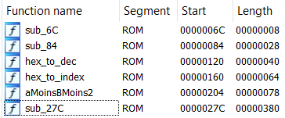

# S3cr37 4g3nt
### Embedded (100 points)

#### Énoncé

*En tant qu'agent spécial au service de la faction XXX vous devez décoder un message intercepté sur un théâtre d'opération entre deux agents ennemis. Pour ce faire, votre spécialiste radio vous livre le message (qui semble être chiffré) ainsi que le firmware d'un terminal de chiffrement malheureusement détruit.
A vous de jouer agent XXX 007...*

Dans cette épreuve, on nous fournissait un message chiffré ainsi qu'un binaire, `cryptomachine.bin` qui s'occupait de chiffrer un message.

Le message chiffré, lui, n'était rien d'autre qu'une chaîne hexadécimale :

```
49D29B3439B8FB013DE2F9FD35B8F8FD36E5F8FC3409FCFF352DA8033BEAA8F83B73FBFC373AAD003573FB026990FEFA65B8FCFE343AA90034E6AE013DE5AA2A6AA9AEFE81
```

#### Solution

Cette épreuve faisait directement suite à une première épreuve de la catégorie Embedded, *Defused*. Je n'ai pas écrit de write-up pour celle-ci, donc un petit peu de contexte s'impose : dans *Defused*, on nous donnait une [image](plan.jpg) présentant un circuit dans lequel on retrouvait un microcontrôleur ARM (STM32F103C8T6).

Cet article explique bien comment configurer IDA pour reverse ce type de binaire :
https://blog.3or.de/starting-embedded-reverse-engineering-freertos-libopencm3-on-stm32f103c8t6.html

Une fois le binaire chargé et IDA configuré, on se retrouve face à un code assez court avec 6 fonctions (ici j'en avais déjà renommé quelques unes).



`sub_27C` semble être le "main" du programme, que IDA décompile :

```C
void __noreturn sub_27C()
{
  char *v0; // r6
  char *v1; // r3
  int v2; // r0
  signed int v3; // r4
  int v4; // t1
  unsigned int v5; // r4
  int v6; // r0
  int v7; // r5
  int v8; // r0
  signed int v9; // r4
  int v10; // t1
  char v11; // r5
  char v12; // r3
  char *v13; // r4
  char v14; // r2
  unsigned int v15; // r0
  char v16; // r2
  unsigned int v17; // r3
  unsigned __int8 v18; // r3
  int v19; // r0
  char v20; // r3
  char v21; // r3
  __int16 *v22; // r6
  int v23; // t1
  char v24; // r2
  unsigned int v25; // r0
  char v26; // r2
  unsigned int v27; // r3
  unsigned __int8 v28; // r3
  int v29; // r0
  char v30; // r3
  char v31; // r3
  __int16 *v32; // r6
  int v33; // t1
  unsigned int v34; // r3
  bool v35; // cf
  bool v36; // zf
  unsigned int v37; // r2
  char v38; // r3
  char v39; // r2
  unsigned int v40; // r3
  unsigned int v41; // r0
  unsigned int v42; // r3
  int v43; // r0
  char v44; // r3
  __int16 *v45; // r6
  int v46; // t1
  char v47; // r2
  unsigned int v48; // r0
  char v49; // r2
  unsigned int v50; // r3
  unsigned __int8 v51; // r3
  int v52; // r0
  char v53; // r3
  char v54; // r3
  __int16 *v55; // r6
  int v56; // t1
  int v57; // t1
  int v58; // r0
  signed int v59; // r4
  int v60; // t1
  int v61; // r0
  signed int v62; // r4
  int v63; // t1
  char v64; // [sp+4h] [bp-134h]
  char v65; // [sp+5h] [bp-133h]
  char v66; // [sp+6h] [bp-132h]
  __int16 v67; // [sp+8h] [bp-130h]
  char v68; // [sp+Ah] [bp-12Eh]
  char v69; // [sp+Ch] [bp-12Ch]
  char v70; // [sp+Dh] [bp-12Bh]
  char v71; // [sp+Eh] [bp-12Ah]
  __int16 v72; // [sp+10h] [bp-128h]
  char v73; // [sp+12h] [bp-126h]
  __int16 v74; // [sp+14h] [bp-124h]
  char v75; // [sp+16h] [bp-122h]
  char v76; // [sp+18h] [bp-120h]
  char v77; // [sp+19h] [bp-11Fh]
  char v78; // [sp+1Ah] [bp-11Eh]
  __int16 v79; // [sp+1Ch] [bp-11Ch]
  char v80; // [sp+1Eh] [bp-11Ah]
  char v81; // [sp+1Fh] [bp-119h]
  char v82; // [sp+20h] [bp-118h]
  char v83; // [sp+11Fh] [bp-19h]
  char v84; // [sp+120h] [bp-18h]

  v64 = MEMORY[0x10718];
  v69 = MEMORY[0x10718];
  v76 = MEMORY[0x10718];
  v67 = MEMORY[0x1071C];
  v72 = MEMORY[0x1071C];
  v74 = MEMORY[0x1071C];
  v79 = MEMORY[0x1071C];
  v65 = 0;
  v66 = 0;
  v68 = 0;
  v70 = 0;
  v71 = 0;
  v73 = 0;
  v75 = 0;
  v77 = 0;
  v78 = 0;
  v80 = 0;
  sub_6C(270471168);
  while ( 1 )
  {
    v0 = &v81;
    v1 = &v81;
    do
      (v1++)[1] = 0;
    while ( v1 != &v83 );
    v2 = 63;
    v3 = 67360;
    do
    {
      sub_84(v2);
      v4 = *(unsigned __int8 *)(v3++ + 1);
      v2 = v4;
    }
    while ( v4 );
    v5 = v2;
    do
    {
      while ( !(sub_6C(270471192) & 0x40) )
        ;
      sub_84(42);
      v6 = (unsigned __int8)sub_6C(270471168);
      v7 = v6 - 13;
      ++v5;
      if ( v6 != 13 )
        v7 = 1;
      if ( v5 > 0xFE )
        v7 = 0;
      (v0++)[1] = v6;
    }
    while ( v7 );
    *(&v84 + v5 - 256) = 0;
    sub_84(10);
    if ( v5 > 2 && v5 & 1 )
    {
      v8 = 67;
      v9 = 67372;
      v64 = 0;
      v65 = 0;
      v69 = 0;
      v70 = 0;
      v76 = 0;
      v77 = 0;
      v67 = 0;
      v72 = 0;
      v74 = 0;
      v79 = 0;
      do
      {
        sub_84(v8);
        v10 = *(unsigned __int8 *)(v9++ + 1);
        v8 = v10;
      }
      while ( v10 );
      v11 = v8;
      v12 = v82;
      v13 = &v82;
      do
      {
        v14 = v13[1];
        v64 = v12;
        v65 = v14;
        v15 = hex_to_dec((unsigned __int8 *)&v64);
        v16 = v15;
        v17 = (unsigned __int8)(v15 >> 4);
        if ( v17 <= 9 )
          v18 = v17 + 48;
        else
          v18 = v17 + 55;
        v19 = v18;
        v20 = v16 & 0xF;
        if ( (v16 & 0xFu) <= 9 )
          v21 = v20 + 48;
        else
          v21 = v20 + 55;
        LOBYTE(v67) = v19;
        HIBYTE(v67) = v21;
        v68 = v11;
        if ( v19 )
        {
          v22 = &v67;
          do
          {
            sub_84(v19);
            v23 = *((unsigned __int8 *)v22 + 1);
            v22 = (__int16 *)((char *)v22 + 1);
            v19 = v23;
          }
          while ( v23 );
        }
        if ( v13[2] == 13 )
          break;
        v24 = v13[3];
        v69 = v13[2];
        v70 = v24;
        v25 = hex_to_index((unsigned __int8 *)&v69);
        v26 = v25;
        v27 = (unsigned __int8)(v25 >> 4);
        if ( v27 <= 9 )
          v28 = v27 + 48;
        else
          v28 = v27 + 55;
        v29 = v28;
        v30 = v26 & 0xF;
        if ( (v26 & 0xFu) <= 9 )
          v31 = v30 + 48;
        else
          v31 = v30 + 55;
        LOBYTE(v72) = v29;
        HIBYTE(v72) = v31;
        v73 = v11;
        if ( v29 )
        {
          v32 = &v72;
          do
          {
            sub_84(v29);
            v33 = *((unsigned __int8 *)v32 + 1);
            v32 = (__int16 *)((char *)v32 + 1);
            v29 = v33;
          }
          while ( v33 );
        }
        v34 = (unsigned __int8)v13[4];
        if ( v34 == 13 )
          break;
        v35 = v34 >= 0x39;
        v36 = v34 == 57;
        v37 = (unsigned __int8)v13[5];
        if ( v34 <= 0x39 )
          v38 = 16 * v34;
        else
          v38 = 16 * (v34 - 55);
        if ( v36 || !v35 )
          v38 &= 0xF0u;
        v39 = v37 <= 0x39 ? v37 - 48 : v37 - 55;
        v40 = (unsigned __int8)(v38 + v39) ^ 0xCC;
        v41 = v40 >> 4;
        v35 = v40 >> 4 >= 9;
        v36 = v40 >> 4 == 9;
        v42 = v40 & 0xF;
        v43 = !v36 && v35 ? v41 + 55 : v41 + 48;
        v44 = v42 <= 9 ? v42 + 48 : v42 + 55;
        LOBYTE(v74) = v43;
        HIBYTE(v74) = v44;
        v75 = v11;
        v45 = &v74;
        do
        {
          sub_84(v43);
          v46 = *((unsigned __int8 *)v45 + 1);
          v45 = (__int16 *)((char *)v45 + 1);
          v43 = v46;
        }
        while ( v46 );
        if ( v13[6] == 13 )
          break;
        v47 = v13[7];
        v76 = v13[6];
        v77 = v47;
        v48 = aMoinsBMoins2((unsigned __int8 *)&v64, (unsigned __int8 *)&v76);
        v49 = v48;
        v50 = (unsigned __int8)(v48 >> 4);
        v51 = v50 <= 9 ? v50 + 48 : v50 + 55;
        v52 = v51;
        v53 = v49 & 0xF;
        v54 = (v49 & 0xFu) <= 9 ? v53 + 48 : v53 + 55;
        LOBYTE(v79) = v52;
        HIBYTE(v79) = v54;
        v80 = v11;
        if ( v52 )
        {
          v55 = &v79;
          do
          {
            sub_84(v52);
            v56 = *((unsigned __int8 *)v55 + 1);
            v55 = (__int16 *)((char *)v55 + 1);
            v52 = v56;
          }
          while ( v56 );
        }
        v57 = (unsigned __int8)v13[8];
        v13 += 8;
        v12 = v57;
      }
      while ( v57 != 13 );
      v58 = 13;
      v59 = 67376;
      do
      {
        sub_84(v58);
        v60 = *(unsigned __int8 *)(v59++ + 1);
        v58 = v60;
      }
      while ( v60 );
    }
    else
    {
      v61 = 33;
      v62 = 67364;
      do
      {
        sub_84(v61);
        v63 = *(unsigned __int8 *)(v62++ + 1);
        v61 = v63;
      }
      while ( v63 );
    }
  }
}
```

Étudions d'abord quelques des autres fonctions avant de s'attarder au main. La fonction `sub_120` (renommée `hex_to_dec`) :

```C
int __fastcall hex_to_dec(unsigned __int8 *a1)
{
  unsigned int v1; // r3
  unsigned int v2; // r0
  bool v3; // cf
  bool v4; // zf
  char v5; // r3
  char v6; // r0

  v1 = *a1;
  v2 = a1[1];
  v3 = v1 >= 0x39;
  v4 = v1 == 57;
  if ( v1 <= 0x39 )
    v5 = 16 * v1;
  else
    v5 = 16 * (v1 - 55);
  if ( v4 || !v3 )
    v5 &= 0xF0u;
  if ( v2 <= 0x39 )
    v6 = v2 - 48;
  else
    v6 = v2 - 55;
  return (unsigned __int8)(v5 + v6 + 4);
}
```

Celle-ci prend une chaîne a1 et va convertir les deux premiers caractères depuis l'hexadécimal... et ajouter 4. Par exemple, `7C` deviendrait 128.

Ensuite, regardons le `sub_160` (renommé `hex_to_index`) :

```C
int __fastcall hex_to_index(unsigned __int8 *a1)
{
  unsigned int v1; // r2
  unsigned int v2; // r1
  int v3; // r3
  char v4; // r2
  int v5; // r3
  int v6; // r2
  int v7; // r1
  int result; // r0

  v1 = *a1;
  v2 = a1[1];
  v3 = 16 * (v1 - 55);
  if ( v1 <= 0x39 )
    v4 = 16 * v1 & 0xF0;
  else
    v4 = v3 & 0xF0;
  v5 = (unsigned __int8)(v4 + v2 - 55);
  v6 = (unsigned __int8)(v4 + v2 - 48);
  if ( v2 <= 0x39 )
    v7 = v6;
  else
    v7 = v5;
  for ( result = 0; *(unsigned __int8 *)(result + 67096) != v7; result = (unsigned __int8)(result + 1) )
    ;
  return result;
}
```

Cette fonction va aussi convertir deux caractères hexadécimaux en décimal, mais va ensuite chercher, à un certain endroit dans la mémoire, l'octet résultant, et retourner sa position.

Cette zone mémoire commence en 67096 = 0x10618, c'est-à-dire à l'offset réel 0x618 dans le binaire. On dump sur 256 octets :

```
94 AE 4F CC A9 BB 78 8A FB 31 C0 06 85 30 F9 C3
54 47 96 7D 6B CF 90 BA DD 29 02 A8 69 79 45 49
38 4B 4C 87 6C 8C C2 82 D2 BD FE 3D F6 37 DE 2A
19 22 E5 F0 E7 AF 98 7F DB D9 32 9F 3E AB 89 73
0D 25 53 D0 A1 07 F7 5F 3B 99 17 3C BF B8 CB FD
DC 44 C5 B2 B5 16 6F D8 83 AA 9B 14 26 50 B7 9C
D1 71 23 04 5A 8E 93 FC 09 2E 55 D3 0A CE 7B D6
C7 2B 97 33 B6 E1 5B 57 1E E3 AC 5D EB 00 36 74
A0 7A A6 15 E8 C9 8B F4 1A BE 13 E9 D7 0B 51 0E
35 70 56 0F F1 92 7E 86 24 DF 8F 10 88 7C 20 2F
68 3F A4 8D 6D 6A 84 C1 9E 65 E0 5E 95 1D EF 0C
4E 05 18 59 4A 27 EE 01 39 76 D4 46 63 A5 DA F2
ED 81 F5 AD D5 66 A7 EA A2 EC E2 3A 5C 1B B4 1C
2C 41 43 60 40 FF 4D CA E4 F8 58 91 52 28 6E 9A
48 11 64 2D 21 34 61 B1 B3 9D 62 E6 BC FA CD 42
72 C8 C6 03 1F B0 F3 75 A3 67 08 77 12 B9 C4 80
```

Sans surprise, il s'agit d'une permutation de la liste des octets de 0 à 255. La fonction retourne donc la position de notre octet dans cette table.

Enfin, la fonction `sub_204` (renommée ici subtilement `aMoinsBMoins2`) :

```C
int __fastcall aMoinsBMoins2(unsigned __int8 *a1, unsigned __int8 *a2)
{
  unsigned int v2; // r3
  unsigned int v3; // r2
  bool v4; // cf
  bool v5; // zf
  char v6; // r3
  char v7; // r2
  char v8; // r3
  unsigned int v9; // r2
  unsigned int v10; // r0
  bool v11; // cf
  bool v12; // zf
  char v13; // r2
  char v14; // r0

  v2 = *a2;
  v3 = a2[1];
  v4 = v2 >= 0x39;
  v5 = v2 == 57;
  if ( v2 <= 0x39 )
    v6 = 16 * v2;
  else
    v6 = 16 * (v2 - 55);
  if ( v5 || !v4 )
    v6 &= 0xF0u;
  if ( v3 <= 0x39 )
    v7 = v3 - 48;
  else
    v7 = v3 - 55;
  v8 = v6 + v7;
  v9 = *a1;
  v10 = a1[1];
  v11 = v9 >= 0x39;
  v12 = v9 == 57;
  if ( v9 <= 0x39 )
    v13 = 16 * v9;
  else
    v13 = 16 * (v9 - 55);
  if ( v12 || !v11 )
    v13 &= 0xF0u;
  if ( v10 <= 0x39 )
    v14 = v10 - 48;
  else
    v14 = v10 - 55;
  return (unsigned __int8)(v8 - 2 - (v13 + v14));
}
```

Après étude, celle-ci semble simplement renvoyer `a - b - 2`, où a et b sont les valeurs décimales associées aux arguments (toujours en hexa) a2 et a1.

Avec toutes ces informations en main, nous pouvions alors comprendre la routine de chiffrement du main. C'est un peu fastidieux donc je vais directement sauter à l'explication de l'algorithme :

* On lit le plaintext sous forme de chaîne hexadécimale, deux caractères par deux
* Soit m[i] le i-ème octet du plaintext, et c[i] son chiffré :
    * Si i mod 4 = 0, alors c[i] = m[i] + 4
    * Si i mod 4 = 1, alors c[i] est l'indice de m[i] dans la table de permutation
    * Si i mod 4 = 2, alors c[i] = m[i] xor 0xCC
    * Si i mod 4 = 3, alors c[i] = m[i] - c[i-3] - 2
* Le texte chiffré est c sous forme de chaîne hexadécimale

Il ne reste plus qu'à coder un algo de déchiffrement.

```python
P = "94AE4FCCA9BB788AFB31C0068530F9C35447967D6BCF90BADD2902A869794549384B4C876C8CC282D2BDFE3DF637DE2A1922E5F0E7AF987FDBD9329F3EAB89730D2553D0A107F75F3B99173CBFB8CBFDDC44C5B2B5166FD883AA9B142650B79CD17123045A8E93FC092E55D30ACE7BD6C72B9733B6E15B571EE3AC5DEB003674A07AA615E8C98BF41ABE13E9D70B510E3570560FF1927E8624DF8F10887C202F683FA48D6D6A84C19E65E05E951DEF0C4E0518594A27EE013976D44663A5DAF2ED81F5ADD566A7EAA2ECE23A5C1BB41C2C41436040FF4DCAE4F8589152286E9A4811642D213461B1B39D62E6BCFACD4272C8C6031FB0F375A367087712B9C480"
P = [int(P[i:i+2], 16) for i in range(0, len(P), 2)]

m = "49D29B3439B8FB013DE2F9FD35B8F8FD36E5F8FC3409FCFF352DA8033BEAA8F83B73FBFC373AAD003573FB026990FEFA65B8FCFE343AA90034E6AE013DE5AA2A6AA9AEFE81"
m = [int(m[i:i+2], 16) for i in range(0, len(m), 2)]

out = []
for i in range(len(m)):
    if i % 4 == 0:
        out.append(m[i] - 4)
    if i % 4 == 1:
        out.append(P[m[i]])
    if i % 4 == 2:
        out.append(m[i] ^ 0xCC)
    if i % 4 == 3:
        out.append((m[i] + 2 + (m[i-3]-4)) & 0xff)

print(bytes(out))
```

Et le résultat :

```
b'ECW{59789d5819402440010117d67bd1737532a51375e52aa90a02e20ab394fefebf}'
```

#### Conclusion

Une épreuve plutôt sympathique même si analyser le code en statique est légèrement sale et fastidieux. C'est la première fois que je fais un challenge de ce genre (reverse du ARM microcontrôleur) et je suis content d'avoir fait first blood !

Je suis d'ailleurs étonné du nombre peu élevé de validations sur cette épreuve, que je n'ai pas trouvée spécialement plus difficile que son homologue *Defused* qui en a 3 fois plus.

Enjoy!
