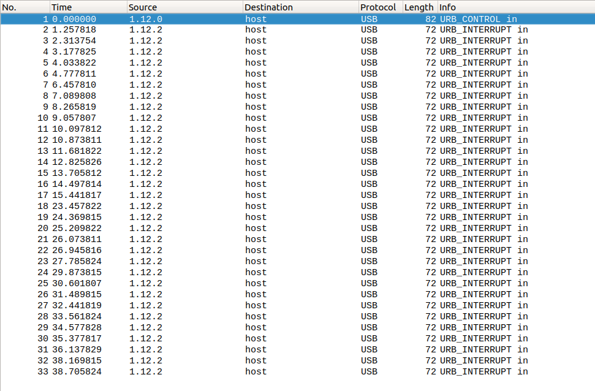
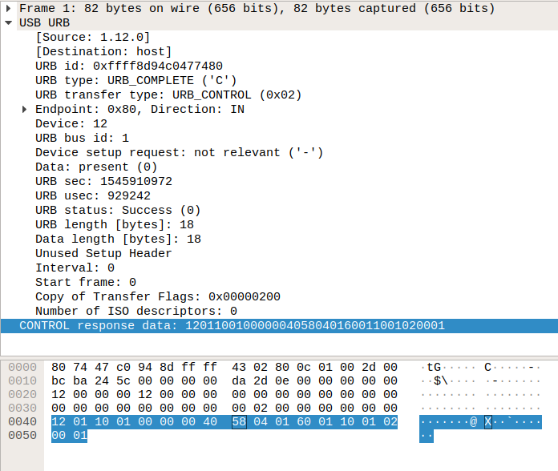

# Save Earth

Forensics, 150 points

## Description

*In the mid 21st century, Ex-NASA pilot Cooper leaves his little daughter and goes an interstellar journey around the space to find an alternative planet (PLAN A) or to capture gravitational data and send it back to earth, which Scientists will use to save Earth. However Cooper finds himself stuck in a tesseract that spans across time, there is only one way he could transmit the data to his little girl.*

*We have obtained parts of what Cooper sent to his daughter, can you find the flag and save the earth?*

*Note: This question does not follow the flag format*

## Solution

We're given a [SaveEarth.pcap](SaveEarth.pcap) file. Let's open it in Wireshark. The file is pretty short:



The protocol is USB. What could this be? Mouse inputs? Keyboard inputs? The contents of the first packet (URB_CONTROL) actually gives some information.



In the CONTROL response data, the bytes 9-10 and 11-12 are supposed to give the vendor ID and the product ID. Here, it is 0x0458 and 0x6001. We can look those up online, for instance [here](http://www.linux-usb.org/usb.ids).

We find out the vendor is **KYE Systems Corp.** and the product is **GF3000F Ethernet Adapter**.

Now what we should need is some kind of format specification related to this product to make sense of the following packets, but I couldn't find any on the Internet.

So I decided to go in pretty randomly. After all, there's so little data and the flag has to be somewhere!

I dumped the contents of the "Leftover Capture Data" of each packet:

```
01:02:00:00:00:00:00:00
01:04:00:00:00:00:00:00
01:02:00:00:00:00:00:00
01:04:00:00:00:00:00:00
01:01:00:00:00:00:00:00
01:02:00:00:00:00:00:00
01:01:00:00:00:00:00:00
01:04:00:00:00:00:00:00
01:04:00:00:00:00:00:00
01:02:00:00:00:00:00:00
01:04:00:00:00:00:00:00
01:01:00:00:00:00:00:00
01:04:00:00:00:00:00:00
01:04:00:00:00:00:00:00
01:04:00:00:00:00:00:00
01:01:00:00:00:00:00:00
01:04:00:00:00:00:00:00
01:04:00:00:00:00:00:00
01:04:00:00:00:00:00:00
01:04:00:00:00:00:00:00
01:02:00:00:00:00:00:00
01:01:00:00:00:00:00:00
01:04:00:00:00:00:00:00
01:04:00:00:00:00:00:00
01:04:00:00:00:00:00:00
01:02:00:00:00:00:00:00
01:01:00:00:00:00:00:00
01:04:00:00:00:00:00:00
01:04:00:00:00:00:00:00
01:04:00:00:00:00:00:00
01:02:00:00:00:00:00:00
01:02:00:00:00:00:00:00
```

Each packet, the second byte is either 01, 02 or 04. Welp, that's three different characters, so I immediately thought of morse code.

Inline: `24241214424144414444214442144422`

The space character cannot be 4, nor can it be 2 because they are sometimes repeated.

Let's try to interpret it as `-.-. - ..-. ... ....- ...- ...--`. This decodes as `CTFS4V3`.

In the end I'm not sure how to make sense of this task, but we have the flag.

Enjoy!

