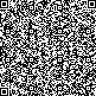
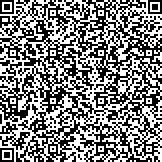
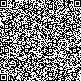

# QvR Code

Forensic, 150 points

## Description

*This is now a STEAM focused competition. Check out our new patented Quade van Ravesteyn (QvR) code. QvR beats similar codes by marginally increasing storage capacity. And it’s prettier to look at. Each encoding is like its own masterpiece.*

## File 

## Solution

The image gives strong QR code vibes, and the title of the task cannot lie. The only thing is that plenty of colors are used here, instead of the usual black and white.

**Quade van Ravesteyn** was a Dutch painter so we initially thought of Piet Mondrian, another Dutch painter who inspired the **Piet** programming language, which is written using colorful images that oddly look like the one we are given (look it up). The number of colors used didn't match though, so we quickly abandoned the idea of Piet hidden inside a QR code.

Our next idea was to simply to try and transform this image into black and white, and hope it reads as a valid QR code.

Luckily enough, if we put away `#000000` and `#ffffff`, only 6 different colors are used in the image, which allows to bruteforce 64 possibilities of black and white images associated to it. Check [QvR.py](QvR.py) for the code.

After generating the 64 images, I estimated that figuring out a way to automatize the QR code decryption would take more time than doing it myself by hand (thanks zxing decoder).

It turns out that 3 of the 64 possibilities read as valid QR codes, which is actually not surprising because it is the maximum amount of distinct black and white images one could extract from an image that uses six different colors.

Here are the 3 valid images:

  

And their plaintext:

* `We wanted to incorporate Science Technology Engineering Art and Mathematics (STEAM). Enclose with MCA{} for final flag. So we needed to cover each letter. Let's start with S. Science: Science is the intellectual and practical activity encompassing the systematic study of the structure and behavior of the physical and natural world through observation and experiment. We incorporated science by allowing competitors to explore scientific concepts about the world such as color theory. Competitors also have to experiment to get the correct answer through observation.`

* `Now we are going to explore T. Technology: Competitors need to use the Internet to compete. What an amazing Technology. The internet was invented by Al Gore. Anyway, technology enables the encoding of the data, decoding of the data, and critical error correction algorithms present in the code. Prepend salt_ and append _pepper to flag. The next letter is E. Engineering: Competitors need to reverse-engineer a solution to decode the QvR code because the specification isn't published. As a discipline, engineering incorporates science and technology.`

* `And now it's A. Flag is impossible_color_theory Art: Art art art art art art art art. <- art. It can be anything. But specifically it's Dirck de Quade van Ravesteyn. This is the namesake artist of the QvR code. This artist was chosen because his name is similar to existing barcodes. Art also makes an appearance because of the RYB color theory. de Quade would have used this color theory in his works as he predated Newton, an organism who discovered that cyan, yellow, and magenta provide the largest color gamut. Finally, M: Mathematics: BORING!
`

Enjoy!
