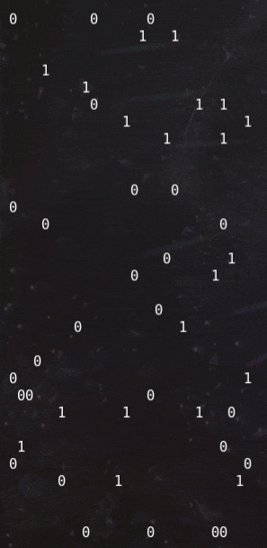

# FUNction Plotter

## Misc, 50 points

### Description

*One of Santa's elves found this weird service on the internet. He doesn't like maths, so he asked you to check if there's anything hidden behind it.

Remote Server: `nc challs.xmas.htsp.ro 13005`
Author: yakuhito*

### Solution

Let's connect to the server and see what's going on.

```shell
╭─face0xff@aniesu-chan /den/ctf/xmas  
╰─$ nc challs.xmas.htsp.ro 13005
Welcome to my guessing service!
Can you guess all 961 values?


f(27, 5)=0
Pretty close, but wrong!

f(26, 6)=1
Pretty close, but wrong!

f(4, 20)=0
Good!

f(17, 13)=1
Pretty close, but wrong!
```

After enough retries, we can infer several important points:
* The server asks us for a value of f(x, y), with x and y in {0, ... 30}
* The only answers that can (sometimes) give "Good!" answers are "0" and "1"
* Our goal is certainly to determine f over [[0, 31]]^2.

At this point I was thinking about what we would get once we fully recovered f. It could not be a binary text because of the length, so I thought of a QR Code because of the square shape.

It happened I had the correct intuition; here's an animation of the script recovering the square:



What was only left to do was to make an image out of it:


which decodes as the flag : `X-MAS{Th@t's_4_w31rD_fUnCt10n!!!_8082838205}`.

Enjoy!
