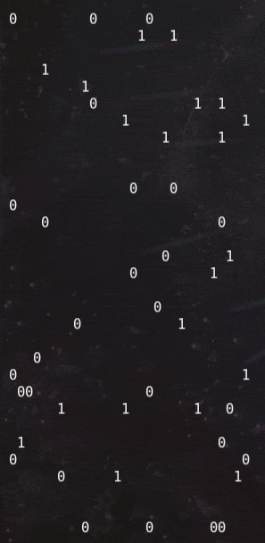

# FUNction Plotter

## Misc, 50 points

### Description

_One of Santa's elves found this weird service on the internet. He doesn't like maths, so he asked you to check if there's anything hidden behind it._

_Remote Server: `nc challs.xmas.htsp.ro 13005`_ _Author: yakuhito_

### Solution

Let's connect to the server and see what's going on.

```text
╭─face0xff@aniesu-chan /den/ctf/xmas  
╰─$ nc challs.xmas.htsp.ro 13005
Welcome to my guessing service!
Can you guess all 961 values?


f(27, 5)=0
Pretty close, but wrong!

f(26, 6)=1
Pretty close, but wrong!

f(4, 20)=0
Good!

f(17, 13)=1
Pretty close, but wrong!
```

After enough retries, we can infer several important points:

* The server asks us for a value of f\(x, y\), with x and y in {0, ... 30}
* The only answers that can \(sometimes\) give "Good!" answers are "0" and "1"
* Our goal is certainly to determine f over \[\[0, 31\]\]^2.

At this point I was thinking about what we would get once we fully recovered f. It could not be a binary text because of the length, so I thought of a QR Code because of the square shape.

It happened I had the correct intuition; here's an animation of the script recovering the square:



What was only left to do was to make an image out of it:


which decodes as the flag : `X-MAS{Th@t's_4_w31rD_fUnCt10n!!!_8082838205}`.

Enjoy!

### Script

```python
import socket, itertools

def display(S):
    for j in range(31):
        print(''.join(str(u) if u >= 0 else ' ' for u in S[j]))
    print('\n')

s = socket.socket(socket.AF_INET, socket.SOCK_STREAM)
s.connect(('challs.xmas.htsp.ro', 13005))

square = [[-1] * 31 for i in range(31)]

d = s.recv(4096)

while -1 in list(itertools.chain(*square)):
    coords = d.split(b'\n')[-1].replace(b'f(', b'').replace(b')=', b'')
    x, y = map(int, coords.decode('utf-8').split(', '))
    s.send(b'0\n')
    d = s.recv(4096)
    square[y][x] = 1 if b'wrong' in d else 0
    display(square)

s.close()

from PIL import Image

BLOCK = 10
img = Image.new('RGB', (31 * BLOCK, 31 * BLOCK))

for y in range(31):
    for x in range(31):
        color = (0,) * 3 if square[y][x] else (255,) * 3
        for i in range(BLOCK):
            for j in range(BLOCK):
                img.putpixel((x * BLOCK + i, y * BLOCK + j), color)

img.save('out.png')
```

