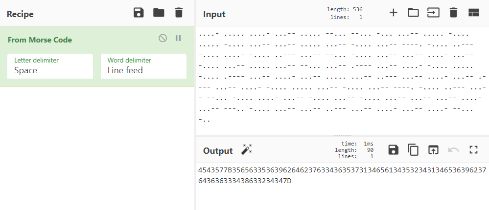
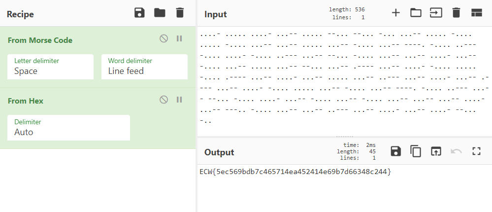

# Windtalkers

## Stega / 200 points / 9 solves

### Description

_We have recovered this image from the enemy, find out what is in it!_

[Jellyfish.bmp](https://github.com/face0xff/ctf/tree/bb723312984aa28433a94fe3af88659c45a0b559/2020/ECW_Quals_2020/Windtalkers/Jellyfish.bmp)


### Solution

**Windtalkers** was a classic steganography challenge, but with an extra step that was not that easy to figure out.

If you are not familiar with the **BMP** file format, it is relatively simple. Here are the main things you need to know about BMP:

* The file header is \(usually\) 0x36 = 54 bytes long, starts with "BM".
* Following the header is an uncompressed bitmap, which consists of the raw list of pixels, starting from the last row \(bottom -&gt; up\) and from left to right.
* A pixel is coded by a certain number of bits specified in the header \(usually 24 or 32\) in _little-endian_ \(so for 24 bits it goes like BGRBGRBGR...\).
* The size of a row in bytes should always be a multiple of 4; if it's not, padding is added.
* There are two main BMP steganography techniques:
  * LSB, hiding data in the least significant bits of the colors, which works the same way as it does in the PNG file format since the images do not suffer information loss. Since the bitmap is raw and uncompressed, it is also possible to read and hide data very intuitively by directly working on the file each byte at a time \(skipping the header of course\). This latter technique means the data is hidden in a specific order though \(last row first and BGR\), so when you look for LSB in a BMP, it is important to keep this in mind.
  * Padding. As stated earlier, rows are padded with null bytes if they're not multiples of 4, but you can totally pad with arbitrary data. For instance, if you have a 24-bits 250px × 250px image, the size of a row in the file is 250 × 3 = 750 bytes so you would have to pad each row with 2 bytes to get a multiple of 4, which gives 2 × 250 = 500 bytes of data that you can hide in total inside padding.

Not all of this knowledge is useful for this challenge but I thought it'd be interesting to broaden a little bit. Now onto figuring out how to start on the actual task.

A good initial idea is to fire up **Stegsolve**, visually check the bit planes, read header information and try some LSB extraction. File format analysis does not yield anything unusual.


The image is quite naturally noisy so it's hard to tell if there's data hidden in the LSB. Maybe there's some in the first few or last lines, but generic data extraction does not yield anything really interesting either.

At this point, before it gets _guessy_, there's a last classic thing that is mandatory to look for in this kind of challenge, and that is **retrieving the original image**.

Indeed, if you think from the creator's perspective, they would probably have to have picked a picture somewhere on the Internet, and then hide their data inside it. Retrieving the original image allows you to compare them and have a better overview of where data might actually be hidden. For this to work though, finding the exact same image is really important: any little filter, noise, compression or resizing of the image will certainly make any comparison process irrelevant.

Luckily, reverse search engines such as TinEye are able to find the same image with the exact same size, in a lossless format \(PNG\). Stegsolve has an **image combiner** feature that we can use:


The result of XORing the two images is all black, which means they are extremely similar. Now, we're going to export this XOR, load it back up into Stegsolve and check out the lowest bit planes. We can see everything is fully black, except for the lowest **blue plane**:


There are two rows of pixels at the top which contain differences!

Let's open Jellyfish.bmp with Stegsolve again and try to extract this blue plane. The full message is 1168 bits \(over this length, the images are the exact same\). Here's the beginning of the hex dump of the extracted data:

```text
0c08204302381040 e207103102381040  .. C.8.@ ...1.8.@
c2041030811c08e0 41023818408e07d0  ...0.... A.8.@...
30813c0c20430308 13c08e071030811c  0.<. C.. .....0..
08e043023818408e 04102381c408e05f  ..C.8.@. ..#...._
023810c0c2041030 817c08e043023810  .8.....0 .|..C.8.
408e04f023810c08 e05f023810c0c204  @...#... ._.8....
1023818408e07d03 0813c08e07103081  .#....}. ......0.
0c08e06102381840 8e047023810c08e0  ...a.8.@ ..p#....
79030811c08e04f0 23810c08e0430388  y....... #....C..
19036fd74c8a53f1 865ab567f3877272  ..o.L.S. .Z.g..rr
[...]
```

Yeah... this is strange. Not readable, but you can still feel like it hides something \(or at least I do... just CTF player quirks\). It has a lot of reoccuring characters such as `C`, `@` or `#`. Shannon entropy is 4.7, which is probably not bad if we're looking for something that makes sense.

At this point I spent hours trying to make sense of this but had no luck. I looked into caesar, xor, morse, 7-bit and many other cryptos/conversions/encodings/... Extracting data from the XORed image instead of just looking at the values of the changes... Reading in reverse or just from right to left... Visualizing the binary blob by reorganizing it in rectangle shapes... \(who knows, maybe you can make a QR code pop out of nowhere\).

In the span of a week, no one managed to solve Windtalkers. This pushed the organizers into giving a hint, which was the following:

```text
.-- . .. .-. -.. / .-.. ... -...
```

This is **morse code** for "WEIRD LSB". Okay, thanks, nothing new here. But of course, what is crucial in this hint is the fact that it is morse code. _But wait... I've already been trying to read morse for hours from this cursed binary blob!_ Well, gotta try harder man.

At some point, I was playing again with trying to form images with the binary blob, replacing zeroes with spaces, when I stumbled upon this kind of stuff:

```text
    11      1     1      1    11      1   111      1     1      1
11   1      111   1      11   1      1   111      1     1      11
    1      1     1      11    1      1   111      1   111      1 
    1      1   111      11    1      1   111      11111 1      11
    1      1  1111      11    1      1    11      11    1      1 
 1111      1   111      111   1      11    1      1   111      1 
  111      1    11      1   111      11    1      1   111      1 
    1      1   111      111   1      1   111      1 11111      1 
  111      1    11      11    1      1     1      11    1      1 
11111      1   111      1    11      1   111      1     1      1 
  111      1  1111      1   111      1    11      1   111      1 
11111      1   111      1    11      11    1      1     1      1 
  111      11    1      1   111      11111 1      11    1      1 
 1111      1   111      111   1      11    1      1    11      1 
  111      11    1      1   111      11    1      1   111      1 
  111      1   111      1    11      1   111      1111  1      11
    1      1   111      1   111      1  1111      1   111      1 
   11      1   111      1    11      111   1      11  1      11
```

Truth is I had already seen these several times during my research and I've always thought it looks _way_ too organized and full of patterns, but only at this point did I decide to genuinely look further into it. I think it was because these patterns reminded me of the way digits look like in morse \(`0123456789` = `----- .---- ..--- ...-- ....- ..... -.... --... ---.. ----.`\)

So this is when I tried splitting the binary blob on "10000001", which resulted in this list:

```text
['00001', '00000', '00001', '00011', '00000', '11000', '11000', '1000', '00011', '00000', '10000', '00000', '10000', '00011', '00011', '00000', '00011', '10000', '00011', '11110', '10000', '00111', '10000', '00001', '10000', '00111', '00011', '11000', '10000', '00011', '00011', '00001', '00011', '10000', '00011', '00000', '00011', '11000', '00011', '01111', '00011', '00001', '10000', '00000', '10000', '01111', '00011', '00001', '00011', '00000', '00011', '00111', '00011', '00001', '00011', '01111', '00011', '00001', '10000', '00000', '00011', '10000', '00011', '11110', '10000', '00111', '00011', '11000', '10000', '00001', '00011', '10000', '00011', '10000', '00011', '00011', '00011', '00001', '00011', '11100', '10000', '00011', '00011', '00111', '00011', '00001', '00011', '00001', '11000', '100']
```

Somehow this looks really good. Now let's say `0` is `.`, `1` is `-`, and let the magic unfold:



Okay, so encoding the flag in hex before encoding it in morse was a dick move because I spent a lot of time trying to encode `ECW{` in morse and compare it to the binary blob, hoping to see interesting correlations. But I have to admit encoding the flag in hex made it so that most of the hex digits are 0-9, which is what gave the binary blob this shape and these remarkable patterns that eventually helped me solve the challenge. Enjoy:



