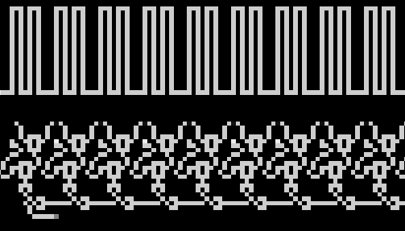
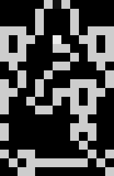
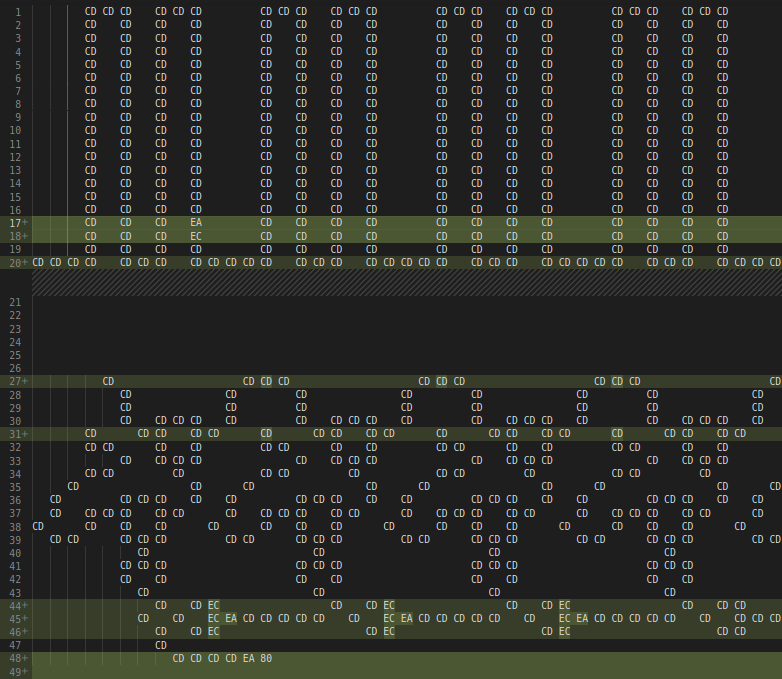

# cable management

*cable management* was a reverse challenge from DiceCTF 2022 that was released midway through the CTF, with 7 solves.

Since I got first blood in around an hour (whereas other teams started flagging it only 12 hours after release),
I thought it would be interesting to share how I approached the problem.

**Description:** *Help me manage my cables! Note: Flag may take a while to verify.*

## First glance

We are given a 5 MB 64-bit ELF `chall` that asks for user input.

```
╭─face@0xff ~/ctf/dice/cable 
╰─$ ./chall
test 
aaaaaaaaaaaaaaaaaaaaaaaaaaa
:(
```

It doesn't directly answer back if we send it a small string: instead, it waits
for enough characters. This way, we can already retrieve the flag length, which is 29.

We can also notice if we send 29 bytes at once it takes a long time to process,
but if we send it in two parts it takes less time to process the second part. 
This may suggest the flag is checked progressively (for example one byte at a time),
and not all at once.

Finally, one can notice sending "dice{aaaaaaaaaaaaaaaaaaaaaaaa" takes roughly 2 seconds more
than sending "aaaaaaaaaaaaaaaaaaaaaaaaaaaaa". At this point a timing attack may work out
(although possibly very slow), but at the time of the CTF I didn't think of it and directly
started reversing.

## Reversing (but not too much)

Let's load the binary in IDA. The main function is quite straightforward:

```c
__int64 __fastcall main(int argc, char **argv, char **envp) {
  __int64 v4[3]; // [rsp+0h] [rbp-18h] BYREF

  v4[1] = __readfsqword(0x28u);
  setvbuf(stdout, 0LL, 1, 0x2000uLL);
  v4[0] = (__int64)read_one_bit;
  if ( (unsigned int)f1(v4) == 1 )
    puts(":)");
  else
    puts(":(");
  return 0LL;
}
```

The function I renamed `read_one_bit` is passed as an argument to another function, `f1`, which has to
return 1 in order to output the success message.

`read_one_bit` is self-explanatory: it reads one bit of the user input. More precisely, it reads a byte
from `stdin` with `getc` every 8 calls, stores its bits in `.data` variables. Therefore, each call,
it returns a new bit from the user input.

The main logic of the binary lies inside the `f1` function (0x1540). IDA refuses to decompile it
because the stack frame is huge (0x5269a0 bytes).

```x86
.text:00001540     push    r14
.text:00001542     lea     r14, map
.text:00001549     mov     edx, offset unk_526990 ; n
.text:0000154E     push    r13
.text:00001550     mov     rsi, r14        ; src
.text:00001553     mov     r13, rdi
.text:00001556     push    r12
.text:00001558     push    rbp
.text:00001559     push    rbx
.text:0000155A     sub     rsp, 5269A0h
.text:00001561     mov     rax, fs:28h
.text:0000156A     mov     [rsp+5269C8h+var_30], rax
.text:00001572     xor     eax, eax
.text:00001574     mov     r12, rsp
.text:00001577     mov     rdi, r12        ; dest
.text:0000157A     call    _memcpy
```

The first thing this function does is calling `memcpy` to copy a certain buffer (0x4058, here renamed `map`)
from `.data` to the stack frame. Its length (`rdx` argument) is 0x526990 = 5400976 bytes, so pretty huge: actually,
it takes up almost 99% of the binary's size. We can then observe the function seems to loop on this map and
perform different actions depending on the read value.

Skimming through it shows `map` mostly comprises bytes such as 0x00 and 0xCD. At this moment, I went to check out
other functions inside the binary, and stumbled upon the function at 0x1390.

```c
bool __fastcall sub_1390(int idx, __int64 map) {
  unsigned int y; // eax
  unsigned int x; // edx
  unsigned int right_cell; // ebx
  int sum; // ecx
  unsigned int bottom_cell; // edi
  unsigned int left_cell; // ebp
  unsigned int top_cell; // eax

  y = idx / 2324;
  x = idx % 2324;
  right_cell = idx % 2324 + 1;
  if ( (unsigned int)(idx / 2324) > 0x913 || right_cell > 0x913 )
    sum = 0;
  else
    sum = *(_BYTE *)(map + (int)(right_cell + 2324 * y)) == 0xEC;// right cell
  bottom_cell = y + 1;
  if ( right_cell <= 0x913 && bottom_cell <= 0x913 )
    sum += *(_BYTE *)(map + (int)(right_cell + 2324 * bottom_cell)) == 0xEC;// bottom right cell
  if ( bottom_cell <= 0x913 && x <= 0x913 )
    sum += *(_BYTE *)(map + (int)(x + 2324 * bottom_cell)) == 0xEC;// bottom cell
  left_cell = x - 1;
  if ( bottom_cell <= 0x913 && left_cell <= 0x913 )
    sum += *(_BYTE *)(map + (int)(left_cell + 2324 * bottom_cell)) == 0xEC;// bottom left cell
  if ( y <= 0x913 && left_cell <= 0x913 )
    sum += *(_BYTE *)(map + (int)(left_cell + 2324 * y)) == 0xEC;// left cell
  top_cell = y - 1;
  if ( left_cell <= 0x913 && top_cell <= 0x913 )
    sum += *(_BYTE *)(map + (int)(left_cell + 2324 * top_cell)) == 0xEC;// top left cell
  if ( x <= 0x913 && top_cell <= 0x913 )
    sum += *(_BYTE *)(map + (int)(2324 * top_cell + x)) == 0xEC;// top cell
  if ( right_cell <= 0x913 && top_cell <= 0x913 )
    sum += *(_BYTE *)(map + (int)(right_cell + 2324 * top_cell)) == 0xEC;// top right cell
  return (unsigned int)(sum - 1) <= 1;
}
```

Since it performs integer division by 2324, it makes sense to view the variables I renamed `x` and `y`
as coordinates. Furthermore, we can try dumping and visualizing the map as a 2324-bytes-wide image:



Looks nice... what could it mean? Let's zoom in on a pattern.



The map mostly consists of 232 of these patterns horizontally glued next to each other.
Here is the same pattern in hexadecimal, where I removed null bytes for clarity.

```
               CD 11 CD               
            CD          CD            
            CD          CD            
CD CD CD    CD          CD    CD CD CD
CD    CD CD       EC       CD CD    CD
CD    CD          CD CD       CD    CD
CD CD CD                CD    CD CD CD
   CD             CD CD          CD   
      CD       CD                   CD
CD    CD    CD          CD CD CD    CD
CD CD       CD    CD CD CD    CD CD   
CD       CD       CD    CD    CD      
CD          CD CD       CD CD CD      
                           CD         
CD                      CD CD CD      
CD                      CD    CD      
                           CD         
CD    CD CD                   CD    CD
   CD    CD CD CD CD CD CD CD    CD   
      CD CD                         CD
```

We notice two things:
* Some patterns have an 0xEC byte on the fifth line, some don't and have a 0xCD instead. This may be important data in flag verification.
* All the patterns have an 0x11 byte at the top center.

Let's come back on the `f1` function to see how this 0x11 byte is handled.

```x86
.text:00001590                 cmp     al, 11h
.text:00001592                 jz      handle_11
[...]
.text:00001640 handle_11:                              ; CODE XREF: f1+52↑j
.text:00001640                 xor     eax, eax
.text:00001642                 call    qword ptr [r13+0]
.text:00001646                 test    al, al
```

It calls the function pointed by `r13`, which is the function pointer argument passed by main (`read_one_bit`).
Therefore, for each of these patterns in the map, one bit of the user input is read. This confirms that
the flag is indeed 232 / 8 = 29 bytes long.

At this point, what I did is extract the data formed by the 0xEC and 0xCD bytes in each pattern.

```
1010110010111011101001011010111110001101100110010101000010
0101101011010010101100111000011011000110101010111000011001
1001010100111001011010101111100101011110000101010000010101
0101010110010010110101110001001000010100000101010110000110
```

I tried some wild guessing to find out how it could relate to the flag, but could not find anything meaningful.
Instead, I went for a different approach.


## Leaking the flag

Before going any further into reversing, I wanted to experiment with how the map evolved in memory.
Since the flag is read bit by bit, perhaps some local modifications are performed for each bit, which can in turn
leak information.

I wrote a very simple GDB script to dump the state of the map after the program finished its execution for a given input.

```
starti

# Breakpoint at the end of main
pie breakpoint *0x10e0

r
dump memory dump-map.txt 0x00007fffffad5000 0x00007ffffffff000
quit
```

I generated a dump for "aaaaaaaaaaaaaaaaaaaaaaaaaaaaa" and compared it with the original map.



We can see the lines where changes happened. 
Most importantly, it seems that some bits of data (0xEA/0xCD) now appear on line 45+:

```
CD    CD EC                   CD    CD EC                   CD    CD CD      
   CD    EC EA CD CD CD CD CD    CD    EC EA CD CD CD CD CD    CD    CD CD CD
      CD EC  ^                      CD EC  ^                      CD CD  ^    
```

I decided to extract these bits:

```
1110001100000000110000011000010111000111010111100110011010
1000101110000111101000010000100100000100101000010001110101
1110000001101010000110000110110010000101111001111110110111
1010111101000111111111110101111110011111101100010010000000
```

Then, I also generated a dump for "dice{aaaaaaaaaaaaaaaaaaaaaaaa" and extracted the relevant bits.
The result is extremely promising:

```
1101011110011001101010001011100001111010000100001001000001
0010100001000111010111100000011010100001100001101100100001
0111100111111011011110101111010001111111111101011111100111
1110110001001000000000000000000000000000000000000000000000
```

Suddenly a bunch of zeroes! Assuming they're here because the flag does start with `dice{`,
it is now easy to write a script that bruteforces the flag bit by bit to make this suffix
of zeroes grow.

```
starti
pie breakpoint *0x10e0
r < payload.txt
dump memory dump-tmp.txt 0x00007fffffad5000 0x00007ffffffff000
quit
```

```python
import os

tobin = lambda s: "".join(f"{c:08b}" for c in s)
frombin = lambda s: bytes(int("".join(str(_) for _ in s[i:i + 8]), 2) for i in range(0, len(s), 8))

flag = [0] * 29 * 8

for k in range(29 * 8):

    if k % 8 == 0:
        flag[k] = 0
        continue

    scores = []

    for bit in [0, 1]:

        flag_ = flag[:]
        flag_[k] = bit

        open("payload.txt", "wb").write(frombin(flag_))
        os.system("gdb -q --command=script.gdb chall")

        f = open("dump-tmp.txt", "rb").read()
        f = f[f.find(b"\x00\x00\x00\xcd\xcd\xcd\x00"):]

        out = ""
        for i in range(11, 2324, 10):
            cell = f[44 * 2324 + i]
            if cell == 0xEA:
                out += "1"
            elif cell == 0xCD:
                out += "0"

        n = 0
        for j in range(len(out) - 1, -1, -1):
            if out[j] != "0":
                break
            n += 1

        print(out)
        print(frombin(flag_), n)
        scores.append(n)

    flag[k] = 1 if scores[0] <= scores[1] else 0

```

After around 40 minutes, the flag is succesfully leaked! And we still have no clue what the
challenge is about.

```
╭─face@0xff ~/ctf/dice/cable 
╰─$ time ./chall
dice{w0rld_of_w1res_03294803}
:)
./chall  87,08s user 0,01s system 99% cpu 1:27,81 total
```

Once the CTF ended, the author mentioned the source of their inspiration for this challenge:
[Wireworld](https://en.wikipedia.org/wiki/Wireworld).

To conclude this write-up, I would say that in reverse challenges, you should always look for
obvious side channels (time, number of instructions, code or memory coverage...) before
actually going too deep into the reversing process.
