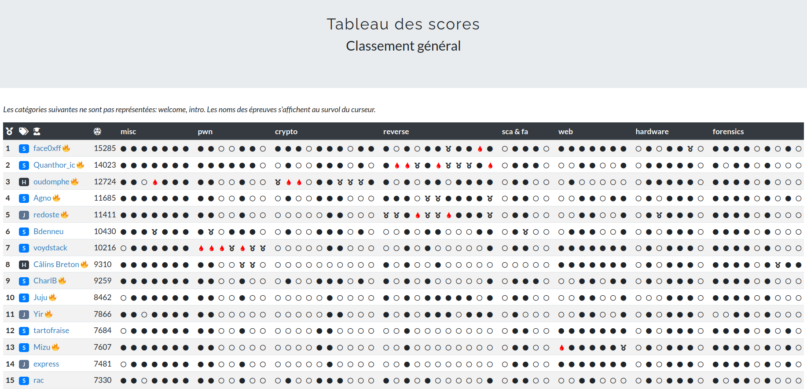
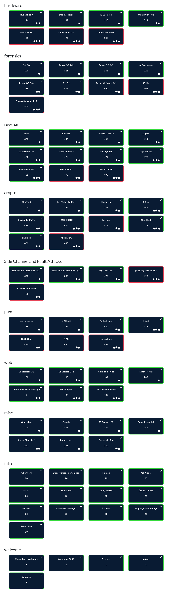

# FCSC 2022

I participated in the **France Cyber Security Challenge 2022** (04/29 - 05/08) in the *Senior* category.

I managed to rank **1st place** in the global ranking, among over 1500 participants.
This was my ultimate goal after ranking 3rd in last year's competition, and I am very pleased to have managed to fulfill it.

I wrote two write-ups which were required for the qualification, on the following challenges:
* [httpd (pwn)](./httpd/README.md)
* [Hyper Packer (reverse)](./hyper-packer/README.md)

