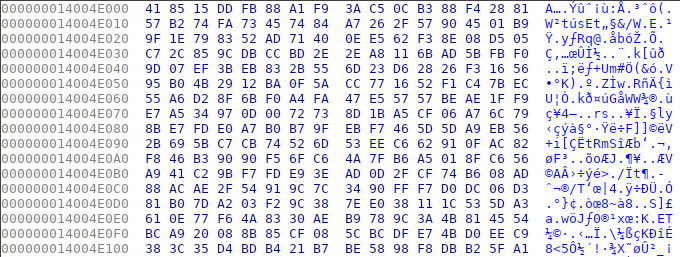

# Hyper Packer

**Hyper Packer** was a reverse challenge from FCSC 2022, of *medium* difficulty, and for which I got first blood.

We were asked to connect to a remote server that sends us multiple binaries, to unpack these and send back the secret they display.

## Preliminary analysis

First, we connect to the remote server once and solve the *proof-of-work* using `hashcash`, in order to retrieve a sample binary. Surprise, it's a Windows executable.

<pre style="background:rgba(20,20,40,0.9)">
<span style="color:#fff">╭─</span><b><span style="color:#67F86F">face@0xff</span></b><span style="color:#fff"> </span><b><span style="color:#6A76FB">~/ctf/fcsc/reverse/hyperpacker </span></b><span style="color:#fff">                                                      </span>
<span style="color:#fff">╰─</span><b><span style="color:#fff">$</span></b><span style="color:#fff"> file sample.exe                                                                              </span>
<span style="color:#fff">sample.exe: PE32+ executable (console) x86-64, for MS Windows</span>
</pre>

If we try to execute it, nothing really seems to happen. It just runs indefinitely.

Let's open up IDA. Although the executable is ~300KB, there are very few functions:


The `main` function looks like this:


It first calls `sub_140097203`, and if it succeeded, calls `sub_1400973F0` next. We notice these two sub-functions have an address as argument: `0x14004E000`, which is the start of the `.data` section. If we look at what's in there, all we can see is lots of high entropy data, which accounts for the vast majority of the file's size.



Let's check out the second function first (`sub_1400973F0`) because it will be easier to understand.

```c
_BOOL8 __fastcall sub_1400973F0(__int64 data)
{
  _BOOL8 result; // rax
  __int64 v2; // [rsp+128h] [rbp-18h]
  __int64 v3; // [rsp+130h] [rbp-10h]

  result = 0;
  if ( CheckMZ((_QWORD *)data) )
  {
    v2 = CheckPE(data);
    if ( v2 )
    {
      v3 = sub_14009773A(v2, data, 0x48A7Ci64);
      if ( v3 )
      {
        if ( sub_1400974A6(v3) && sub_140097647(v2, data, 0x48A7Ci64) )
          result = 1;
      }
    }
  }
  return result;
}
```

The functions `CheckMZ` and `CheckPE` simply check that the `data` buffer starts with `MZ` and also contains a PE header. Therefore, these are checks for a valid executable file. We understand another executable shall be unpacked, or decrypted, to this buffer.

We also guess the next functions take care of loading this new executable and running it, hence we will rename `sub_1400973F0` as `CheckAndRun`.

Let's now dive into the `sub_140097203` function, which we suppose is what unpacks the executable.

## Reversing the unpacking algorithm

Let's go through the `Unpack` function.

First, a 16-byte buffer (`v6`) is set to all null bytes. This could very be a key for a block cipher like AES. We will rename it `key` for the future.

```c
char *v1; // rdi
__int64 v2; // rcx
char v6[16]; // [rsp+118h] [rbp-18h] BYREF

v1 = v6;
v2 = 16i64;
do
{
  *v1++ = 0;
  --v2;
}
while ( v2 );
```

Next, `0x48A80` bytes of memory are allocated and the `data` buffer is copied to this newly allocated space.

```c
v3 = VirtualAlloc(0i64, 0x48A80ui64, 0x3000u, 4u);
if ( v3 )
{
  lpAddress = v3;
  qmemcpy(v3, data, 0x48A80ui64);
LABEL_5:
  if ( sub_1400971C8((__int64)data, (__int64)v6) )
  {
    sub_140097132(lpAddress, data, v6, 18600i64);
    LODWORD(v4) = VirtualFree(lpAddress, 0i64, 0x8000u);
    if ( v4 )
      return 1i64;
  }
  else
  {
    qmemcpy(data, lpAddress, 0x10ui64);
    while ( sub_1400973B3(v6) )
    {
      if ( !sub_140097358(v6, 0x140096A80i64, 16i64) )
        goto LABEL_5;
    }
  }
}
return 0i64;
```

The remaining part makes more sense if we write it with a `while` loop:

```c
while (1) {
  if (sub_1400971C8(data, key)) {
    sub_140097132(lpAddress, data, key, 0x48A8);
    VirtualFree(lpAddress, 0, 0x8000);
    break;
  } else {
    qmemcpy(data, lpAddress, 0x10ui64);
    while (sub_1400973B3(key)) {
      if (!sub_140097358(key, 0x140096A80, 16))
        break;
    }
  }
}
```

The `sub_1400971C8` function takes the `data` and `key` buffers as input.
It is rather straightfoward:

```c
_BOOL8 __fastcall sub_1400971C8(__int64 data, __int64 key)
{
  _QWORD outbuf[2]; // [rsp+10h] [rbp-10h] BYREF

  sub_140097132(data, outbuf, key, 1i64);
  return CheckMZ(outbuf);
}
```

It calls `sub_140097132`, which is the same function that is called in `Unpack` right after this the call to this function, although with different arguments: `0x48A8` instead of `1` here.

We notice `0x48A8` is `0x48A80` divided by 16, in other words `0x48A8` is the number of 16-byte blocks in the `data` buffer, which supports the idea of AES-like symmetrical encryption.

Then, it checks whether `outbuf` starts with `"MZ"`. This surely means `sub_140097132` decrypts a first block of `data`, and a basic heuristic is used to determine whether the decryption was successful. We will rename this function to `GoodFirstBlock`, and the `sub_140097132` function to `DecryptData`.

If it passes the check for the first block, then it proceeds to decrypt the entire `data` buffer. If it does not, then something happens with the `key`:

```c
while (sub_1400973B3(key)) {
  if (!sub_140097358(key, 0x140096A80, 16))
    break;
}
```

The first function, `sub_1400973B3`, is easy to understand:

```c
__int64 __fastcall sub_1400973B3(_BYTE *key)
{
  _BYTE *v1; // rax

  v1 = key;
  do
  {
    if ( ++*v1 != 0xFF )
      return 1i64;
    *v1++ = 0;
  }
  while ( v1 != key + 16 );
  return 0i64;
}
```

It increments the `key` buffer, viewed as a 16-byte integer in little endian. We will rename it to `Increment`.

The second function, `sub_140097358`, takes the `key` and an address (`0x140096A80`) as input:

```
.data:0000000140096A80 unk_140096A80   db    0                 ; DATA XREF: DecryptData+54↓o
.data:0000000140096A81                 db  98h ; ˜
.data:0000000140096A82                 db    0
.data:0000000140096A83                 db    0
.data:0000000140096A84                 db 0C8h ; È
.data:0000000140096A85                 db    0
.data:0000000140096A86                 db    0
.data:0000000140096A87                 db    0
.data:0000000140096A88                 db    0
.data:0000000140096A89                 db    0
.data:0000000140096A8A                 db    0
.data:0000000140096A8B                 db    0
.data:0000000140096A8C                 db    0
.data:0000000140096A8D                 db    0
.data:0000000140096A8E                 db    0
.data:0000000140096A8F                 db    0
```


What it does is ensure that all the bits set to 1 in the key lie at positions defined by a certain mask (`unk_140096A80`). For instance (with a reduced number of bits), with the mask `01100010`, the key `01000010` passes the check, but the key `01100011` does not. We will rename this function to `CheckBitMask`.

Therefore, the following loop increments the key until it finds a key that satisfies the mask.

```c
while (Increment(key)) {
  if (!CheckBitMask(key, mask, 16))
    break;
}
```

We understand now why the executable never really manages to finish unpacking itself: this loop is extremely unefficient. It comes down to brute-forcing to $2^{128}$ keys worst-case scenario until finding one that satisifes the mask. 

It is much easier to brute-force all the possible subsets of bit indexes given by the mask, since the mask only contains a few one bits.

Finally, let's reverse at the `DecryptData` function. 

```c
__int64 __fastcall DecryptData(__int64 data, _BYTE *outbuf, __int64 key, __int64 n_blocks) {
  __int64 result; // rax
  __int64 v5; // rcx
  _BYTE *v6; // r9
  _BYTE *v7; // r8
  __int64 v9; // [rsp+20h] [rbp-30h]
  _BYTE *v11; // [rsp+28h] [rbp-28h]
  __int64 v13; // [rsp+38h] [rbp-18h]
  char v14; // [rsp+40h] [rbp-10h]

  v14 = 1;
  result = InitRoundKeys(key);
  while ( n_blocks ) {
    result = DecryptAESBlock(data, outbuf);
    v5 = 0i64;
    v6 = v11;
    if ( v14 == 1 ) {
      v7 = &mask;
      v14 = 0;
    } else {
      v7 = (_BYTE *)(v9 - 16);
    }
    do {
      *v6++ ^= *v7++;
      ++v5;
    }
    while ( v5 != 16 );
    data = v9 + 16;
    outbuf = v11 + 16;
    n_blocks = v13 - 1;
  }
  return result;
}
```

The `InitRoundKeys` and `DecryptAESBlock` functions were easily recognizable because of the heavy use of XMM registers and AES-related instructions specific to Intel. For instance, the following `DecryptAESBlock` function leverages the `aesdec` instruction with the XMM registers `xmm5` to `xmm15` already filled with the round keys.


As we can see, a XOR is performed at the end of each block, hinting at CBC mode decryption. Under this hypothesis, we notice the `mask` is also used as the initialization vector for the decryption. One can verify the hypothesis of AES-128-CBC by debugging the executable.

All there is left for us to do is to implement the unpacking algorithm for generalized executables.

## Solution implementation

If we ask for a few more executables, we notice the only parts that change through these are the encrypted `data` and the `mask` value.

We can then easily fetch an executable, extract the relevant parts (the packed data and the mask) and run our "optimized brute-force" to find the key. Once the binary is unpacked, we get a new executable that runs:


Fortunately for us, there is no obfuscation in this unpacked binary: the secret string can be found inside it in cleartext.

<pre style="background:rgba(20,20,40,0.9)">
<span style="color:#fff">╭─</span><b><span style="color:#67F86F">face@0xff</span></b><span style="color:#fff"> </span><b><span style="color:#6A76FB">~/ctf/fcsc/reverse/hyperpacker </span></b><span style="color:#fff">                                                       </span>
<span style="color:#fff">╰─</span><b><span style="color:#fff">$</span></b><span style="color:#fff"> python3.9 solve_pow.py                                                                        </span>
<span style="color:#fff">[</span><b><span style="color:#67F86F">+</span></b><span style="color:#fff">] Opening connection to challenges.france-cybersecurity-challenge.fr on port 2202: Done         </span>
<span style="color:#fff">[</span><b><span style="color:#6A76FB">*</span></b><span style="color:#fff">] Solving PoW                                                                                   </span>
<span style="color:#fff">[</span><b><span style="color:#67F86F">+</span></b><span style="color:#fff">] Solved PoW: 1:26:220507:603e6556f2108faf::kDm1OewN30GkkNXF:6wHth                              </span>
<span style="color:#fff">b'Here is your binary:\n'                                                                         </span>
<span style="color:#fff">[</span><b><span style="color:#67F86F">+</span></b><span style="color:#fff">] Binary written at /tmp/hyperpacker.bin                                                        </span>
<span style="color:#fff">b'Please input the secret within 60 seconds:\n'                                                   </span>
<span style="color:#fff">00000000000000190010000000000000                                                                  </span>
<span style="color:#fff">b'MZ\x90\x00\x03\x00\x00\x00\x04\x00\x00\x00\xff\xff\x00\x00'                                     </span>
<span style="color:#fff">00000000000000190000000000000000                                                                  </span>
<span style="color:#fff">b'BLPEN3FICK5OJEXG80YQS83HRIDGAS1M'                                                               </span>
<span style="color:#fff">b'Well done!\n'                                                                                </span>
<span style="color:#fff"></span>
<span style="color:#fff">[...]</span>
<span style="color:#fff"></span>
<span style="color:#fff">b'Here is your binary:\n'                                                                         </span>
<span style="color:#fff">[</span><b><span style="color:#67F86F">+</span></b><span style="color:#fff">] Binary written at /tmp/hyperpacker.bin                                                        </span>
<span style="color:#fff">b'Please input the secret within 60 seconds:\n'                                                   </span>
<span style="color:#fff">000000ac7488349c0000000000000000                                                                  </span>
<span style="color:#fff">b'MZ\x90\x00\x03\x00\x00\x00\x04\x00\x00\x00\xff\xff\x00\x00'                                     </span>
<span style="color:#fff">0000002c300034840000000000000000                                                                  </span>
<span style="color:#fff">b'G46PZ0L9PIMUZAUA6J7SK4USE451ZIQK'                                                               </span>
<span style="color:#fff">b'Well done!\n'                                                                                   </span>
<span style="color:#fff">b'Congratulations! Here is your flag: FCSC{2b60aef3d241d3c37c30373a9a4446017a6d5b6761ae5492e3f824e</span>
<span style="color:#fff">280cb8ceb}\n'  </span>
</pre>

### Solve script

```python
import subprocess
from pwn import *
from Crypto.Cipher import AES
from itertools import chain, combinations


def powerset(iterable):
    xs = list(iterable)
    return chain.from_iterable(combinations(xs,n) for n in range(len(xs)+1))


def decrypt(data, key, IV):
    cipher = AES.new(key, AES.MODE_CBC, IV=IV)
    return cipher.decrypt(data)


HOST = args.HOST or "challenges.france-cybersecurity-challenge.fr"
PORT = args.PORT or 2202


def main():
    r = remote(HOST, PORT)
    _ = r.recvlines(5)

    cmdline = r.recvline().strip().decode("utf-8").split(" ")
    assert cmdline[0] == "hashcash"
    assert cmdline[1] == "-mb26"
    assert cmdline[2].isalnum()

    log.info(f"Solving PoW")
    solution = subprocess.check_output([cmdline[0], cmdline[1], cmdline[2]])
    log.success(f"Solved PoW: {solution.decode()}")

    r.send(solution)

    while True:
        _ = r.recvline()
        print(_)

        encoded = r.recvline().strip()
        binary = b64d(encoded)

        with open("/tmp/hyperpacker.bin", "wb") as fp:
            fp.write(binary)

        log.success("Binary written at /tmp/hyperpacker.bin")
        print(r.recvline())

        magic_data = binary[0x400:0x400 + 0x48a80]
        IV = binary[0x48e80:0x48e80 + 0x10]
        print(IV.hex())
        
        bin_iv = f"{int.from_bytes(IV, byteorder='big'):0128b}"
        ones = [i for i in range(128) if bin_iv[i] == "1"]

        found = False
        for subset in powerset(ones):
            int_key = 0
            for bit_index in subset:
                int_key ^= 1 << (127 - bit_index)

            key = int_key.to_bytes(length=16, byteorder="big")

            first_block = decrypt(magic_data[:16], key, IV)
            if first_block[:2] == b"MZ":
                if b"PE" in decrypt(magic_data[:256], key, IV):
                    found = True
                    break

        if not found:
            print("not found :(")
            exit(1)

        print(first_block)
        print(key.hex())

        decrypted = decrypt(magic_data, key, IV)
        secret = decrypted.split(b"SECRET is : ")[1].split(b"\x00")[0]
        print(secret)

        r.sendline(secret)
        print(r.recvline())


if __name__ == "__main__":
    main()

"""
FCSC{2b60aef3d241d3c37c30373a9a4446017a6d5b6761ae5492e3f824e280cb8ceb}
"""
```
