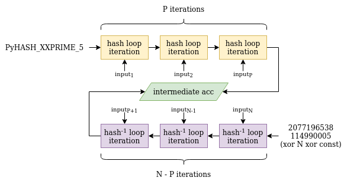

# Khal Hash

**Khal Hash** was a cryptography challenge from FCSC 2022, of *hard* difficulty.

The goal of the challenge was basically to perform a **preimage attack** on Python's **`hash`** function, with some additional constraints. More particularly, we had to find a **tuple** of ASCII bytes ($$< 128$$) that hashes to `2077196538114990005`.

```python
#!/usr/bin/env python3.9
try:
    flag = tuple(open("flag.txt", "rb").read())
    assert len(flag) == 70

    challenge = hash(flag)
    print(f"{challenge = }")

    T = tuple(input(">>> ").encode("ascii"))
    if bytes(T).isascii() and hash(T) == challenge:
        print(flag)
    else:
        print("Try harder :-)")
except:
    print("Error: please check your input")
```

```
╭─face@0xff ~/ctf/fcsc/crypto/khalhash 
╰─$ nc challenges.france-cybersecurity-challenge.fr 2104
challenge = 2077196538114990005
>>>
```

## Python's hash function

Python's hash function is a builtin that can compute a 64-bit hash value for many types of object (but not every single one of them — dicts, for instance, are unhashable). Their main purpose is to enable quick look-up of values in data structures such as dicts or sets. They are by no means meant to be cryptographically secure.

For *tuples* specifically, the source code of the hash computation algorithm can be found [here](https://github.com/python/cpython/blob/3.9/Objects/tupleobject.c):

```c
#define _PyHASH_XXPRIME_1 ((Py_uhash_t)11400714785074694791ULL)
#define _PyHASH_XXPRIME_2 ((Py_uhash_t)14029467366897019727ULL)
#define _PyHASH_XXPRIME_5 ((Py_uhash_t)2870177450012600261ULL)
#define _PyHASH_XXROTATE(x) ((x << 31) | (x >> 33))  /* Rotate left 31 bits */

static Py_hash_t tuplehash(PyTupleObject *v)
{
    Py_ssize_t i, len = Py_SIZE(v);
    PyObject **item = v->ob_item;

    Py_uhash_t acc = _PyHASH_XXPRIME_5;
    for (i = 0; i < len; i++) {
        Py_uhash_t lane = PyObject_Hash(item[i]);
        if (lane == (Py_uhash_t)-1) {
            return -1;
        }
        acc += lane * _PyHASH_XXPRIME_2;
        acc = _PyHASH_XXROTATE(acc);
        acc *= _PyHASH_XXPRIME_1;
    }

    acc += len ^ (_PyHASH_XXPRIME_5 ^ 3527539UL);

    if (acc == (Py_uhash_t)-1) {
        return 1546275796;
    }
    return acc;
}
```

Knowing that Python integers hash to themselves, we can rewrite the algorithm for integer tuples this way in Python:

```python
PyHASH_XXPRIME_1 = 11400714785074694791
PyHASH_XXPRIME_2 = 14029467366897019727
PyHASH_XXPRIME_5 = 2870177450012600261
MASK = 0xFFFFFFFFFFFFFFFF

def hash_python(L):
  acc = PyHASH_XXPRIME_5
  for item in L:
    acc = (acc + item * PyHASH_XXPRIME_2) & MASK
    acc = ((acc << 31) | (acc >> 33)) & MASK
    acc = (acc * PyHASH_XXPRIME_1) & MASK
  acc = (acc + (len(L) ^ (PyHASH_XXPRIME_5 ^ 3527539))) & MASK
  return acc
```

We need to find a tuple of arbitrary length, with elements that are integers between 0 and 127 inclusive, that hashes to `2077196538114990005`.

I tried naively throwing z3 at this problem, by fixing the length of the tuple and increasing it when z3 determined the constraints were not satisfiable. This obviously did not work, otherwise the challenge would have been too easy.

Indeed, we can sense that in order to trigger a collision with the target value, we would need at least around 9 bytes in our tuple (this makes 63 bits of entropy), perhaps 10 bytes.

Brute-forcing around $$2^{64}$$ input values is way out of the question on a regular modern computer. Is there some kind of flaw that could allow us to construct an input that hashes to the target value?

With only the first and third lines in the for loop, it would have been easy as the function would become linear. Unfortunately, the bit rotation step breaks this linearity and makes it really hard to follow how tweaking the input impacts the output.

## Meet me in the middle

When looking up "python hash collision" on Google, I stumbled upon this blog post: [Efficiently generating Python hash collisions](https://www.leeholmes.com/efficiently-generating-python-hash-collisions/).

It highlights how in Python 3.2 and below, the `hash` function was vulnerable to a [MITM (Meet-in-the-Middle) attack](https://en.wikipedia.org/wiki/Meet-in-the-middle_attack). I realized even though the algorithm has changed since, we can still perform such an attack because the operations that are carried out are all **reversible**.

Naturally, you could go through the algorithm the opposite direction, knowing the target hash and the bytes that compose the input in the reverse order: you would then recover all the intermediate `acc` values and eventually get back the `_PyHASH_XXPRIME_5` constant.

The attack becomes clear now: the search space can drop from $$2^{64}$$ to $$2^{32}$$ by brute-forcing half the input length forward, half the input length backward, and leverage the birthday paradox theorem.

With only around $$2^{32}$$ inputs, we would have a decent chance of finding an intermediate `acc` value that has also been computed with around $$2^{32}$$ inputs in the *backwards* version of the algorithm.



Once we found a common intermediate `acc` value, we only have to concatenate the two found paths to get our solution to the preimage problem.

There's just one drawback with this method: it brings significant **space complexity**. Indeed, we need to store all the intermediate `acc` values to be able to look up if the one we computed backwards has already been computed forward.

Ideally, we want this LUT (look-up table) to tell us if we have already seen an intermediate value in $$O(1)$$, therefore it should be indexed with the intermediate `acc` value (e.g. `LUT[acc] = path_half`). This requires $$2^{64} \times \text{sizeof}(\text{path\_half})$$ bytes, which is out of the question.

We need to find some kind of compromise between space complexity and time complexity to find a real candidate: because reducing space complexity will inevitably bring collisions here, we will find many candidates for a common intermediate `acc` value, and we will have to check each time whether it is an actual one or not.

## Implementing the attack

For my solution, I tried to make the most of the RAM available on my computer. I chose to index my look-up table with 31 bit integers, each element in the table being a 4-byte path. This takes up **8 GB** of RAM.

```c
uint32_t *LUT = mmap(NULL, 2147483648 * sizeof(uint32_t), PROT_READ | PROT_WRITE, MAP_PRIVATE | MAP_ANONYMOUS, 0, 0);
```

Therefore, intermediate hash values would need to be reduced to 31 bits, which I did with a simple mask:

```c
hash = intermediate_forward(prefix, size);
lut_index = hash & 0x7FFFFFFF;
LUT[lut_index] = (prefix[0] << 24) | (prefix[1] << 16) | (prefix[2] << 8) | prefix[3];
```

The `intermediate_forward` function takes a prefix path of bytes and its size (here, 4). It returns the intermediate `acc` value for this path.

```c
uint64_t intermediate_forward(unsigned char *v, size_t len)
{
    uint64_t acc = _PyHASH_XXPRIME_5;
    for (size_t i = 0; i < len; i++) {
        acc += ((uint64_t) v[i]) * _PyHASH_XXPRIME_2;
        acc = _PyHASH_XXROTATE(acc);
        acc *= _PyHASH_XXPRIME_1;
    }
    return acc;
}
```

I also implemented an `intermediate_backward` function:

```c
uint64_t intermediate_backward(unsigned char *v, size_t len, size_t total_len, uint64_t hash)
{
    uint64_t acc = hash;
    // Total len shall take into account the prefix that is not here
    acc -= total_len ^ (_PyHASH_XXPRIME_5 ^ 3527539UL);
    for (size_t i = 0; i < len; i++) {
        acc *= _PyHASH_XXPRIME_1_inv;
        acc = _PyHASH_XXROTATE_inv(acc);
        acc -= ((uint64_t) v[i]) * _PyHASH_XXPRIME_2;
    }
    return acc;
}
```

My exploit first fills the LUT with all the $$2^{28}$$ possible intermediate values for 4-byte prefix paths. Then, it brute-forces 6-byte suffix paths until finding a matching entry in the LUT, and ensures that this entry is a valid one by concatenating the two paths and computing the final hash.


After 30 minutes to 1 hour, I finally get a valid candidate:

```
Found: 43 0f 39 6a 40 04 01 28 36 39
```

Let's try it out in Python:

```python
>>> hash(tuple(b"\x43\x0f\x39\x6a\x40\x04\x01\x28\x36\x39"))
2077196538114990005
```

It works! Now we send it to the remote, and get back the flag.

```
$ echo -e "\x43\x0f\x39\x6a\x40\x04\x01\x28\x36\x39" | nc challenges.france-cybersecurity-challenge.fr 2104
challenge = 2077196538114990005
>>> (70, 67, 83, 67, 123, 49, 100, 52, 51, 99, 100, 57, 49, 48, 101, 53, 55, 55, 53, 98, 56, 48, 99, 97, 55, 97, 50, 99, 51, 57, 51, 53, 102, 99, 53, 99, 55, 54, 98, 50, 48, 55, 100, 50, 98, 98, 52, 52, 97, 53, 57, 54, 98, 52, 55, 52, 53, 50, 49, 100, 55, 55, 54, 98, 56, 101, 52, 49, 50, 125)
```

```python
>>> bytes((70, 67, 83, 67, 123, 49, 100, 52, 51, 99, 100, 57, 49, 48, 101, 53, 55, 55, 53, 98, 56, 48, 99, 97, 55, 97, 50, 99, 51, 57, 51, 53, 102, 99, 53, 99, 55, 54, 98, 50, 48, 55, 100, 50, 98, 98, 52, 52, 97, 53, 57, 54, 98, 52, 55, 52, 53, 50, 49, 100, 55, 55, 54, 98, 56, 101, 52, 49, 50, 125))
b'FCSC{1d43cd910e5775b80ca7a2c3935fc5c76b207d2bb44a596b474521d776b8e412}'
```


PS: I am deeply sorry to that person I kicked out of the top 3 crypto senior ranking by solving this challenge, who had already submitted their write-ups. 😭

### Full solution code

```c
#include <stdint.h>
#include <stdio.h>
#include <stdlib.h>
#include <string.h>
#include <sys/mman.h>

#define _PyHASH_XXPRIME_1 ((uint64_t) 11400714785074694791ULL)
#define _PyHASH_XXPRIME_2 ((uint64_t) 14029467366897019727ULL)
#define _PyHASH_XXPRIME_5 ((uint64_t) 2870177450012600261ULL)
#define _PyHASH_XXROTATE(x) ((x << 31) | (x >> 33))

#define _PyHASH_XXPRIME_1_inv ((uint64_t) 614540362697595703ULL)
#define _PyHASH_XXROTATE_inv(x) ((x << 33) | (x >> 31))


uint64_t tuplehash(unsigned char *v, size_t len)
{
    uint64_t acc = _PyHASH_XXPRIME_5;
    for (size_t i = 0; i < len; i++) {
        acc += ((uint64_t) v[i]) * _PyHASH_XXPRIME_2;
        acc = _PyHASH_XXROTATE(acc);
        acc *= _PyHASH_XXPRIME_1;
    }
    acc += len ^ (_PyHASH_XXPRIME_5 ^ 3527539UL);
    return acc;
}

uint64_t intermediate_forward(unsigned char *v, size_t len)
{
    uint64_t acc = _PyHASH_XXPRIME_5;
    for (size_t i = 0; i < len; i++) {
        acc += ((uint64_t) v[i]) * _PyHASH_XXPRIME_2;
        acc = _PyHASH_XXROTATE(acc);
        acc *= _PyHASH_XXPRIME_1;
    }
    return acc;
}

uint64_t intermediate_backward(unsigned char *v, size_t len, size_t total_len, uint64_t hash)
{
    uint64_t acc = hash;
    // Total len shall take into account the prefix that is not here
    acc -= total_len ^ (_PyHASH_XXPRIME_5 ^ 3527539UL);
    for (size_t i = 0; i < len; i++) {
        acc *= _PyHASH_XXPRIME_1_inv;
        acc = _PyHASH_XXROTATE_inv(acc);
        acc -= ((uint64_t) v[i]) * _PyHASH_XXPRIME_2;
    }
    return acc;
}

void increment(unsigned char x[], size_t size) {
    for(size_t i = 0; i < size; i++) {
        x[i]++;
        if (i >= 4) {
            printf("%d\n", x[i]);
        }
        if (x[i] == 128) {
            x[i] = 0;
        } else {
            break;
        }
    }
}

int main() {

    unsigned char prefix[64] = { 0 };
    unsigned char max[64] = { 0 };
    uint64_t hash;
    uint64_t lut_index;

    size_t size = 4; 

    // 8 GB RAM LUT
    uint32_t *LUT = mmap(NULL, 2147483648 * sizeof(uint32_t), PROT_READ | PROT_WRITE, MAP_PRIVATE | MAP_ANONYMOUS, 0, 0);

    if(LUT == MAP_FAILED){
        perror("mmap");
        return 1;
    }

    memset(max, 0x7F, sizeof(max));
    memset(prefix, 0, sizeof(prefix));
    memset(LUT, 0, sizeof(LUT));

    puts("Creating LUT...");

    while (1) {

        hash = intermediate_forward(prefix, size);

        // 31 bits to address LUT.
        // There can be collisions, but there should be few since we are brute-forcing a 28-bit prefix.
        lut_index = hash & 0x7FFFFFFF;
        LUT[lut_index] = (prefix[0] << 24) | (prefix[1] << 16) | (prefix[2] << 8) | prefix[3];

        increment(prefix, size);

        if (!memcmp(prefix, max, size)) {
            break;
        }
    
    }

    puts("Finished filling LUT. Gonna brute-force backwards now...");

    uint64_t target_hash = 2077196538114990005;

    unsigned char suffix[64] = { 0 }; // Suffix will be stored in reverse
    unsigned char final[64] = { 0 };
    memset(max, 0x7F, sizeof(max));
    memset(suffix, 0, sizeof(suffix));
    memset(final, 0, sizeof(suffix));

    size = 6;

    while (1) {

        hash = intermediate_backward(suffix, size, 4 + size, target_hash);
        lut_index = hash & 0x7FFFFFFF;
        
        if (LUT[lut_index] != 0x00000000) {
            final[0] = (LUT[lut_index] >> 24) & 0xFF;
            final[1] = (LUT[lut_index] >> 16) & 0xFF;
            final[2] = (LUT[lut_index] >> 8) & 0xFF;
            final[3] = LUT[lut_index] & 0xFF;
            final[4] = suffix[5];
            final[5] = suffix[4];
            final[6] = suffix[3];
            final[7] = suffix[2];
            final[8] = suffix[1];
            final[9] = suffix[0];

            hash = tuplehash(final, 4 + size);
            if (hash == target_hash) {
                printf("Found: %02x %02x %02x %02x %02x %02x %02x %02x %02x %02x\n", final[0], final[1], final[2], final[3], final[4], final[5], final[6], final[7], final[8], final[9]);
            }
        }

        increment(suffix, size);

        if (!memcmp(suffix, max, size)) {
            break;
        }
    
    }

    return 0;
}
```