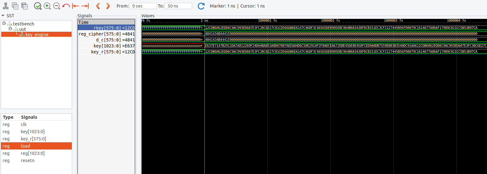

# Cubik'cipher

**Cubik'cipher** was a challenge from the @HackDay Qualifications 2022 in the **hardware** category, with 3 solves. The challenge in itself was a mixture of hardware and crypto and was a fun introduction to VHDL, as well as an opportunity for me to learn playing with some HDL-specific tools, which was out of my comfort zone.


## Description

> *A month ago, a spy managed to infiltrate the secret lair of an enemy!*
> *This one was developing his own data encryptor!*
> *Since then, it seems that the enemy has finished it, so it's up to us to build the decryptor that will allow us to spy on him without him noticing!*
> *The flag is of the form HACKDAY{...}*

We were given several files:
* `cubik_cipher.vhd`, `cubik_pkg.vhd` and `key_randomize.vhd`:  VHDL sources for a cryptographic algorithm implementation, which included encryption only.
* `test_vector.txt`: a file containing an example case of plaintext, key and corresponding ciphertext.
* `flag.txt`: a file containing a ciphertext and a key.

The goal of the challenge is therefore clear: we have to implement the algorithm that will decrypt the flag. We also understand that this is not an *actual* crypto challenge — in the sense that, even though the algorithm may be original, it is not expected to find weaknesses in it in order to solve the challenge, as the key is given.

Globally, there are two main routes one can choose from:
* Implement decryption directly in VHDL.
* Translate the whole algorithm to another language, use the test vector to make sure encryption works correctly, and implement decryption.

Since I didn't feel comfortable enough to go for the first option, I rewrote the algorithm in Python with Sage. But first, we need to look at the sources and understand the algorithm.


## Understanding the cryptography

Prior to anything, let's take a look at `test_vector.txt` and `flag.txt`.

```
data : 4841434B4441590000000000000000000000000000000000000000000000000000000000000000000000000000000000000000000000000000000000000000000000000000000000
key : e637e7147b2911da7a812269f24da4ba853a8d07087aeea84d6c50e2914f2f8adcea672ebe45de8e458fced9a0db7559eb83b3548dc91aa612cdb6062edd6c9ac993ed607e3fc38c6e27c81cd5666b6ea147c460f3c46565de8905ebc964b683430fdcb151ec3cf2127445b56fd0079c1614677a866f17989c021cc5b53b97ca
data_ciphered : 065A9D041EA0ABB6A38764BA3DCB6B13EFE3FC67DF249BFF149A8EFEA0984D52AC295403103023537198AFDE0C64D7AC5D23F2F25BE941C1AA8149E9FC174995D491F150E518AF26
```

```
data_ciphered : 79EEEF596B960C42262DFD1D0A2DB218FA3C71C681963F0CC389D3F0F5234C8023CA79D315186AF55621289F92AD6D9B657D999E074C84E13BFDAEDC94A3BA4FCB95B4013BFC40E5
key : f0ae2e1abee8afbe3ea424cc71f4ce17455a21d5df15cc4f6362e3af095cfb6da7188a9777c2c875ab39145a88a2142aea7b5411607110d70cd3d37c20f259b1920031990709d8e0e8d661b1a05fe8b5719aab6569835b3e52be738982608fda36549fd1e3398c725190356fbe97998b79f84f0ef23c4dea63898b52319a47a2
```

Before encryption, the plaintext is padded with null bytes to have a 576-bits block (72 bytes). The ciphertext is also a 576-bits block. The key, however, is much larger (1024 bits).

### Main entity

The "main" file in the VHDL sources is `cubik_cipher.vhd`:

```vhdl
library ieee;
use ieee.std_logic_1164.all;
use ieee.numeric_std.all;

use work.cubik_pkg.all;


entity cubik_cipher is
    generic (round_div_2 : positive := 8);
    port (
    resetn : in  std_logic;
    clk    : in  std_logic;
-- key
    key    : in std_logic_vector(1023 downto 0);
-- d in
    d_v_i  : in  std_logic;
    d_i    : in  std_logic_vector(data_width-1 downto 0);
-- dout
    d_c    : out std_logic_vector(data_width-1 downto 0);
    d_v_c  : out  std_logic
  );
end entity;

architecture rtl of cubik_cipher is
    constant key_w : positive := 576;
    type state is (idle, engine);
    signal current_state,next_state    : state;
    signal ctr_round : natural range 0 to 9;
    signal end_ctr,cmd_ctr : std_logic;
    signal rkey :  std_logic_vector(key_w-1 downto 0);
    signal reg_cipher :  std_logic_vector(d_i'range);
begin


process (clk, resetn) is
  begin
    if resetn = '0' then
      ctr_round <= 0;
    elsif rising_edge(clk) then
      if cmd_ctr = '0' then
        ctr_round <= 0;
      else
        ctr_round <= ctr_round + 1;
      end if;
    end if;
  end process;
end_ctr <= '1' when ctr_round = 9 else '0';

process (clk, resetn) is
begin
      if resetn = '0' then
          current_state <= idle;
      elsif rising_edge(clk) then
          current_state <= next_state;
      end if;
end process;

process (clk, resetn) is
begin
      if resetn = '0' then
          reg_cipher <= (others => '0');
      elsif rising_edge(clk) then
          if d_v_i = '1' and ctr_round = 0 then
            reg_cipher <= d_i;
          else 
            reg_cipher <= round(reg_cipher, rkey);
          end if;
      end if;
end process;
d_c <= reg_cipher;

process (current_state, end_ctr, d_v_i)
begin
  d_v_c <= '0';
  case current_state is
----------------------------
    when idle    =>
    if d_v_i = '1' then
      next_state <= engine;
    end if;
    cmd_ctr <= '0';
----------------------------
    when engine  =>
    if end_ctr = '1' then
      next_state <= idle;
      d_v_c <= '1';
      cmd_ctr <= '0';
    else 
      cmd_ctr <= '1';    
    end if;
----------------------------
end case;
end process;

  key_engine : entity work.key_randomize
  generic map(key_w => key_w)
  port map (
    resetn => resetn,
    clk    => clk,
    load   => d_v_i,
    key    => key,
    key_r  => rkey
  );
end architecture;
```

Note: again, I am not well-versed in hardware and HDL, so some of my explanations or the terminology that I use may be incorrect at times.

The following part describes the inputs and outputs of the `cubik_cipher` entity:

```vhdl
entity cubik_cipher is
    generic (round_div_2 : positive := 8);
    port (
    resetn : in  std_logic;
    clk    : in  std_logic;
-- key
    key    : in std_logic_vector(1023 downto 0);
-- d in
    d_v_i  : in  std_logic;
    d_i    : in  std_logic_vector(data_width-1 downto 0);
-- dout
    d_c    : out std_logic_vector(data_width-1 downto 0);
    d_v_c  : out  std_logic
  );
end entity;
```

We can see it needs a clock signal `clk`, an input key `key` (1024 bits), and input data `d_i` which is the plaintext. We will see that `d_v_i` dictates when the encryption process should start. The outputs are `d_c`, the ciphertext, and `d_v_c`, a bit that notifies the encryption process has terminated.

Then, the architecture for `cubik_cipher` is described at RTL (*Register Transfer Level*), which is a way to represent a circuit at a higher level of abstraction, using registers acting as signals.

```vhdl
architecture rtl of cubik_cipher is
    constant key_w : positive := 576;
    type state is (idle, engine);
    signal current_state,next_state    : state;
    signal ctr_round : natural range 0 to 9;
    signal end_ctr,cmd_ctr : std_logic;
    signal rkey :  std_logic_vector(key_w-1 downto 0);
    signal reg_cipher :  std_logic_vector(d_i'range);
begin
[...]
```

The architecture comprises several processes.

```vhdl
process (clk, resetn) is
    begin
        if resetn = '0' then
            ctr_round <= 0;
        elsif rising_edge(clk) then
            if cmd_ctr = '0' then
                ctr_round <= 0;
            else
                ctr_round <= ctr_round + 1;
            end if;
        end if;
    end process;
end_ctr <= '1' when ctr_round = 9 else '0';
```

This process keeps track of a *round counter* incremented at each clock rising edge. We learn that when the counter reaches 9, the `end_ctr` signal is set to 1. This hints at the algorithm being a block cipher with around 9 rounds. However, with the way VHDL works and how difficult it is to have a clear idea in mind of how logic is sequentially unfolded, I wasn't sure at this point that the number of rounds was *exactly* 9, and not something like 8 or 10.

```vhdl
process (clk, resetn) is
begin
    if resetn = '0' then
        reg_cipher <= (others => '0');
    elsif rising_edge(clk) then
        if d_v_i = '1' and ctr_round = 0 then
            reg_cipher <= d_i;
        else 
            reg_cipher <= round(reg_cipher, rkey);
        end if;
    end if;
end process;
d_c <= reg_cipher;
```

This process performs, at each clock rising edge, a round of encryption. At the beginning (`d_v_i = 1`), the `reg_cipher` signal is loaded with the plaintext (`d_i`). Then, each iteration, the `round` function is called on the `reg_cipher`, with a `rkey` parameter. The `d_c` signal, which is the output of the entity, is linked to the `reg_cipher`, and therefore contains the output ciphertext when all rounds have been computed.

Let's see what is this `rkey` signal:

```vhdl
key_engine : entity work.key_randomize
generic map(key_w => key_w)
port map (
    resetn => resetn,
    clk    => clk,
    load   => d_v_i,
    key    => key,
    key_r  => rkey
);
```

This portion of code maps inputs and outputs for another entity in another file `key_randomize.vhd`. The `rkey`, which we understand means "round key", is an output of this `key_randomize` entity. Let's check it out.

### Key randomization entity

```vhdl
library ieee;
use ieee.std_logic_1164.all;

entity key_randomize is
    generic (key_w : positive := 32);
    port (
	resetn : in std_logic;
    clk    : in std_logic;
    load   : in std_logic;
    key    : in std_logic_vector(1023 downto 0);
    key_r  : out std_logic_vector(key_w-1 downto 0)
  );
end entity;

architecture rtl of key_randomize is
signal reg : std_logic_vector(key'range);
begin
    process (clk,resetn) is
    begin
        if resetn = '0' then
            reg  <= (others => '1');
        elsif rising_edge(clk) then
            if load = '1' then
                reg <= key;
            else
                reg      <= reg(reg'length-2 downto 0) & reg(reg'high);
                reg(24)  <= reg(23) xor reg(reg'high);
                reg(421) <= reg(420) xor reg(reg'high);
                reg(476) <= reg(475) xor reg(reg'high);
                reg(545) <= reg(544) xor reg(reg'high);
                reg(923) <= reg(922) xor reg(reg'high);
            end if;
        end if;
    end process;
    key_r <= reg(key_r'range);
end architecture;
```

At first, when `load = 1` (`d_v_i = 1`), the key is loaded in the `reg` register, which acts as an internal state for a round key derivation function. At each clock rising edge, this internal state is updated by rotating it 1 bit to the left and flipping a few specific bits.

The output round key (`key_r`) is then a *projection* of the internal state, `key_w` being 576 bits. Therefore, even though the key is 1024 bits, the round keys are always 576 bits (least significant bits of the internal state).

### Core cryptographic entity

Let's now focus on the core part of the algorithm: the `round` function in `cubik_pkg.vhd`.

```vhdl
function round(data : std_logic_vector(data_width-1 downto 0) ;  key : std_logic_vector(575 downto 0)) return std_logic_vector is
    variable tmp : cubix;
    variable data_out : std_logic_vector(data'range);
begin
    tmp := slv2cubix(data);
    tmp := mixcubix(tmp, (m_0,m_1,m_2,m_3));
    tmp := roundcubix(tmp, key);
    tmp := swap_rows(tmp);
    data_out := cubix2slv(tmp);
    return data_out;
end round;
```

In order to perform calculations, the input data vector is converted (`slv2cubix`) to another representation, called **cubix**, and converted back to normal at the end (`cubix2slv`).

A **cubix** is composed of four $$4 \times 4$$ matrices which coefficients are **9-bit** integers, which I will call *nonets*. Indeed, even though the data vectors are 72 bytes long, 576 bits is divisible by 9, which gives **64 nonets**. These nonets are split in 4 groups of 16 nonets, each group populating a square matrix.

Denoting $$(m_0, \ldots, m_{63})$$ the input nonets, the cubix is therefore:

$$ \begin{bmatrix}d_{63} & d_{62} & d_{61} & d_{60} \\ d_{59} & d_{58} & d_{57} & d_{56} \\ d_{55} & d_{54} & d_{53} & d_{52} \\ d_{51} & d_{50} & d_{49} & d_{48}\end{bmatrix} \: \ldots \: \begin{bmatrix} d_{15} & d_{14} & d_{13} & d_{12} \\ d_{11} & d_{10} & d_{9} & d_{8} \\ d_{7} & d_{6} & d_{5} & d_{4} \\ d_{3} & d_{2} & d_{1} & d_{0} \end{bmatrix} $$

Then, the actual encryption part is carried through three different steps.

**Mix cubix.** This step uses four constant matrices $$m_0, m_1, m_2, m_3$$, defined as follows.

$$ \begin{bmatrix} 3 & 0 & 2 & 6 \\ 6 & 3 & 0 & 2 \\ 2 & 6 & 3 & 0 \\ 0 & 2 & 6 & 3 \end{bmatrix}, \begin{bmatrix} 6 & 4 & 3 & 0 \\ 0 & 6 & 4 & 3 \\ 3 & 0 & 6 & 4 \\ 4 & 3 & 0 & 6 \end{bmatrix}, \begin{bmatrix} 4 & 0 & 9 & 3 \\ 3 & 4 & 0 & 9 \\ 9 & 3 & 4 & 0 \\ 0 & 9 & 3 & 4 \end{bmatrix}, \begin{bmatrix} 2 & 4 & 0 & 9 \\ 9 & 2 & 4 & 0 \\ 0 & 9 & 2 & 4 \\ 4 & 0 & 9 & 2 \end{bmatrix} $$

```vhdl
function mixcubix(c : cubix;  mt : matrix_t) return cubix is
    variable tmp : cubix;
begin
    for k in cubix'range loop
        tmp(k) := mixmatrix(c(k),shiftmt(mt,k)); 
    end loop;
    return tmp;
end mixcubix;
```

Each matrix in the cubix is mixed using 4 matrices. More especially, if $$(C_0, C_1, C_2, C_3)$$ is the cubix:

$$ C_0 = \text{mixmatrix}(C_0, (m_0, m_1, m_2, m_3)) \\ C_1 = \text{mixmatrix}(C_1, (m_1, m_2, m_3, m_0)) \\ C_2 = \text{mixmatrix}(C_2, (m_2, m_3, m_0, m_1)) \\ C_3 = \text{mixmatrix}(C_3, (m_3, m_0, m_1, m_2)) $$

As for the `mixmatrix` function, it basically multiplies each row of the input matrix with the $$m_i$$ matrices:

$$ \text{mixmatrix}(C, (m_0, m_1, m_2, m_3)) = \begin{bmatrix} C^{(0)} m_0 \\ C^{(1)} m_1 \\ C^{(2)} m_2 \\ C^{(3)} m_3 \end{bmatrix} $$

```vhdl
function mixrow(r : row; m : matrix_c) return row is
    variable tmp : row;
begin
    for i in row'range loop
        tmp(i) := times(m(i,0),r(0)) xor times(m(i,1),r(1)) xor times(m(i,2),r(2)) xor times(m(i,3),r(3));
    end loop;
    return tmp;
end mixrow;

function mixmatrix(m : matrix; mt : matrix_t) return matrix is
    variable tmp : matrix;
begin
    for j in matrix'range loop
        tmp(j) := mixrow(m(j),mt(j)); 
    end loop;
    return tmp;
end mixmatrix;
```

However, the multiplications are carried out in a specific mathematical space. The function `times` implements a *double-and-add* algorithm.

```vhdl
function times2(n : nonaire) return nonaire is
    variable tmp :nonaire;
begin
    tmp := n(7 downto 4) & (n(3) xor n(8)) & n(2 downto 0) & n(8);
    return tmp;
end times2;   

function times(n1: nonaire; n2: nonaire) return nonaire is
    variable tmp : nonaire;
begin
    tmp := (others => '0');
    for i in n1'range loop
        if n1(i) = '1' then
            tmp := tmp xor n2;
        end if;
        if i > 0 then
            tmp := times2(tmp);
        end if;
    end loop;
    return tmp;
end times;
```

If the *add* operation is merely a XOR, the *double* operation is more intricate. A comment at the beginning of the file gives out a big hint:

```vhdl
-- Primitive polynomial = D^9+D^4+1  -- GF(512)
```

Operations are actually carried out in a [Galois Field](https://en.wikipedia.org/wiki/Finite_field), $$\text{GF}(512)$$, with the primitive polynomial $$D^9 + D^4 + 1$$. Roughly, this means a nonet can be seen as a polynomial modulo $$D^9 + D^4 + 1$$ (so max degree 8), whose coefficients are in $$\mathbb{Z}/2\mathbb{Z}$$ (so each coefficient is a bit of the nonet).

Matrices can be defined over this space since it is a field, and thus operations such as addition, multiplication, inverse... exist as well.

**Round cubix.** This second step is easier to understand. It simply performs a bitwise XOR between `tmp` and the round key:

```vhdl
function roundrow(r : row;  key : std_logic_vector(35 downto 0)) return row is
    variable tmp : row;
begin
    for i in row'range loop
        tmp(i) := r(i) xor key(9*(i+1)-1 downto 9*i); 
    end loop;
    return tmp;
end roundrow;

function roundmatrix(m : matrix;  key : std_logic_vector(143 downto 0)) return matrix is
    variable tmp : matrix;
begin
    for j in matrix'range loop
        tmp(j) := roundrow(m(j),key(36*(j+1)-1 downto 36*j)); 
    end loop;
    return tmp;
end roundmatrix;

function roundcubix(c : cubix;  key : std_logic_vector(575 downto 0)) return cubix is
    variable tmp : cubix;
begin
    for k in cubix'range loop
        tmp(k) := roundmatrix(c(k),key(144*(k+1)-1 downto 144*k)); 
    end loop;
    return tmp;
end roundcubix;
```

**Swap rows.** The final step is also quite simple — it only permutes the coefficients of the matrix a certain way:

```vhdl
function swap_rows (c: cubix) return cubix is
    variable tmp :cubix;
begin
    tmp (0)(0) := c(1)(1);
    tmp (0)(1) := c(3)(3);
    tmp (0)(2) := c(2)(2);
    tmp (0)(3) := c(2)(1);
    tmp (1)(0) := c(3)(1);
    tmp (1)(1) := c(2)(0);
    tmp (1)(2) := c(0)(1);
    tmp (1)(3) := c(1)(2);
    tmp (2)(0) := c(1)(0);
    tmp (2)(1) := c(0)(3);
    tmp (2)(2) := c(2)(3);
    tmp (2)(3) := c(3)(0);
    tmp (3)(0) := c(3)(2);
    tmp (3)(1) := c(0)(0);
    tmp (3)(2) := c(1)(3);
    tmp (3)(3) := c(0)(2);
    return tmp;
end swap_rows; 
```

We should have everything needed to implement the *encryption* algorithm. As for the Galois Field part, SageMath makes it easy.

But obviously, it didn't work at first try. As I presented it here, the algorithm seems rather unambiguous, but when you are in the process of reversing it, there are a lot of elements for which you have uncertainties. Indeed, many issues could happen at different levels:

* Actual bugs in my Python code
* Misunderstanding of the VHDL algorithm
  * Uncertainty about the number of rounds
  * Uncertainty about endianness at many steps
  * Uncertainty about indices
  * Is the key randomization function applied before or after the round function?
  * Did I understand the key randomization function properly? (especially with the fact that in VHDL, signals are updated at the end of a process)
  * Do the `times` and `times2` functions even do what I think they do?
  * Is my mathematical interpretation correct?
  * Is my translation to Sage correct?
  * ...

With so many doubts, it felt mandatory to run the original VHDL sources with the test vector and observe the state of the signals at each iteration, in order to debug my code.


## Creating a testbench for debugging

I read some documentation and wrote a testbench to interact with the `cubik_cipher` component:

```vhdl
library ieee;
use ieee.std_logic_1164.all;

use work.cubik_pkg.all;

entity testbench is
end testbench;

architecture behavior of testbench is
    component cubik_cipher is
        port (
          resetn : in  std_logic;
          clk    : in  std_logic;
      -- key
          key    : in std_logic_vector(1023 downto 0);
      -- d in
          d_v_i  : in  std_logic;
          d_i    : in  std_logic_vector(data_width-1 downto 0);
      -- dout
          d_c    : out std_logic_vector(data_width-1 downto 0);
          d_v_c  : out  std_logic
        );
    end component;
    signal resetn : std_logic := '0';
    signal input  : std_logic_vector(data_width-1 downto 0);
    signal output : std_logic_vector(data_width-1 downto 0);
    signal inputkey : std_logic_vector(1023 downto 0);
    signal d_v_i : std_logic := '0';
    signal d_v_c : std_logic := '0';
    signal clk : std_logic := '0';
    constant clk_period : time := 1 ns;
begin
    uut: cubik_cipher port map (
        resetn => resetn,
        clk => clk,
        key => inputkey,
        d_v_i => d_v_i,
        d_i => input,
        d_c => output,
        d_v_c => d_v_c
    );

    clk_process : process
    begin
        clk <= '0';
        wait for clk_period;
        clk <= '1';
        wait for clk_period;
    end process;

    stim_process: process
    begin
        wait for 1 ns;
        resetn <= '1';
        inputkey <= "1110011000110111111001110001010001111011001010010001000111011010011110101000000100100010011010011111001001001101101001001011101010000101001110101000110100000111000010000111101011101110101010000100110101101100010100001110001010010001010011110010111110001010110111001110101001100111001011101011111001000101110111101000111001000101100011111100111011011001101000001101101101110101010110011110101110000011101100110101010010001101110010010001101010100110000100101100110110110110000001100010111011011101011011001001101011001001100100111110110101100000011111100011111111000011100011000110111000100111110010000001110011010101011001100110101101101110101000010100011111000100011000001111001111000100011001010110010111011110100010010000010111101011110010010110010010110110100000110100001100001111110111001011000101010001111011000011110011110010000100100111010001000101101101010110111111010000000001111001110000010110000101000110011101111010100001100110111100010111100110001001110000000010000111001100010110110101001110111001011111001010";
        input <= "010010000100000101000011010010110100010001000001010110010000000000000000000000000000000000000000000000000000000000000000000000000000000000000000000000000000000000000000000000000000000000000000000000000000000000000000000000000000000000000000000000000000000000000000000000000000000000000000000000000000000000000000000000000000000000000000000000000000000000000000000000000000000000000000000000000000000000000000000000000000000000000000000000000000000000000000000000000000000000000000000000000000000000000000000000000000000000000000000000000000000000000000000000000000000000000000";
        d_v_i <= '1';
        wait for 1 ns;
        d_v_i <= '0';
        wait for 11 ns;
    end process;
end;
```

In order to simulate the circuit, I used [GHDL](https://github.com/ghdl/ghdl), an open-source compiler and simulator for VHDL.

I ran the simulation with `ghdl -r testbench --vcd=out.vcd --stop-time=50ns`. This generated a trace file in the VCD format, which I viewed with [GTKWave](http://gtkwave.sourceforge.net/). Here is what it looks like:




Thanks to this, I was able to determine that there were indeed 9 rounds and that the key started to be randomized *after* the first round. I could also debug my script step by step and compare my values to the signals, to locate where I made mistakes.

This allowed to have a working implementation of the encryption algorithm.


## Implementing decryption

The only thing that remained was to implement decryption. This should not be too hard — we only need to generate the round keys and follow the reverse steps for the rounds.

The **swap rows** and **round cubix** steps are trivial to invert (inverse permutation, and XOR the round key). As for the **mix cubix** step, its inverse it is actually the same operation, but with the **inverse matrices** for $$m_i$$ (which is also trivial to do thanks to Sage).

### Solution script

Here is the full script that implements encryption and decryption in Python and Sage.

```python
F.<D> = GF(2)[]
K.<x> = GF(512, name='x', modulus=D^9+D^4+1)

m0_ = [[3,0,2,6],[6,3,0,2],[2,6,3,0],[0,2,6,3]]
m1_ = [[6,4,3,0],[0,6,4,3],[3,0,6,4],[4,3,0,6]]
m2_ = [[4,0,9,3],[3,4,0,9],[9,3,4,0],[0,9,3,4]]
m3_ = [[2,4,0,9],[9,2,4,0],[0,9,2,4],[4,0,9,2]]

def swap_rows(c):
    tmp = [[0] * 4 for i in range(4)]
    tmp[0][0], tmp[0][1], tmp[0][2], tmp[0][3] = c[1][1], c[3][3], c[2][2], c[2][1]
    tmp[1][0], tmp[1][1], tmp[1][2], tmp[1][3] = c[3][1], c[2][0], c[0][1], c[1][2]
    tmp[2][0], tmp[2][1], tmp[2][2], tmp[2][3] = c[1][0], c[0][3], c[2][3], c[3][0]
    tmp[3][0], tmp[3][1], tmp[3][2], tmp[3][3] = c[3][2], c[0][0], c[1][3], c[0][2]
    return tmp

def inv_swap_rows(c):
    tmp = [[0] * 4 for i in range(4)]
    tmp[1][1], tmp[3][3], tmp[2][2], tmp[2][1] = c[0][0], c[0][1], c[0][2], c[0][3]
    tmp[3][1], tmp[2][0], tmp[0][1], tmp[1][2] = c[1][0], c[1][1], c[1][2], c[1][3]
    tmp[1][0], tmp[0][3], tmp[2][3], tmp[3][0] = c[2][0], c[2][1], c[2][2], c[2][3]
    tmp[3][2], tmp[0][0], tmp[1][3], tmp[0][2] = c[3][0], c[3][1], c[3][2], c[3][3]
    return tmp

def decimal2bin(d):
    return [int(_) for _ in f"{d:09b}"]

def bin2nonet(d):
    return K(d[::-1])

def nonet2bin(N):
    L = N.polynomial().list()
    while len(L) != 9:
        L.append(0)
    return L[::-1]

m0 = [[bin2nonet(decimal2bin(m0_[j][i])) for i in range(4)] for j in range(4)]
m1 = [[bin2nonet(decimal2bin(m1_[j][i])) for i in range(4)] for j in range(4)]
m2 = [[bin2nonet(decimal2bin(m2_[j][i])) for i in range(4)] for j in range(4)]
m3 = [[bin2nonet(decimal2bin(m3_[j][i])) for i in range(4)] for j in range(4)]

def slv2row(data):
    return [bin2nonet(data[9 * i:9 * (i + 1)]) for i in range(3, -1, -1)]

def slv2matrix(data):
    return [slv2row(data[36 * j:36 * (j + 1)]) for j in range(3, -1, -1)]

def slv2cubix(data):
    return [slv2matrix(data[144 * k:144 * (k + 1)]) for k in range(3, -1, -1)]

def row2slv(r):
    tmp = []
    for i in range(4):
        tmp = nonet2bin(r[i]) + tmp
    return tmp

def matrix2slv(m):
    tmp = []
    for j in range(4):
        tmp = row2slv(m[j]) + tmp
    return tmp

def cubix2slv(c):
    tmp = []
    for k in range(4):
        tmp = matrix2slv(c[k]) + tmp
    return tmp

def mixrow(r, m):
    return [
        (m[i][0] * r[0]) + (m[i][1] * r[1]) + (m[i][2] * r[2]) + (m[i][3] * r[3])
        for i in range(4)
    ]

def inv_mixrow(r, m):
    m_ = matrix(K, m)^(-1)
    return [
        (m_[i][0] * r[0]) + (m_[i][1] * r[1]) + (m_[i][2] * r[2]) + (m_[i][3] * r[3])
        for i in range(4)
    ]

def shiftmt(mt, p):
    return [mt[(l + p) % 4] for l in range(4)]

def mixmatrix(m, mt):
    return [mixrow(m[j], mt[j]) for j in range(4)]

def inv_mixmatrix(m, mt):
    return [inv_mixrow(m[j], mt[j]) for j in range(4)]

def mixcubix(c, mt):
    return [mixmatrix(c[k], shiftmt(mt, k)) for k in range(4)]

def inv_mixcubix(c, mt):
    return [inv_mixmatrix(c[k], shiftmt(mt, k)) for k in range(4)]

def roundrow(r, rsubsubkey):
    return [r[3 - i] + bin2nonet(rsubsubkey[9 * i:9 * (i + 1)]) for i in range(3, -1, -1)]

def roundmatrix(m, rsubkey):
    return [roundrow(m[3 - j], rsubkey[36 * j:36 * (j + 1)]) for j in range(3, -1, -1)]

def roundcubix(c, rkey):
    return [roundmatrix(c[3 - k], rkey[144 * k:144 * (k + 1)]) for k in range(3, -1, -1)]

def inv_roundcubix(c, rkey):
    return roundcubix(c, rkey)

def round(bits, rkey):
    tmp = slv2cubix(bits)
    tmp = mixcubix(tmp, (m0, m1, m2, m3))
    tmp = roundcubix(tmp, rkey)
    tmp = swap_rows(tmp)
    tmp = cubix2slv(tmp)
    return tmp

def inv_round(bits, rkey):
    tmp = slv2cubix(bits)
    tmp = inv_swap_rows(tmp)
    tmp = inv_roundcubix(tmp, rkey)
    tmp = inv_mixcubix(tmp, (m0, m1, m2, m3))
    tmp = cubix2slv(tmp)
    return tmp

def key_randomize(k):
    k_ = k[1:] + [k[0]]
    k_[-24-1] = k[-23-1] ^^ k[0]
    k_[-421-1] = k[-420-1] ^^ k[0]
    k_[-476-1] = k[-475-1] ^^ k[0]
    k_[-545-1] = k[-544-1] ^^ k[0]
    k_[-923-1] = k[-922-1] ^^ k[0]
    return k_

def print_bin(B):
    print("".join(str(_) for _ in B))

def encrypt(bits, key):
    for k in range(1, 10):
        bits = round(bits, key[-576:])
        key = key_randomize(key)
    return bits

def decrypt(bits, key):
    round_keys = [key]

    for k in range(1, 9):
        key = key_randomize(key)
        round_keys.append(key)
    
    for k in range(1, 10):
        bits = inv_round(bits, round_keys[9 - k][-576:])

    return bits


test_vector = list(int(_) for _ in "010010000100000101000011010010110100010001000001010110010000000000000000000000000000000000000000000000000000000000000000000000000000000000000000000000000000000000000000000000000000000000000000000000000000000000000000000000000000000000000000000000000000000000000000000000000000000000000000000000000000000000000000000000000000000000000000000000000000000000000000000000000000000000000000000000000000000000000000000000000000000000000000000000000000000000000000000000000000000000000000000000000000000000000000000000000000000000000000000000000000000000000000000000000000000000000000")
test_vector_key = list(int(_) for _ in "1110011000110111111001110001010001111011001010010001000111011010011110101000000100100010011010011111001001001101101001001011101010000101001110101000110100000111000010000111101011101110101010000100110101101100010100001110001010010001010011110010111110001010110111001110101001100111001011101011111001000101110111101000111001000101100011111100111011011001101000001101101101110101010110011110101110000011101100110101010010001101110010010001101010100110000100101100110110110110000001100010111011011101011011001001101011001001100100111110110101100000011111100011111111000011100011000110111000100111110010000001110011010101011001100110101101101110101000010100011111000100011000001111001111000100011001010110010111011110100010010000010111101011110010010110010010110110100000110100001100001111110111001011000101010001111011000011110011110010000100100111010001000101101101010110111111010000000001111001110000010110000101000110011101111010100001100110111100010111100110001001110000000010000111001100010110110101001110111001011111001010")
test_vector_c = list(int(_) for _ in "000001100101101010011101000001000001111010100000101010111011011010100011100001110110010010111010001111011100101101101011000100111110111111100011111111000110011111011111001001001001101111111111000101001001101010001110111111101010000010011000010011010101001010101100001010010101010000000011000100000011000000100011010100110111000110011000101011111101111000001100011001001101011110101100010111010010001111110010111100100101101111101001010000011100000110101010100000010100100111101001111111000001011101001001100101011101010010010001111100010101000011100101000110001010111100100110")

assert test_vector_c == cubix2slv(slv2cubix(test_vector_c))

assert encrypt(test_vector, test_vector_key) == test_vector_c
assert decrypt(test_vector_c, test_vector_key) == test_vector

flag = list(int(_) for _ in "011110011110111011101111010110010110101110010110000011000100001000100110001011011111110100011101000010100010110110110010000110001111101000111100011100011100011010000001100101100011111100001100110000111000100111010011111100001111010100100011010011001000000000100011110010100111100111010011000101010001100001101010111101010101011000100001001010001001111110010010101011010110110110011011011001010111110110011001100111100000011101001100100001001110000100111011111111011010111011011100100101001010001110111010010011111100101110010101101101000000000100111011111111000100000011100101")
key = list(int(_) for _ in "1111000010101110001011100001101010111110111010001010111110111110001111101010010000100100110011000111000111110100110011100001011101000101010110100010000111010101110111110001010111001100010011110110001101100010111000111010111100001001010111001111101101101101101001110001100010001010100101110111011111000010110010000111010110101011001110010001010001011010100010001010001000010100001010101110101001111011010101000001000101100000011100010001000011010111000011001101001111010011011111000010000011110010010110011011000110010010000000000011000110011001000001110000100111011000111000001110100011010110011000011011000110100000010111111110100010110101011100011001101010101011011001010110100110000011010110110011111001010010101111100111001110001001100000100110000010001111110110100011011001010100100111111101000111100011001110011000110001110010010100011001000000110101011011111011111010010111100110011000101101111001111110000100111100001110111100100011110001001101111010100110001110001001100010110101001000110001100110100100011110100010")

print_bin(decrypt(flag, key))
```

We can then decrypt the flag!

<pre style="background:rgba(20,20,40,0.9)">
<span style="color:#fff">╭─</span><b><span style="color:#67F86F">face@0xff</span></b><span style="color:#fff"> </span><b><span style="color:#6A76FB">~/ctf/hackday/cubik/cubikcipher </span></b><span style="color:#fff">                                                            </span>
<span style="color:#fff">╰─</span><b><span style="color:#fff">$</span></b><span style="color:#fff"> sage implem.sage                                                                                    </span>
<span style="color:#fff">01001000010000010100001101001011010001000100000101011001011110110011100100111001011000100011011001100010</span>
<span style="color:#fff">00110110011001000011001001100011001100000011001100110111011000010011011000110101011001000011010100110000</span>
<span style="color:#fff">00111001011000110011010000110000001100010110001100110111011001000011001001100110001101010011000000110101</span>
<span style="color:#fff">00110010001110010011000100110100011001010011000001100001001101000110010100110011001101000011001000110000</span>
<span style="color:#fff">00110110001100100011011101100100001100100011001101100100001100000110001000111001001101100011100101100100</span>
<span style="color:#fff">01100001011001100011000101100100011001100011001101111101</span>
</pre>

`HACKDAY{99b6b6d2c037a65d509c401c7d2f5052914e0a4e3420627d23d0b969daf1df3}`


### Bonus remark

It appears that the cipher is linear (or at least affine). Indeed, each round and each step is linear in the plaintext and the key. This means that for a given key, the entire encryption can be seen as a single linear map, and thus very easily reversed for an attacker that doesn't know the key but knows enough plaintext/ciphertext couples.

This is why in such block ciphers, it is crucial to have a non-linear operation inside rounds. For instance, in AES, if you remove the S-BOX operation (sub bytes), the entire cipher becomes linear and easily broken if you have access to an encryption oracle, by encrypting a basis to determine the underlying linear map uniquely.


