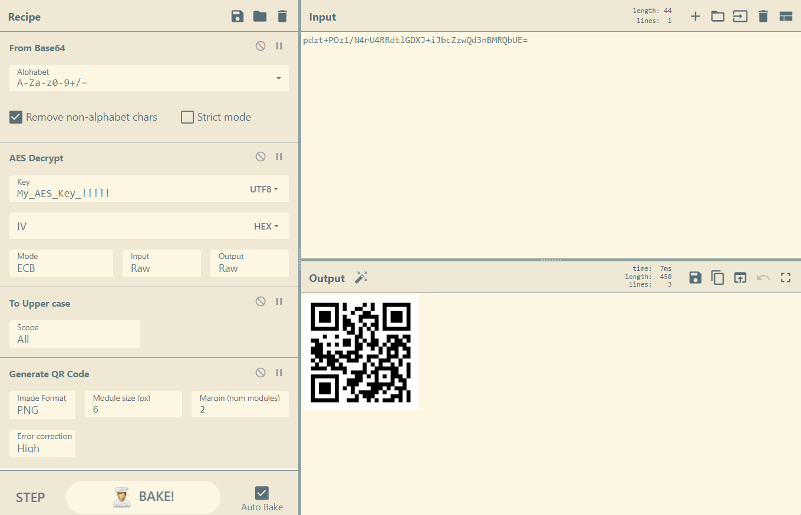
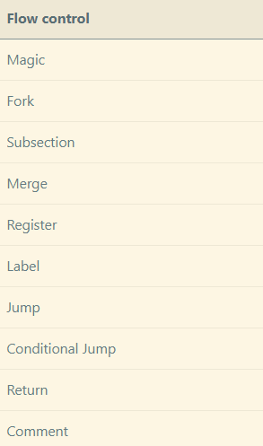
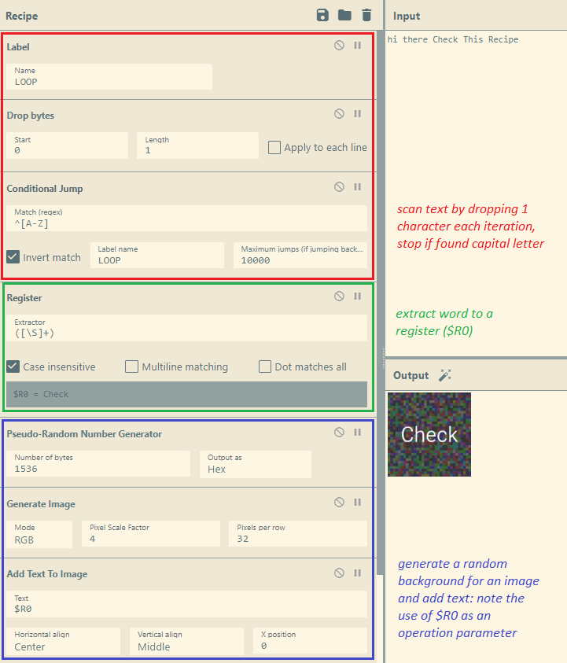
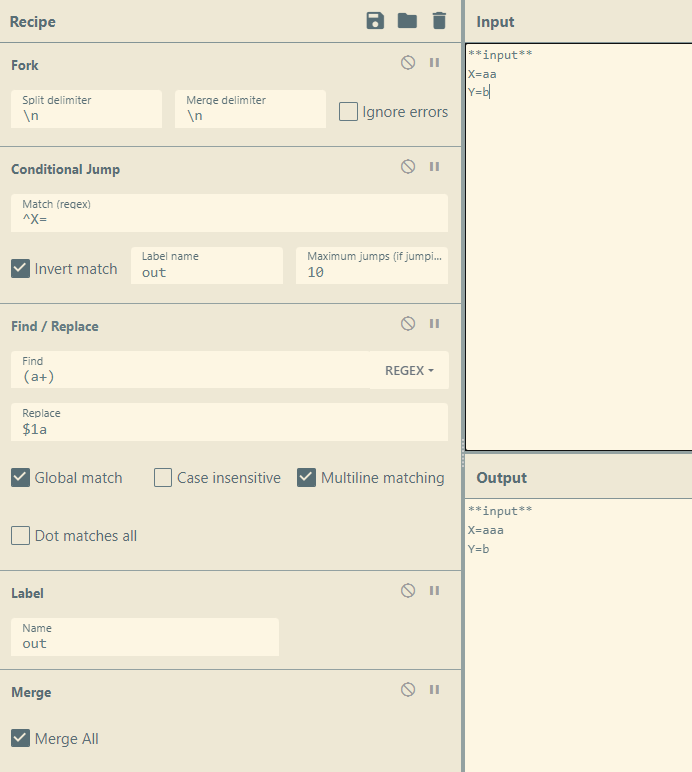
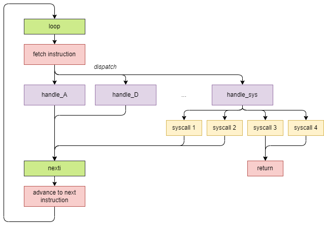

# chef's kiss

For the Root-Me 10K CTF event that was held back in October 2022, I had the opportunity to create a few challenges. This one in particular got a few solves but there wasn't any write-up published for it. Therefore, I thought I would write one myself for posterity and because I really like the idea of the challenge itself (I don't think I have seen anything like this before in another CTF).

**chef's kiss** was a rather atypical reverse engineering challenge. No binaries, no further description, just a URL:

```
https://gchq.github.io/CyberChef/#recipe=Label('loop')Conditional_Jump('%5EPROG%3DA',false,'handle_A',10000)Conditional_Jump('%5EPROG%3DD',false,'handle_D',10000)Conditional_Jump('%5EPROG%3DE',false,'handle_E',10000)Conditional_Jump('%5EPROG%3DI',false,'handle_I',10000)Conditional_Jump('%5EPROG%3DJ',false,'handle_J',10000)Conditional_Jump('%5EPROG%3DP',false,'handle_P',10000)Conditional_Jump('%5EPROG%3DR',false,'handle_R',10000)Conditional_Jump('%5EPROG%3DS',false,'handle_S',10000)Conditional_Jump('%5EPROG%3D%5C%5C$',false,'handle_sys',10000)Label('nexti')Fork('%5C%5Cn','%5C%5Cn',false)Conditional_Jump('%5EPROG%3D',true,'endfork',10000)Find_/_Replace(%7B'option':'Regex','string':'%5EPROG%3D'%7D,'',true,false,true,false)Drop_bytes(0,1,false)Find_/_Replace(%7B'option':'Regex','string':'(.%2B)'%7D,'PROG%3D$1',true,false,true,false)Label('endfork')Merge(true)Jump('loop',10000)Return()Label('handle_A')Fork('%5C%5CnSTACK%3D','%5C%5CnSTACK%3D',false)Conditional_Jump('%5EPROG%3D',false,'handle_A_endfork',10000)Label('handle_A_forkinnerloop')Conditional_Jump('%5E%5C%5Cx00',false,'handle_A_endforkinnerloop',10000)ADD(%7B'option':'Hex','string':'ff010000000000000000000000000000000000000000000000000000000000000000000000000000000000000000000000000000000000000000000000000000000000000000000000000000000000000000000000000000000000000000000000000000000000000000000000000000000000000000000000000000000000000000000000000000000000000000000000000000000000000000000000000000000000000000000000000000000000000000000000000000000000000000000000000000000000000000000000000000000000000000000000000000000000000000000000000000000000000000000000000000000000000000000000000000000000000000000000000000000000000000000000000000000000000000000000000000000000000000000000000000000000000000000000000000000000000000000000000000000000000000000000000000000000000000000000000000000000000000000000000000000000000000000000000000000000000000000000000000000000000000000000000000000000000000000000000000000000000000000000000000000000000000000000000000000000000000000000000000000000000000000000'%7D)Jump('handle_A_forkinnerloop',10000)Label('handle_A_endforkinnerloop')Drop_bytes(0,1,false)Label('handle_A_endfork')Merge(true)Jump('nexti',10000)Label('handle_D')Find_/_Replace(%7B'option':'Regex','string':'STACK%3D(.)(.*)'%7D,'STACK%3D$1$1$2',true,false,true,true)Jump('nexti',10000)Label('handle_E')Find_/_Replace(%7B'option':'Regex','string':'STACK%3D(.)(.)(.*)'%7D,'STACK%3D$2$1$3',true,false,true,true)Jump('nexti',10000)Label('handle_I')Fork('%5C%5CnSTACK%3D','%5C%5CnSTACK%3D',false)Conditional_Jump('%5EPROG%3D',false,'handle_I_endfork',10000)ADD(%7B'option':'Hex','string':'010000000000000000000000000000000000000000000000000000000000000000000000000000000000000000000000000000000000000000000000000000000000000000000000000000000000000000000000000000000000000000000000000000000000000000000000000000000000000000000000000000000000000000000000000000000000000000000000000000000000000000000000000000000000000000000000000000000000000000000000000000000000000000000000000000000000000000000000000000000000000000000000000000000000000000000000000000000000000000000000000000000000000000000000000000000000000000000000000000000000000000000000000000000000000000000000000000000000000000000000000000000000000000000000000000000000000000000000000000000000000000000000000000000000000000000000000000000000000000000000000000000000000000000000000000000000000000000000000000000000000000000000000000000000000000000000000000000000000000000000000000000000000000000000000000000000000000000000000000000000000000000000'%7D)Label('handle_I_endfork')Merge(true)Jump('nexti',10000)Label('handle_J')Conditional_Jump('STACK%3D%5C%5Cx00',true,'handle_J_end',10000)Find_/_Replace(%7B'option':'Regex','string':'PROG%3DJ%5C%5C%5B%5B%5E%5C%5C%5D%5D%2B%5C%5C%5D(.*)'%7D,'PROG%3DJ$1',true,false,true,false)Label('handle_J_end')Find_/_Replace(%7B'option':'Regex','string':'STACK%3D.(.*)'%7D,'STACK%3D$1',true,false,true,true)Jump('nexti',10000)Label('handle_P')Find_/_Replace(%7B'option':'Regex','string':'STACK%3D(.*)'%7D,'STACK%3D%5C%5Cx00$1',true,false,true,true)Jump('nexti',10000)Label('handle_R')Find_/_Replace(%7B'option':'Regex','string':'STACK%3D(.)(.*)'%7D,'STACK%3D$2$1',true,false,true,true)Jump('nexti',10000)Label('handle_S')Fork('%5C%5CnSTACK%3D','%5C%5CnSTACK%3D',false)Conditional_Jump('%5EPROG%3D',false,'handle_S_endfork',10000)SUB(%7B'option':'Hex','string':'010000000000000000000000000000000000000000000000000000000000000000000000000000000000000000000000000000000000000000000000000000000000000000000000000000000000000000000000000000000000000000000000000000000000000000000000000000000000000000000000000000000000000000000000000000000000000000000000000000000000000000000000000000000000000000000000000000000000000000000000000000000000000000000000000000000000000000000000000000000000000000000000000000000000000000000000000000000000000000000000000000000000000000000000000000000000000000000000000000000000000000000000000000000000000000000000000000000000000000000000000000000000000000000000000000000000000000000000000000000000000000000000000000000000000000000000000000000000000000000000000000000000000000000000000000000000000000000000000000000000000000000000000000000000000000000000000000000000000000000000000000000000000000000000000000000000000000000000000000000000000000000000'%7D)Label('handle_S_endfork')Merge(true)Jump('nexti',10000)Label('handle_sys')Conditional_Jump('STACK%3D%5C%5Cx01',false,'handle_sys_1',10000)Conditional_Jump('STACK%3D%5C%5Cx02',false,'handle_sys_2',10000)Conditional_Jump('STACK%3D%5C%5Cx03',false,'handle_sys_3',10000)Conditional_Jump('STACK%3D%5C%5Cx04',false,'handle_sys_4',10000)Jump('handle_sys_err',10000)Label('handle_sys_end')Jump('nexti',10000)Label('handle_sys_1')Fork('%5C%5CnSTACK%3D','%5C%5CnSTACK%3D',false)Conditional_Jump('%5EPROG%3D',false,'handle_sys_1_endfork',10000)Drop_bytes(0,1,false)RC4(%7B'option':'UTF8','string':'A%20cyberchef%20crackme?%20Are%20you%20kidding%20me?'%7D,'Latin1','Latin1')Label('handle_sys_1_endfork')Merge(true)Jump('handle_sys_end',10000)Label('handle_sys_2')Fork('%5C%5CnSTACK%3D','%5C%5CnSTACK%3D',false)Conditional_Jump('%5EPROG%3D',false,'handle_sys_2_endfork',10000)Drop_bytes(0,1,false)Rotate_right(4,false)Label('handle_sys_2_endfork')Merge(true)Jump('handle_sys_end',10000)Label('handle_sys_3')Find_/_Replace(%7B'option':'Regex','string':'.%2B'%7D,'Wrong%20:(',true,false,true,true)Return()Label('handle_sys_4')Find_/_Replace(%7B'option':'Regex','string':'.%2B'%7D,'Congrats%20:)',true,false,true,true)Return()Label('handle_sys_err')Find_/_Replace(%7B'option':'Regex','string':'.%2B'%7D,'Fatal%20error:%20unrecognized%20syscall',true,false,true,true)Return()&input=UFJPRz1QSSRQSUkkUElJSUFSUElBUlBJSUlJQVJQSUFSUElJSUlJQVJQSUlJSUlJSUlJQVJQSUlBUlBJSUlJSUlBUlBJSUlJSUFSUElJSUFSUElJSUlJQVJQSUlJSUlJSUlBUlBJSUlJSUlJSUlBUlBJSUlJSUlJQVJQSUlJSUlJSUlJQVJQSSRTU1NTU1NTU1NTU1NTU1NTU1NTU1NTU1NTU1NTU1NTU1NTU1NTU1NTU1NTU1NTU1NTU1NTU1NTU1NTU1NTU1NTU1NTU1NTU1NTU1NTU1NTU1NTU1NTU1NTU1NTU1NTU1NTU1NTU1NTU1NTU1NTU1NKW1BJSUkkXVNTU1NTU1NTU1NTU1NTU1NTU1NTU1NTU1NTU1NTU1NTU1NTU1NTU1NTU1NTU1NTU1NTU1NTU1NTU1NTU1NTU1NTU1NTU1NTU1NTU1NTU1NTU1NTU1NTU1NTU1NTU1NTU1NTU1NTU1NTU1NTU1NTU1NTU1NTU1NTU1NTU1NTU1NTU1NTU1NTU1NTU1NTU1NTU1NTU1NTU1NTU1NTU1NTU1NTU1NTU1NTU1NTU1NTU1NTU1NTU1NTU1NTU1NTU1NTU1NTU1NTU1NTU1NTU1NTU1NTU1NTU0pbUElJSSRdU1NTU1NTU1NTU1NTU1NTU1NTU1NTU1NTU1NTU1NTU1NTU1NTU1NTU1NTU1NTU1NTU1NTSltQSUlJJF1TU1NTU1NTU1NTU1NTU1NTU1NTU1NTU1NTU1NTU1NTU1NTU1NTU1NTU1NTU1NTU1NTU1NTU1NTU1NTU1NTU1NTU1NTU1NTU1NTU1NTU1NTU1NTU1NTU1NTU1NTU1NTU1NTU1NTU1NTU1NTU1NTU1NTU1NTU1NTU1NTU1NTU1NTU1NTU1NTU1NTU1NTU1NTU1NTU1NTU1NTU1NTU1NTU1NTU1NTU1NTU1NTU0pbUElJSSRdU1NTU1NTU1NTU1NTU1NTU1NTU1NTU1NTU1NTU1NTU1NTU1NTU1NTU1NTU1NTU1NTU1NTU1NTU1NTU1NTU1NTU1NTU1NTU1NTU1NTU1NTU1NTU1NTU1NTU1NTU1NTU1NTU1NTU1NTU1NTU1NTU1NTU1NTU1NTU1NTU1NTU1NTU1NTU1NTU1NTSltQSUlJJF1TU1NTU1NTU1NTU1NTU1NTU1NKW1BJSUkkXVNTU0pbUElJSSRdU1NTU1NTU1NTU1NTU1NTU1NTU1NTU1NTU1NTU1NTU1NTU1NTU1NTU1NTU1NTU1NTU1NTU1NTU1NTU1NTU1NTU1NTU1NTU1NTU1NTU1NTU1NTU1NTU1NTU1NTU1NTU1NTU1NTU1NTU1NTU1NTU1NTU1NTU1NTU1NTU1NTU1NTU1NTU1NTU1NTU1NTU1NTU1NTSltQSUlJJF1TU1NTU1NTU1NTU1NTU1NTU1NTU1NTU1NTU1NTU1NTU1NTU1NTU1NTU1NTU1NTU1NTU1NTU1NTU1NTU1NTU1NTU1NTU1NTU1NTU1NTU1NTU1NTU1NTU1NTU1NTU1NTU1NTU1NTU1NTU1NTU1NTU1NTU1NTU1NTU1NTU1NTU1NTU1NTU1NTU1NTU1NTU1NTU1NTU1NTU1NTU1NTU1NTU1NTU1NTU1NTU1NTU1NTU1NTU1NTU1NTU1NTU1NTU1NTU1NTU1NTU1NTU1NTU1NTU1NTU1NTU0pbUElJSSRdU1NTU1NTU1NTU1NTU1NTU1NTU1NTU1NTU1NTU1NTU1NTU1NTU1NTU1NTU1NTU1NTU1NTU1NTU1NTU1NTU1NTU1NTU1NTU1NTU1NTU1NTU1NTU1NTU1NTU1NTU1NTU1NTU0pbUElJSSRdU1NTU1NTU1NTU1NTU1NTU1NTU1NTU1NTU1NTU1NTU1NTU0pbUElJSSRdU1NTU1NTU1NTU1NTU1NTU1NTU1NTU1NTU1NTU1NTU1NTU1NTU1NTU1NTU1NTU1NTU1NTU1NTU1NTU1NTU1NTU1NTU1NTU1NTU1NTU1NTU1NTU1NTU1NTU1NTU1NTU1NTU1NTU1NTU1NTU1NTU1NTU1NTU1NTU1NTU1NTU1NTU1NTU1NTU1NTU1NTU1NTU1NTU1NTU1NTU1NKW1BJSUkkXVNTU1NTU1NTU1NTU1NTU1NTU1NTU1NTU1NTU1NTU1NTU1NTU1NTU1NTU1NTU1NTU1NTU1NTU1NTU1NTU1NTU1NTU1NTU1NTU1NTU1NTU1NTU1NTU1NTU1NTU1NTU1NTU1NTU1NTU1NTU1NTU1NTU1NTU1NTU1NTU1NTU1NTU1NTU1NTU1NTU1NTU1NTU1NTU1NTU1NTU1NTU1NTU1NTU1NTU1NTU1NTU1NTU1NTU1NTU1NTU1NTU1NTU1NTU1NTU1NTU1NTU1NTU1NTU1NTU1NTU1NTU1NTU1NTU1NTU1NTU1NTU1NTSltQSUlJJF1TU1NTU1NTU1NTU1NTU1NTU1NTU1NTU1NTU1NTU1NTU1NTU1NTU1NTU1NTU1NTU1NTU1NTU1NTU1NTU1NTU1NTU1NTU1NTU1NTU1NTU1NTU1NTU1NTU1NTU1NTU1NTU1NTU1NTU1NTU1NTU1NTU1NTU1NTU1NTU1NTU1NTU1NTU1NTU1NTU1NTU1NTU1NTU1NTU1NTU1NTU1NTU1NTU1NTU1NTU1NTU1NTU1NTU1NTU1NTU1NTU1NTU1NTU1NTU1NTU1NTU1NTU1NTU1NTU1NTU1NTU1NTU1NTU1NTU1NTU1NKW1BJSUkkXVNTU1NTU1NTU1NTU1NTU1NTU1NTU1NTU1NTU1NTU1NTSltQSUlJJF1QSUlJSSQKU1RBQ0s9ZW50ZXJfZmxhZ19oZXJl
```

If you follow this link, you are greeted with a large CyberChef recipe, a rather cryptic input with a part that says "enter flag here", and an output window that says `"Wrong :("`.

This is exactly what it looks like: a crackme implemented using CyberChef.


## CyberChef does more than you think

Most CTF enthusiasts know about [CyberChef](https://github.com/gchq/CyberChef): it is a widely used web application developed by GCHQ for dealing with data encoding, cryptography, networking and many more as it carries tons of features of all kinds.

Its specificity lies in the fact that you can *chain* operations to be performed on your input: for instance, you could ask CyberChef to first decode your data from base64, then decrypt it using AES by specifying a certain mode and key, then make the text uppercase and finally generate a QR code for it — all at once. This is called the *recipe* system.



You can build more or less complex recipes, and even export them through URL format or JSON, so that you can save them or share them with other people.

However, most people do not know about these rarely used operation blocks from the *flow control* category: 



These allow to basically turn CyberChef recipes into whole **programs**, and may even make CyberChef a turing-complete virtual machine.

Most notably, you can fork and merge operations, define registers, labels, and jump on labels conditionally. You can thus define conditional blocks of code and even loops.

Here is an example of recipe that scans a text using a loop, stops on the first capital letter, extracts a word to a register and displays it on an image.




## Defining variables

Unfortunately, the *Register* block does not really implement a register per se, as we would use commonly in assembly code. The fact that CyberChef registers cannot be reassigned makes them a rather limited feature. Indeed, you cannot, for instance, modify the value of a register to increment it. 

How would we implement variables then? Here's a solution that I came up with, that uses the *Fork* and *Merge* blocks. The idea is to define variables inside the input window, one per line, use *Fork* to parallelize the control flow on each line, filter the line that matches the variable we're interested in using a conditional jump, and perform subsequent operations on the variable.

Here is an example of recipe that implements a way to increment a counter.



I'm sure there are plenty of creative ways to implement different kinds of useful programming primitives using all of the blocks that CyberChef provides.

Either way, this is basically all there is to my crackme recipe: it mostly consists of merge, forks, labels, jumps and find/replaces. The recipe is actually rather straightforward, easy to develop and easy to read (apart from the very linear appareance).

However, when I first had the idea of the challenge, I knew I couldn't just stop there. I had to give it that extra twist to make challengers go "double wow": the first one being when you see that it's a CyberChef cracking challenge, and the second one being when you understand that... the recipe implements a **virtual machine** itself.

## Reverse engineering the recipe

The input window looks like this:

```
PROG=PI$PII$PIIIARPIARPIIIIARPIARPIIIIIARPIIIIIIIIIARPIIARPIIIIIIARPIIIIIARPIIIARPIIIIIARPIIIIIIIIARPIIIIIIIIIARPIIIIIIIARPIIIIIIIIIARPI$SSSSSSSSSSSSSSSSSSSSSSSSSSSSSSSSSSSSSSSSSSSSSSSSSSSSSSSSSSSSSSSSSSSSSSSSSSSSSSSSSSSSSSSSSSSSSSSSSSSSSSSSSSSSSSSJ[PIII$]SSSSSSSSSSSSSSSSSSSSSSSSSSSSSSSSSSSSSSSSSSSSSSSSSSSSSSSSSSSSSSSSSSSSSSSSSSSSSSSSSSSSSSSSSSSSSSSSSSSSSSSSSSSSSSSSSSSSSSSSSSSSSSSSSSSSSSSSSSSSSSSSSSSSSSSSSSSSSSSSSSSSSSSSSSSSSSSSSSSSSSSSSSSSSSSSSSSSSSSSSSSSSSSSSSSSSJ[PIII$]SSSSSSSSSSSSSSSSSSSSSSSSSSSSSSSSSSSSSSSSSSSSSSSSSSSJ[PIII$]SSSSSSSSSSSSSSSSSSSSSSSSSSSSSSSSSSSSSSSSSSSSSSSSSSSSSSSSSSSSSSSSSSSSSSSSSSSSSSSSSSSSSSSSSSSSSSSSSSSSSSSSSSSSSSSSSSSSSSSSSSSSSSSSSSSSSSSSSSSSSSSSSSSSSSSSSSSSSSSSSSSSSSSSSSJ[PIII$]SSSSSSSSSSSSSSSSSSSSSSSSSSSSSSSSSSSSSSSSSSSSSSSSSSSSSSSSSSSSSSSSSSSSSSSSSSSSSSSSSSSSSSSSSSSSSSSSSSSSSSSSSSSSSSSSSSSSSSSSSSSSSSSSSSSSSSSJ[PIII$]SSSSSSSSSSSSSSSSSSJ[PIII$]SSSJ[PIII$]SSSSSSSSSSSSSSSSSSSSSSSSSSSSSSSSSSSSSSSSSSSSSSSSSSSSSSSSSSSSSSSSSSSSSSSSSSSSSSSSSSSSSSSSSSSSSSSSSSSSSSSSSSSSSSSSSSSSSSSSSSSSSSSSSSSSSSSSSSSSSSSSJ[PIII$]SSSSSSSSSSSSSSSSSSSSSSSSSSSSSSSSSSSSSSSSSSSSSSSSSSSSSSSSSSSSSSSSSSSSSSSSSSSSSSSSSSSSSSSSSSSSSSSSSSSSSSSSSSSSSSSSSSSSSSSSSSSSSSSSSSSSSSSSSSSSSSSSSSSSSSSSSSSSSSSSSSSSSSSSSSSSSSSSSSSSSSSSSSSSSSSSSSSSSSSSSSSSSSSSSSSSJ[PIII$]SSSSSSSSSSSSSSSSSSSSSSSSSSSSSSSSSSSSSSSSSSSSSSSSSSSSSSSSSSSSSSSSSSSSSSSSSSSSSSSSSSSSSSSSSSSSSSSSSJ[PIII$]SSSSSSSSSSSSSSSSSSSSSSSSSSSSSSSSSSJ[PIII$]SSSSSSSSSSSSSSSSSSSSSSSSSSSSSSSSSSSSSSSSSSSSSSSSSSSSSSSSSSSSSSSSSSSSSSSSSSSSSSSSSSSSSSSSSSSSSSSSSSSSSSSSSSSSSSSSSSSSSSSSSSSSSSSSSSSSSSSSSSSSSSSSSSSSSSSSJ[PIII$]SSSSSSSSSSSSSSSSSSSSSSSSSSSSSSSSSSSSSSSSSSSSSSSSSSSSSSSSSSSSSSSSSSSSSSSSSSSSSSSSSSSSSSSSSSSSSSSSSSSSSSSSSSSSSSSSSSSSSSSSSSSSSSSSSSSSSSSSSSSSSSSSSSSSSSSSSSSSSSSSSSSSSSSSSSSSSSSSSSSSSSSSSSSSSSSSSSSSSSSSSSSSSSSSSSSSSSSSSSSSSSSSSSSSSSJ[PIII$]SSSSSSSSSSSSSSSSSSSSSSSSSSSSSSSSSSSSSSSSSSSSSSSSSSSSSSSSSSSSSSSSSSSSSSSSSSSSSSSSSSSSSSSSSSSSSSSSSSSSSSSSSSSSSSSSSSSSSSSSSSSSSSSSSSSSSSSSSSSSSSSSSSSSSSSSSSSSSSSSSSSSSSSSSSSSSSSSSSSSSSSSSSSSSSSSSSSSSSSSSSSSSSSSSSSSSSSSSSSSSSSSSJ[PIII$]SSSSSSSSSSSSSSSSSSSSSSSSSSSSSSSSJ[PIII$]PIIII$
STACK=enter_flag_here
```

There is a huge variable `PROG` that stores what seems to be a program of some sort. Then, we see a second variable `STACK` inside of which we are supposed to write down the flag.

The recipe starts with a label called "loop", which is probably the loop that decodes each instruction. It is followed by a dispatcher on the first character of the `PROG` variable. We can see conditional jumps on the following regular expressions:
* `^PROG=A`
* `^PROG=D`
* `^PROG=E`
* `^PROG=I`
* `^PROG=J`
* `^PROG=P`
* `^PROG=R`
* `^PROG=S`
* `^PROG=\$`

Each instruction redirects to a dedicated handler, called `handle_A`, `handle_D`... except for the last instruction (`$`) which handler is called `handler_sys`. 

At the end of the dispatcher, a portion of code labeled `nexti` (for *next instruction*) uses the fork/merge technique that I previously described to drop a byte of the `PROG` variable, which allows to advance to the next instruction and loop back.

Then, we can analyze each handler to understand the instructions of the virtual machine.

## Instruction set of the virtual machine

The virtual machine consists of the following (small) instruction set:

* A (*add*): pops `a`, pops `b`, pushes `a + b`
* D (*dup*): duplicates the top element of the stack
* E (*exh*): pops `a`, pops `b`, pushes `a`, pushes `b`
* I (*inc*): increments the top element of the stack
* J (*jiz*): pops `a` and jumps if `a = 0`
* P (*pushz*): pushes a zero
* R (*rots*): pops `a` and appends `a` at the end of the stack
* S (*dec*): decrements the top element of the stack
* $ (*syscall*): pops `n` and performs syscall number `n`

Yeah, I know, the "stack" is not actually a stack because of the "R" instruction that is shamelessly able to append an element at its end. Initially I wanted to implement an actual stack but I ended up simplifying things.

A few other remarks:
* each element on the stack is a byte (which means arithmetic instructions operate on 8 bits);
* conditional jumps (J) work like the following: `J[x]y` runs `x` then `y` if the top element of the stack is not zero, and runs only `y` (the rest of the program) otherwise.

You can notice there is a rather substantial limitation to the virtual machine: jumps are only forward and they cannot go back, which makes writing loops impossible. I didn't have the courage to implement that 😂

Last but not least, the `$` instruction performs what I would call "syscalls". They are operations that are executed not in the context of the VM, but directly in the context of the CyberChef recipe. I implemented four of them: the first two perform more cryptographic-like operations, and the last two are more I/O related.

| Syscall number | Description |
| - | - |
| 1 | Encrypts the whole stack using RC4 and a hardcoded key |
| 2 | Performs a 4-bit rotation to the right of every byte in the stack |
| 3 | Displays "Wrong :(" and terminates execution |
| 4 | Displays "Congrats :)" and terminates execution |

Here is a summary of the control flow of the virtual machine.




Now we have all the elements needed to reverse the program that is run within the virtual machine.

## Reversing the virtualized program

Using the knowledge of the different instructions that compose the virtual machine, we can "disassemble" the code of the program:

```
pushz
inc
syscall ; 1

pushz
inc
inc
syscall ; 2

pushz
inc
inc
inc
add
rots

pushz
inc
add
rots

pushz
inc
inc
inc
inc
add
rots

pushz
inc
add
rots

pushz
inc
inc
inc
inc
inc
add
rots

pushz
inc
inc
inc
inc
inc
inc
inc
inc
inc
add
rots

pushz
inc
inc
add
rots

pushz
inc
inc
inc
inc
inc
inc
add
rots

pushz
inc
inc
inc
inc
inc
add
rots

pushz
inc
inc
inc
add
rots

pushz
inc
inc
inc
inc
inc
add
rots

pushz
inc
inc
inc
inc
inc
inc
inc
inc
add
rots

pushz
inc
inc
inc
inc
inc
inc
inc
inc
inc
add
rots

pushz
inc
inc
inc
inc
inc
inc
inc
add
rots

pushz
inc
inc
inc
inc
inc
inc
inc
inc
inc
add
rots

pushz
inc
syscall ; 1

c1:
dec * 0x6f
jiz c2
pushz
inc * 3
syscall ; 3

c2:
dec * 0xd5
jiz c3
pushz
inc * 3
syscall ; 3

c3:
dec * 0x33
jiz c4
pushz
inc * 3
syscall ; 3

c4:
dec * 0xaa
jiz c5
pushz
inc * 3
syscall ; 3

c5:
dec * 0x87
jiz c6
pushz
inc * 3
syscall ; 3

c6:
dec * 0x12
jiz c7
pushz
inc * 3
syscall ; 3

c7:
dec * 0x03
jiz c8
pushz
inc * 3
syscall ; 3

c8:
dec * 0x90
jiz c9
pushz
inc * 3
syscall ; 3

c9:
dec * 0xd4
jiz c10
pushz
inc * 3
syscall ; 3

c10:
dec * 0x61
jiz c11
pushz
inc * 3
syscall ; 3

c11:
dec * 0x22
jiz c12
pushz
inc * 3
syscall ; 3

c12:
dec * 0x98
jiz c13
pushz
inc * 3
syscall ; 3

c13:
dec * 0xe6
jiz c14
pushz
inc * 3
syscall ; 3

c14:
dec * 0xe1
jiz c15
pushz
inc * 3
syscall ; 3

c15:
dec * 0x20
jiz good
pushz
inc * 3
syscall ; 3

good:
pushz
inc
inc
inc
inc
syscall ; 4
```

We can lift this code to a higher level, clearer representation:

```
syscall(1) ; apply RC4
syscall(2) ; apply ROR (4 bits)

push 3, add, rots
push 1, add, rots
push 4, add, rots
push 1, add, rots
push 5, add, rots
push 9, add, rots
push 2, add, rots
push 6, add, rots
push 5, add, rots
push 3, add, rots
push 5, add, rots
push 8, add, rots
push 9, add, rots
push 7, add, rots
push 9, add, rots

syscall(1) ; apply RC4

dec * 0x6f, syscall(3) if not zero (fail)
dec * 0xd5, syscall(3) if not zero (fail)
dec * 0x33, syscall(3) if not zero (fail)
dec * 0xaa, syscall(3) if not zero (fail)
dec * 0x87, syscall(3) if not zero (fail)
dec * 0x12, syscall(3) if not zero (fail)
dec * 0x03, syscall(3) if not zero (fail)
dec * 0x90, syscall(3) if not zero (fail)
dec * 0xd4, syscall(3) if not zero (fail)
dec * 0x61, syscall(3) if not zero (fail)
dec * 0x22, syscall(3) if not zero (fail)
dec * 0x98, syscall(3) if not zero (fail)
dec * 0xe6, syscall(3) if not zero (fail)
dec * 0xe1, syscall(3) if not zero (fail)
dec * 0x20, syscall(3) if not zero (fail)

syscall(4) ; congrats
```

Finally, we can lift our comprehension of the program into the following Python-like pseudo-code:

```python
RC4_KEY = b"A cyberchef crackme? Are you kidding me?"

stack = RC4(stack, RC4_KEY)
stack = ROR(stack, 4)

ADD_KEY = [3, 1, 4, 1, 5, 9, 2, 6, 5, 3, 5, 8, 9, 7, 9]
out = []
for x, y in zip(stack, ADD_KEY):
  out.append((x + y) % 256)

out = RC4(out, RC4_KEY)

if out == b"\x6f\xd5\x33\xaa\x87\x12\x03\x90\xd4\x61\x22\x98\xe6\xe1\x20":
  print("Congrats :)")
else:
  print("Wrong :(")
```

What is only left to do is to go through the different operations in reverse order, for example using CyberChef itself!

The following recipe computes the flag: https://gchq.github.io/CyberChef/#recipe=RC4(%7B'option':'UTF8','string':'A%20cyberchef%20crackme?%20Are%20you%20kidding%20me?'%7D,'Hex','Latin1')SUB(%7B'option':'Hex','string':'03%2001%2004%2001%2005%2009%2002%2006%2005%2003%2005%2008%2009%2007%2009'%7D)Rotate_left(4,false)RC4(%7B'option':'UTF8','string':'A%20cyberchef%20crackme?%20Are%20you%20kidding%20me?'%7D,'Latin1','Latin1')&input=NmZkNTMzYWE4NzEyMDM5MGQ0NjEyMjk4ZTZlMTIw

Flag: `RM{v1rTu4lch3f}`

We can verify that by plugging in the flag in the original CyberChef recipe and baking it, the output becomes "Congrats :)".

## Conclusion

I had a lot of fun creating this challenge and I hope the players who gave it a try enjoyed it as well. Despite being rather original and surprising, the challenge is quite simple in essence (especially the virtualized program, which is pretty basic).

I think the virtual machine could have been more polished and include more features, such as better control flow and loops that would have allowed to create an even more interesting program.

