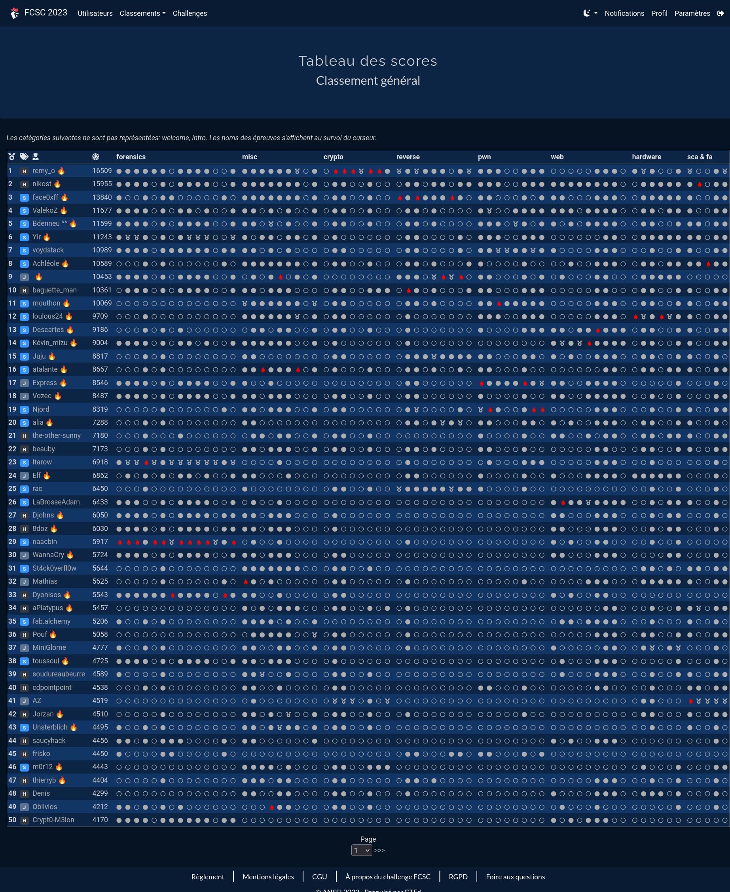
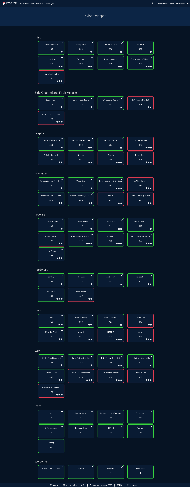

# FCSC 2023

I participated for my fourth consecutive year in the **France Cyber Security Challenge** (04/21 - 30/04) in the *Senior* category.

I ranked **1st place** in the Senior category, and 3rd global among 2000 registered participants.

I wrote two write-ups that were required for the qualifications, on two reverse challenges that I enjoyed:

* [Hola Amigo](./hola-amigo/README.md)
* [Picasso](./picasso/README.md)

