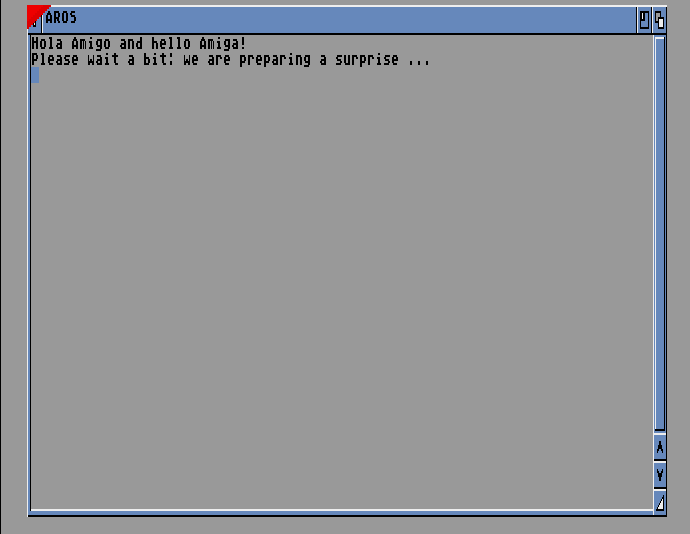
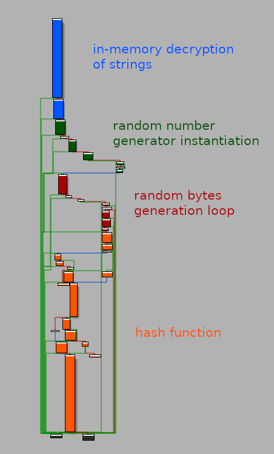

# Hola Amigo

Hola Amigo was a *hard* reverse challenge from FCSC 2023, on which I got first blood 🩸. It was the least solved reverse engineering challenge, and one of the least solved tasks overall from the CTF.

The description states that one of our friends downloaded a demo on their **Amiga 500**, which unfortunately happened to be a ransomware that encrypted their favorite game's floppy disk.

We are asked to analyze the ransomware's floppy disk (`ransomware_floppy.adf`) and to decrypt the data (`flag_floppy_enc.adf`).

## Initial recon, running & debugging

We learn that `adf` stands for [Amiga Disk File](https://en.wikipedia.org/wiki/Amiga_Disk_File), a format used by Amiga computers and emulators to store images of floppy disks. The command `file` also reveals that it was most likely created with a tool called [`exe2adf`](https://www.exe2adf.com/).

<pre style="background:rgba(20,20,40,0.9)">
<span style="color:#fff">╭─</span><b><span style="color:#67F86F">face@0xff</span></b><span style="color:#fff"> </span><b><span style="color:#6A76FB">~/ctf/fcsc/2023/reverse/hola-amigo </span></b><span style="color:#fff">                                                                                                                                                        </span>
<span style="color:#fff">╰─</span><b><span style="color:#fff">$</span></b><span style="color:#fff"> file ransomware_floppy.adf                                                                                                                                                                         </span>
<span style="color:#fff">ransomware_floppy.adf: Amiga DOS disk (DD 880 KiB), probably root block 880, bootable AmigaDOS 3.0, "exe2adf"</span>
</pre>

A bit of research brings us to [ADFlib](https://github.com/lclevy/ADFlib), an open-source tool to play around with the Amiga filesystem. In particular, it allows to extract the floppy disk's data with `unadf`.

Running it on the flag's floppy disk gives us the encrypted flag. Immediately, we notice that its length is a multiple of 16, which hints at the use of a block cipher (maybe AES).


<pre style="background:rgba(20,20,40,0.9)">
<span style="color:#fff">╭─</span><b><span style="color:#67F86F">face@0xff</span></b><span style="color:#fff"> </span><b><span style="color:#6A76FB">~/ctf/fcsc/2023/reverse/hola-amigo </span></b><span style="color:#fff">                                                                                                                                                        </span>
<span style="color:#fff">╰─</span><b><span style="color:#fff">$</span></b><span style="color:#fff"> hexdump -C flag.txt                                                                                                                                                                                </span>
<span style="color:#fff">00000000  28 0c 79 e6 88 36 a2 1f  fb 4f 09 a6 c4 4c 73 42  |(.y..6...O...LsB|                                                                                                                         </span>
<span style="color:#fff">00000010  08 ff 92 16 7d c4 9f c4  33 6a e8 c0 19 9d fa e4  |....}...3j......|                                                                                                                         </span>
<span style="color:#fff">00000020  0d 27 03 8f 74 68 04 cb  b4 6f a7 0f 73 4e 6a d6  |.'..th...o..sNj.|                                                                                                                         </span>
<span style="color:#fff">00000030  7a ae c5 83 28 3e 81 8a  e0 ca 2e 0e bc 5a e5 60  |z...(>.......Z.`|                                                                                                                         </span>
<span style="color:#fff">00000040  74 4b 72 17 c0 58 57 df  b6 a8 44 d0 1c 0c e6 0f  |tKr..XW...D.....| </span>
</pre>

Then, we are also able to extract the ransomware's binary, `a.exe`.

<pre style="background:rgba(20,20,40,0.9)">
<span style="color:#fff">╭─</span><b><span style="color:#67F86F">face@0xff</span></b><span style="color:#fff"> </span><b><span style="color:#6A76FB">~/ctf/fcsc/2023/reverse/hola-amigo </span></b><span style="color:#fff">                                                                                                                                                        </span>
<span style="color:#fff">╰─</span><b><span style="color:#fff">$</span></b><span style="color:#fff"> file a.exe                                                                                                                                                                                         </span>
<span style="color:#fff">a.exe: AmigaOS loadseg()ble executable/binary</span>
</pre>

Amiga 500 runs on the **[Motorola 68000](https://en.wikipedia.org/wiki/Motorola_68000)** architecture (shortened `m68k`). IDA can disassemble this architecture, but I chose to work with Ghidra as it provides a decompiler as well (although it is far from perfect).

But before reversing anything, it would be more comfortable if we could emulate the program and setup a debugging environment.

I chose to use the [FS-UAE](https://fs-uae.net/) Amiga emulator, that runs on Linux and provides debugging support. Arbitrary floppy disks should be placed inside `~/Documents/FS-UAE/Floppies` in order to be loaded. Then, we need to create a configuration file in `~/Documents/FS-UAE/Configurations/Default.fs-uae`:

```
[config]
amiga_model = A500
floppy_drive_0 = ransomware_floppy.adf
floppy_drive_1 = flag_floppy_enc.adf
console_debugger = 1
```

Note the `console_debugger` flag that enables the use of the debugger.

Now, when FS-UAE is launched, it should load the ransomware. At first, we are greeted with a window that asks us to wait for a surprise.



But around ten seconds later, a gruesome sight awaits us...


At any moment, we can bring up the debugging console with `F11 + D`, which pauses the execution:

```
 -- stub -- activate_console 
  D0 FFFFFFFF   D1 00F00000   D2 0000002F   D3 FFFFFFFE 
  D4 0007FFE0   D5 00F80000   D6 00FF8A58   D7 0001FFF8 
  A0 00FF5C00   A1 00FF597B   A2 00F02D54   A3 00C00020 
  A4 00C00000   A5 0003FFD0   A6 00C000D8   A7 0003FEF0 
USP  00000000 ISP  0003FEF0 
T=00 S=1 M=0 X=0 N=0 Z=0 V=0 C=0 IMASK=7 STP=0
Prefetch ba8a (CMP) 548a (ADDA) Chip latch 00000000
00FE623E 548a                     ADDA.L #$00000002,A2
Next PC: 00fe6240
>
```

Depending on when the execution was paused, the floppy disk may or may not have been loaded already. Thanksfully, it seemed to be mapped practically all the time at the same address (or very near), which made it easier to set breakpoints in advance.

## Reversing: the file encryption

Let's load the program with Ghidra and select the default Motorola 68000 architecture (32-bits, big-endian).

Getting started is not easy. The binary is a bit large (100 Ko) and Ghidra seems to miss a lot of code that we need to disassemble manually.

One string is stored in clear text inside the data section (only one...) that says:

```
You have been hacked by ami.ga.ga!
Please send only bitcoin$$$$ to decrypt your files!
```

However, no cross-reference shows up for this string, so it is unclear what we can achieve from it.

After spending a lot of time exploring around and identifying potential candidates for cryptographic functions, a new idea popped in my mind.

This [blog post](https://tetracorp.github.io/guide/reverse-engineering-amiga.html) about reverse engineering Amiga games mentions the following:

> ***Standard Amiga library calls**: Text strings in the game may reference **library files**, such as graphics.library or dos.library. Early on in a program you will see references to ABSEXECBASE ($4) followed by **a jump to an offset; e.g. JSR (-30,A6)**. Calls to ABSEXECBASE are offets of exec.library, and you will often see this to load other libraries with the OpenLibrary function, i.e. JSR (-552,A6). A fully documented list of major library offsets and hardware registers appears in [Mapping the Amiga](https://textfiles.meulie.net/programming/AMIGA/mapamiga.txt).*

The linked documentation is very useful, as it gives the corresponding offsets to all the standard library calls.

I assumed that the ransomware, at some point, had to read from the flag file and then write to it. We quickly stumble upon these relevant calls:

```
Open
Description:		opens a file for input or output
Library:		dos.library
Offset:			-$001E (-30)
Modula-2 Module:	DOS
Syntax:			file = Open(name, accessMode)
C:			BPTR Open(char *, long)
Machine Language:	d0 = Open(d1, d2)
Modula-2:		Open(name: STRPTR; accessMode: LONGINT): FileHandle
Arguments:		name = NULL terminated string specifying filename
			accessMode = type of file access desired-MODE_OLDFILE for
			reading, MODE_NEWFILE for writing
Result:			file = BCPL pointer to file handle; NULL if unsuccessful
```

```
Read
Description:		reads data from a file
Library:		dos.library
Offset:			-$002A (-42)
Modula-2 Module:	DOS
Syntax:			actualLength = Read(file, buffer, length)
C:			long Read(BPTR, char *, long)
Machine Language:	d0 = Read(d1, d2, d3)
Modula-2:		Read(file: FileHandle; buffer: ADDRESS; length: LONGINT):
			LONGINT
Arguments:		file = BCPL pointer to a file handle
			buffer = address of memory block to receive data
			length = number of bytes to read (must not exceed buffer size)
Result:			actualLength = actual number of bytes received
```

```
Write
Description:		writes bytes of data to a file
Library:		dos.library
Offset:			-$0030 (-48)
Modula-2 Module:	DOS
Syntax:			length = Write(file, buffer, length)
C:			long Write(BPTR, char *, long)
Machine Language:	d0 = Write(d1, d2, d3)
Modula-2:		Write(file: FileHandle; buffer: ADDRESS; length: LONGINT):
			LONGINT
Arguments:		file = BCPL pointer to a file handle
			buffer = pointer to start of buffer containing data to write
			length = number of bytes to write
Result:			length = number of bytes successfully written; -1 if error
			occurred
```

Therefore, looking for a function that features the instructions `JSR (-0x1E, A6)`, `JSR (-0x2A, A6)` and `JSR (-0x30, A6)` sounds like a good idea. And there is one!

```cpp
FUN_000010ac(undefined4 param_1,undefined4 param_2,uint param_3)
```

I called this function `encrypt_file`, and tried to identify its main components.

```cpp
local_8 = param_1;
local_c = 0x3ed;
local_14 = (*(code *)(DAT_000000ce + -0x1e))();  /* open file (MODE_OLDFILE) */
local_18 = param_1;
local_1c = 0x3ed;
local_10 = local_14;
local_24 = (*(code *)(DAT_000000ce + -0x1e))();
local_20 = local_24;
if ((local_14 == 0) || (local_24 == 0)) {
  local_64 = (*(code *)(DAT_000000ce + -0x3c))();
  local_68 = &DAT_000019a9;
  local_6c = 4;
  local_60 = local_64;
  (*(code *)(DAT_000000ce + -0x30))();
  return 0;
}
iVar1 = FUN_00000f28(auStack436,param_2,local_4,&local_90,1,0);
if (iVar1 == 0) {
  do {
    local_28 = local_14;
    local_2c = &local_80;
    local_30 = 0x10;
    local_38 = (*(code *)(DAT_000000ce + -0x2a))();  /* read file (0x10 bytes) */
    local_34 = local_38;
    if (local_38 == 0) {
      /* close file */
      local_3c = local_14;
      local_40 = (*(code *)(DAT_000000ce + -0x24))();
      local_44 = local_24;
      (*(code *)(DAT_000000ce + -0x24))();
      return 0;
    }
    iVar1 = FUN_00001074(auStack436,&local_80,&local_80,0x10);
    if (iVar1 != 0) {
      return 0xffffffff;
    }
    local_4c = local_24;
    local_50 = &local_80;
    local_54 = local_38;
    local_5c = (*(code *)(DAT_000000ce + -0x30))();  /* write file */
    local_58 = local_5c;
  } while (local_5c == local_38);
}
```

First, the file is opened. Then, a certain function `FUN_00000f28` is called, maybe to initialize a cryptographic context. Finally, 16-bytes blocks are read from the file. Each block undergoes the `FUN_00001074` function, probably an encryption function, and the output is written back to the file.

I will spare the details of reversing these two cryptographic functions. It is rather tedious work, but nonetheless very classic when you have to reverse binaries that include cryptographic libraries: there are often big context structures wandering around and many different parameters and modes are implemented, all of this impacting the code's legibility and making it harder to find exactly which cryptographic primitive is actually being used.

We eventually understand that the flag is encrypted using **AES-256 in CBC mode** and a null IV. However, it is hard to tell at first glance where the key comes from. Debugging can help validating this fact and retrieving the key, but it turns out the key seems to change every time we run the program again (of course, this is quite a classic behavior for a ransomware).

The goal now is therefore to find how the AES key is generated, and which key was used to encrypt the flag.


## Reversing: the key generation process

First, we identify that the `encrypt_file` function is called with the `key` and its size `key_size` (which is always 32 bytes) as parameters.

The parent function, its only cross-reference, is rather large and cryptic. I called it `ransomware`. I went for a "bottom-up" approach in order to understand where the key comes from.

Here are the main blocks that constitute this function:



Yup, there's still a lot of cryptographic functions going on... AES was the easy part.

Starting with the *hash function* part in orange. We immediately notice the presence of some magic values:

```cpp
uStack888 = 0x7380166f;
uStack884 = 0x4914b2b9;
uStack880 = 0x172442d7;
uStack876 = 0xda8a0600;
uStack872 = 0xa96f30bc;
uStack868 = 0x163138aa;
uStack864 = 0xe38dee4d;
uStack860 = 0xb0fb0e4e;
iStack792 = 0x29475103;
uStack788 = 0x12849204;
```

Googling leads us to [SM3](https://en.wikipedia.org/wiki/SM3_(hash_function)). It is a hash function used in the Chinese National Standard, that outputs a 256-bit digest (fits perfectly to feed the subsequent AES part). It features different rounds of compression using 64-byte blocks.

Now, we need to understand what exactly is fed to this SM3 part. Debugging shows that its input is pretty much 128 seemingly random bytes.

At this point, as I was debugging and casually navigating through the memory by searching for known bytes with the `s` command, I stumbled upon a few interesting plaintext strings. Namely, I was looking for the strings that showed up on the screen (like "we are preparing a surprise"), thinking they were perhaps initially encrypted, and then decrypted on-the-fly.

```
>s "surprise"
Searching from 00000000 to 00C80000..
Scanning.. 00000000 - 00080000 (Chip memory)
 -- stub -- console_isch 
Scanning.. 00000000 - 00c80000 (Chip memory)
 -- stub -- console_isch 
 -- stub -- console_isch 
 -- stub -- console_isch 
 -- stub -- console_isch 
 -- stub -- console_isch 
 -- stub -- console_isch 
 -- stub -- console_isch 
 -- stub -- console_isch 
 -- stub -- console_isch 
 -- stub -- console_isch 
 -- stub -- console_isch 
 -- stub -- console_isch 
 00C4A73C -- stub -- console_isch 
 00C5C556 -- stub -- console_isch 
 -- stub -- console_isch 

>m 00C4A650
00C4A650 4575 00C3 65F8 00F9 6F02 DBDB DBDB DBDB  Eu..e...o.......
00C4A660 DBDB DBDB DBDB DBDB DBDB DBDB DBDB DBDB  ................
00C4A670 DBDB DBDB DBDB DBDB DBDB DBDB DBDB DBDB  ................
00C4A680 0000 0104 0000 0000 0000 0000 0000 0000  ................
00C4A690 0000 0000 004E 4953 545F 5350 3830 3039  .....NIST_SP8009
00C4A6A0 3041 5F41 4553 3235 362D 4354 525F 4452  0A_AES256-CTR_DR
00C4A6B0 4247 5F50 4552 535F 3133 3337 5F43 5259  BG_PERS_1337_CRY
00C4A6C0 5054 3052 5F46 524F 4D5F 414D 4947 4147  PT0R_FROM_AMIGAG
00C4A6D0 4100 00AB 84DC 696E 7475 6974 696F 6E2E  A.....intuition.
00C4A6E0 6C69 6272 6172 7900 0000 0000 0000 0000  library.........
00C4A6F0 0000 0000 0000 0000 0000 486F 6C61 2041  ..........Hola A
00C4A700 6D69 676F 2061 6E64 2068 656C 6C6F 2041  migo and hello A
00C4A710 6D69 6761 210A 506C 6561 7365 2077 6169  miga!.Please wai
00C4A720 7420 6120 6269 743A 2077 6520 6172 6520  t a bit: we are 
00C4A730 7072 6570 6172 696E 6720 6120 7375 7270  preparing a surp
00C4A740 7269 7365 202E 2E2E 0A00 646F 732E 6C69  rise .....dos.li
00C4A750 6272 6172 7900 00C0 1780 00AA 4948 6772  brary.......IHgr
00C4A760 6170 6869 6373 2E6C 6962 7261 7279 0000  aphics.library..
00C4A770 00C0 058C 0000 0000 0000 00DF F000 0000  ................
00C4A780 0000 0000 DBDB DBDB DBDB DBDB DBDB DBDB  ................
```

What's this?! A rather compelling magic string from out of nowhere...

```
NIST_SP80090A_AES256-CTR_DRBG_PERS_1337_CRYPT0R_FROM_AMIGAGA
```

According to [Wikipedia](https://en.wikipedia.org/wiki/NIST_SP_800-90A), **NIST SP 800-90A** is a publication by the NIST, called *Recommendation for Random Number Generation Using Deterministic Random Bit Generators*, that specifies three different allegedly secure pseudo-random number generators: *Hash DRBG*, *HMAC DRBG* and *CTR DRBG*.

The latter is referenced in the magic string: we can assume the program makes use at some point of the **CTR DRBG** algorithm using the AES-256 block cipher primitive.

With a bit more reversing, we find that the function `FUN_00006aac` is responsible for decrypting the strings in memory. It is called with the offset of the string to decrypt and a 8-bit key $k$. It uses AES-CTR with an initial zero counter and a key consisting of all bytes $k \oplus \text{0xAA}$. This knowledge is not essential to solve the challenge.

Back to the missing blocks: the random number generation. The idea now is to correlate what we see in the binary with an existing library, because there's so much code (and so much *useless* code) that it seems unlikely it was implemented for this challenge only.

After a bit of research, we find the [libdrbg](https://github.com/ANSSI-FR/libdrbg) library, conveniently designed by the ANSSI, and most notably by the challenge author himself.

With this knowledge, we are able to grasp a more astute understanding of the random generation block.

CTR DRBG is instantiated through the `ctr_drbg_instantiate` function, and takes in several parameters:

* an entropy input;
* a nonce;
* a *personalization string*.

In the challenge, we assess that the nonce is an array consisting of the bytes 0x00, 0x01, ... 0x7F, and the personalization string is the magic string from earlier (`NIST_SP80090A_AES256-CTR_DRBG_PERS_1337_CRYPT0R_FROM_AMIGAGA`). It is still unclear, however, how the entropy input is generated --- we will come back to it later.

Then, random bytes can be generated using the `ctr_drbg_generate` method. It takes in some additional entropy input and outputs 128 bytes of random data.

In the challenge, this function is called twice, with two different additional entropy inputs which seem to be generated using the same method than for the first entropy input.

Let's now dive into how these entropy inputs are computed. This is done through the `FUN_000012f4` function, which I renamed `get_entropy_input`.

Unfortunately, Ghidra's decompiler has a very hard time understanding these patterns and messes up the arguments, so we have to resort to the assembly code.

```=
00008266 42 ad fc 46     clr.l      (-0x3ba,A5)
0000826a 42 ad fc 4a     clr.l      (-0x3b6,A5)
0000826e 41 ed fc 46     lea        (-0x3ba,A5),A0
00008272 43 ed fc 4a     lea        (-0x3b6,A5),A1
00008276 4e ae ff ac     jsr        (-0x54,A6)
0000827a 42 a7           clr.l      -(SP)
0000827c 20 2d fc 46     move.l     (-0x3ba,A5),D0
00008280 48 40           swap       D0
00008282 42 40           clr.w      D0w
00008284 2f 00           move.l     D0,-(SP)
00008286 48 78 01 00     pea        (0x100).w
0000828a 48 6d ff 00     pea        (-0x100,A5)
0000828e 47 fa 90 64     lea        (-0x6f9c,PC)=>get_entropy_input,A3
00008292 4e 93           jsr        (A3=>get_entropy_input)
```

Before calling the `get_entropy_input` function itself, some important arguments are prepared. The `(-0x100, A5)` pointer stores the output entropy buffer, and 0x100 is its size.

The third argument comes from the `D0` register, which itself is derived from a library call. Grepping through the *Mapping the Amiga* document, here's what we find:

```
CurrentTime
Description:		returns the current system time
Library:		intuition.library
Offset:       		-$0054 (-84)
Modula-2 Module: 	Intuition
Syntax:        		CurrentTime(seconds, micros)
C:            		void CurrentTime(long *, long *)
Machine Language: 	CurrentTime(d0, d1)
Modula-2:		CurrentTime(VAR seconds, micros: LONGCARD)
Arguments:		seconds = pointer to four-byte (LONG) variable to receive sec-
			onds value
			micros = pointer to four-byte (LONG) variable to receive micro-
			seconds value
Result:			returned in seconds and micros arguments
```

That's right, as in 9 ransomware CTF challenges out of 10, a **timestamp** is involved! We should have seen this coming.

The `CurrentTime` library call writes two longs (one for the seconds and one for the microseconds) to user-provided pointers: here, the local variables `(-0x3ba, A5)` and `(-0x3b6, A5)`. However, only the first one is passed to the next function: the microseconds are basically discarded. It is also important to note that the timestamp is byte-swapped before it is passed over.

Finally, here is the `get_entropy_input` function:

```cpp
void get_entropy_input(char *out_buf, uint size, uint k, int idx) {
  uint i;  
  for (i = 0; i < size; i++) {
    out_buf[i] = entropy_box[(idx + i) & 0xff] ^ (byte)((k >> 0x10) >> (i & 0x1f));
  }
  return;
}
```

We see that there is also a fourth argument, which I called `idx`. Its value is 0 for the first call, 1 for the second and 2 for the third. The `k` value is the timestamp in seconds. `entropy_box` is a 256-byte array of constant, random data that we can dump. 

One should notice that the timestamp is shifted 16 bits to the left. Therefore, there are only 16 bits of entropy (the upper bits of the timestamp), which is easily bruteforceable if need be.

We now have pretty much everything we need in order to generate the key!


## Reimplementing the algorithm

At first, I thought I could simply get the timestamp from the `flag.txt` file and plug it directly in the algorithm. By patching the executable or modifying the returned timestamp through debugging, we could let it compute the AES key automatically for us.

<pre style="background:rgba(20,20,40,0.9)">
<span style="color:#fff">╭─</span><b><span style="color:#67F86F">face@0xff</span></b><span style="color:#fff"> </span><b><span style="color:#6A76FB">~/ctf/fcsc/2023/reverse/hola-amigo </span></b><span style="color:#fff">                                                 </span>
<span style="color:#fff">╰─</span><b><span style="color:#fff">$</span></b><span style="color:#fff"> stat -c '%Y' flag.txt                                                                       </span>
<span style="color:#fff">1680805873 </span>
</pre>

Unfortunately, this does not work: this timestamp is not correct. This was hinted at in the challenge's description, which warned us that we shouldn't take the encrypted floppy disk's metadata for granted, as they were most likely overwritten.

Consequently, we need to brute-force the $2^{16}$ possible AES keys, and thus reimplement the whole key generation algorithm. Thanksfully, we can reuse the libdrbg library.

After spending quite some time assimilating the library and debugging my implementation, which seemed to correspond very closely to the executable's after performing various dynamic checks, I still couldn't find the correct key and I realized that something was wrong.

My mistake was to patch the executable so that it always returns the same timestamp in order to make the calculations deterministic and ease the debugging process. But I totally neglected a crucial detail : there are **three distinct calls** to `CurrentTime()`, and these may return **different timestamps**.

Indeed, the random number generation function is quite computationally heavy for the Amiga 500. With the FS-UAE emulator, I measured a delay of 8 seconds between the first two calls, and 4 seconds between the last two. We need to take into account these delays $\delta_1, \delta_2$ in our brute-force.

Additionally, since the timestamp is byte-swapped, the `k >> 0x10` quantity in `get_entropy_input` represents seconds of lower significance, which means that the three timestamps are really distinct for small delays.

Even with this new realization, it took me a lot of time to find the correct $(\delta_1, \delta_2)$ pair --- it came down to basically guessing how slow the author's emulator was when they encrypted the flag. Bruteforcing the timestamp was already not instantaneous, so expanding the search space for the delays came with a certain computational cost.

Eventually, I found the correct delays (18 seconds and 6 seconds) along with the timestamp (0x06fc). Here is my brute-force solve script. Note: the libdrbg library happens to implement the SM3 hash function as well, which was a blessing.

```cpp
#include <stdio.h>
#include <stdlib.h>
#include "ctr_drbg.h"
#include "drbg.h"
#include "drbg_common.h"
#include "libhash/sm3.h"
#include "aes/aes_glue.h"

const unsigned char encrypted_flag[] = "\x28\x0c\x79\xe6\x88\x36\xa2\x1f\xfb\x4f\x09\xa6\xc4\x4c\x73\x42\x08\xff\x92\x16\x7d\xc4\x9f\xc4\x33\x6a\xe8\xc0\x19\x9d\xfa\xe4\x0d\x27\x03\x8f\x74\x68\x04\xcb\xb4\x6f\xa7\x0f\x73\x4e\x6a\xd6\x7a\xae\xc5\x83\x28\x3e\x81\x8a\xe0\xca\x2e\x0e\xbc\x5a\xe5\x60\x74\x4b\x72\x17\xc0\x58\x57\xdf\xb6\xa8\x44\xd0\x1c\x0c\xe6\x0f";
const unsigned char pers_string[] = "NIST_SP80090A_AES256-CTR_DRBG_PERS_1337_CRYPT0R_FROM_AMIGAGA";
const unsigned char entropy_box[] = "\x0E\x70\xBF\xAB\xE8\x2E\x34\x10\x8B\x52\x81\xDF\xCB\x2D\x0A\x64\x12\xF9\x82\xA7\xCD\x06\xC6\xD4\x2B\xC1\x2A\x21\x5B\x98\x80\xFA\x87\x35\x71\xF3\x4E\x8D\xD7\x63\x23\x9B\x9D\x4C\x19\x6F\x0D\x8E\xD5\x01\xF5\xA2\xEC\x3F\xD8\xB7\xA6\x48\x26\xB1\x36\x2F\x07\x9E\x49\x38\x0B\x57\x9A\xD3\xD1\xBD\xB6\x00\xF6\xA1\x58\x61\xCC\x4A\xC9\x59\x15\x02\x42\x3D\xED\x03\x6A\xE1\xFC\x31\x96\x20\x7F\xF4\x1F\x5A\x17\x5E\x13\xF1\xB4\x05\x47\xD9\xF8\x51\x75\x08\x88\x28\x5D\x43\xBE\xB0\x95\x56\x89\x9C\xE4\x68\xD6\xF0\x27\x4B\x54\x25\x3A\xEF\x7A\xDB\xAA\x44\xFF\xCE\x74\xBB\xA3\x90\xE9\x24\xFE\x1B\x7B\x4D\xC0\x0C\xF2\x92\x67\x39\xF7\x1D\x37\x97\x29\xC5\x45\x65\xDC\xEB\xA8\x7C\x50\xAE\xD2\xAD\x33\x93\x11\x1C\x0F\x91\xBC\xAF\x32\x4F\xEE\x22\xC8\x1A\x73\xFD\xCA\xC3\xB9\x69\x7D\xA5\x72\x9F\x46\x09\x3E\x79\x5F\xFB\xAC\x6E\xC7\x40\x84\xE7\xE0\x1E\xE5\x83\x3C\x14\xB2\xC4\xB8\x94\x77\x18\xDE\xC2\xE3\x8C\x8F\xE2\x55\xEA\x86\xD0\x53\x66\x16\x99\x78\x04\x60\xA4\xA9\x8A\x6D\xBA\xE6\x62\x3B\xCF\xDD\x6C\x2C\x85\x7E\xDA\x5C\xA0\x6B\x76\x30\xB3\xB5\x41";

void _get_entropy_input(unsigned char * out_entropy, unsigned int timestamp, int idx, int size) {
  for (int i = 0; i < size; i++) {
    out_entropy[i] = entropy_box[(idx + i) & 0xff] ^ (unsigned char)((timestamp) >> (i & 0x1f));
  }
}

int main() {

  unsigned char entropy_input[0x100] = { 0 };
  unsigned char addin1[0x80] = { 0 };
  unsigned char addin2[0x80] = { 0 };

  unsigned char nonce[] = "\x00\x01\x02\x03\x04\x05\x06\x07\x08\x09\x0a\x0b\x0c\x0d\x0e\x0f\x10\x11\x12\x13\x14\x15\x16\x17\x18\x19\x1a\x1b\x1c\x1d\x1e\x1f\x20\x21\x22\x23\x24\x25\x26\x27\x28\x29\x2a\x2b\x2c\x2d\x2e\x2f\x30\x31\x32\x33\x34\x35\x36\x37\x38\x39\x3a\x3b\x3c\x3d\x3e\x3f\x40\x41\x42\x43\x44\x45\x46\x47\x48\x49\x4a\x4b\x4c\x4d\x4e\x4f\x50\x51\x52\x53\x54\x55\x56\x57\x58\x59\x5a\x5b\x5c\x5d\x5e\x5f\x60\x61\x62\x63\x64\x65\x66\x67\x68\x69\x6a\x6b\x6c\x6d\x6e\x6f\x70\x71\x72\x73\x74\x75\x76\x77\x78\x79\x7a\x7b\x7c\x7d\x7e\x7f";
  unsigned char IV[] = "\x00\x00\x00\x00\x00\x00\x00\x00\x00\x00\x00\x00\x00\x00\x00\x00";

  unsigned char decrypted_flag[0x100] = { 0 };

  unsigned char outbuf[0x80] = { 0 };
  sm3_context sm3_ctx;
  unsigned char digest[32] = { 0 };

  drbg_ctx ctx;
  drbg_options opt;
  aes_context aes_ctx;

  for (unsigned int timestamp = 0; timestamp <= 0xFFFF; timestamp++) {

    for (unsigned int delta1 = 0; delta1 <= 20; delta1++) {

      for (unsigned int delta2 = 0; delta2 <= 16; delta2++) {

        _get_entropy_input(entropy_input, timestamp & 0xffff, 0x0, 0x100);
        _get_entropy_input(addin1, (timestamp + delta1) & 0xffff, 0x1, 0x80);
        _get_entropy_input(addin2, (timestamp + delta1 + delta2) & 0xffff, 0x2, 0x80);

        DRBG_CTR_OPTIONS_INIT(opt, CTR_DRBG_BC_AES256, true, 0);
        ctr_drbg_instantiate(&ctx, entropy_input, 0x100, nonce, 0x80, pers_string, sizeof(pers_string) - 1, 0, &opt);

        ctr_drbg_generate(&ctx, addin1, 0x80, outbuf, 0x80);
        ctr_drbg_generate(&ctx, addin2, 0x80, outbuf, 0x80);

        sm3_init(&sm3_ctx);
        sm3_update(&sm3_ctx, outbuf, 0x80);
        sm3_final(&sm3_ctx, digest);

        memset(decrypted_flag, 0, sizeof(decrypted_flag));
        aes_init(&aes_ctx, digest, AES256, IV, CBC, AES_DECRYPT);
        aes_exec(&aes_ctx, encrypted_flag, decrypted_flag, sizeof(encrypted_flag) - 1);
        if (!memcmp(decrypted_flag, "FCSC", 4)) {
          printf("0x%04x %d %d\n", timestamp, delta1, delta2);
          printf("Key: ");
          for (int i = 0; i < 32; i++) {
            printf("%02x", (unsigned char)(digest[i]));
          }
          printf("\n");
          for (size_t i = 0; i < sizeof(encrypted_flag) - 1; i++) {
            printf("%c", (unsigned char)(decrypted_flag[i]));
          }
          printf("\n");
        }

      }
    }
  }

  return 0;

}
```

We find the correct AES key, and the decrypted flag!

```
Key: 5a0ba5a7848532cd1a2764ae5c313d1c11192ce38cdaa45ecfae245495093113
FCSC{76072BB466DFF95EA075E867B481EFD7C7A32BCE59E3E03A193AEA5EA377DD0C} == flag!
```


## Conclusion

Hola Amigo was a quite fun and well-designed challenge that tackled an architecture and an environment I was not familiar with at all. It also taught me a few new cryptographic primitives.

I thought the brute-force part at the very end was not *that* guessy, but still slightly frustrating, especially when you've spent your whole week-end reversing the binary, managing to get a correct implementation up and running, and having the pressure of not letting your first blood fall into someone else's hands. 😀


