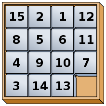
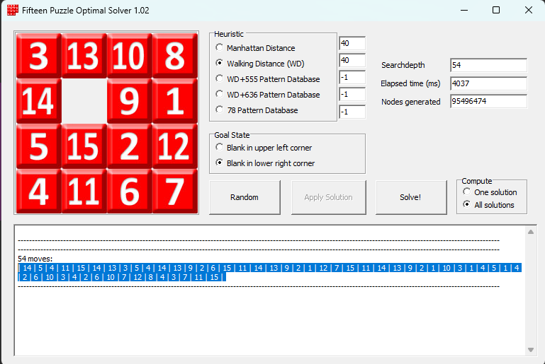

# Picasso

Picasso was a *hard* reverse challenge from FCSC 2023, which verged on the more puzzly side of the spectrum.

We were given a tiny ELF file (15 Ko) and asked to find a valid entry.

<pre style="background:rgba(20,20,40,0.9)">
<span style="color:#fff">╭─</span><b><span style="color:#67F86F">face@0xff</span></b><span style="color:#fff"> </span><b><span style="color:#6A76FB">~/ctf/fcsc/2023/reverse/picasso </span></b><span style="color:#fff">                                                                                                       </span>
<span style="color:#fff">╰─</span><b><span style="color:#fff">$</span></b><span style="color:#fff"> file picasso                                                                                                                                   </span>
<span style="color:#fff">picasso: ELF 64-bit LSB pie executable, x86-64, version 1 (SYSV), dynamically linked, interpreter /lib64/ld-linux-x86-64.so.2, BuildID[sha1]=6821f8</span>
<span style="color:#fff">a80706b51ecc2b3d5da5bbc3c59a8e8868, for GNU/Linux 3.2.0, stripped</span>
</pre>

## Reverse engineering

The reverse engineering part of the challenge was definitely the easiest part. There is only one (!) function of interest, and it is rather small --- everything is here.

At first glance of the code, here are the main takeaways:

* The input is a 24-character string with lower case letters from the alphabet (minus `o` and `i`) that encode $(x, y)$ couples, with $x \in \{0, \ldots, 5\}$ and $y \in \{0, \ldots, 3\}$.
* There are two central parts in the verification algorithm, that should be solved in reverse order. 

In the first part, each $(x, y)$ couple acts on a certain array of 54 elements, which I call `initial_state`.

```cpp
k = 0;
qmemcpy(v23, &initial_state, sizeof(v23));
printf("Password: ");
fflush(stdout);
__isoc99_scanf("%24s", s);
while ( strlen(s) > k )
{
  idx = strchr("abcdefghjklmnpqrstuvwxyz", s[k]);
  if ( !idx )
  {
    v5 = "Nope!";
    goto ERR;
  }
  y = (idx - "abcdefghjklmnpqrstuvwxyz") % 4;
  permutation = &permutations[54 * ((idx - "abcdefghjklmnpqrstuvwxyz") / 4)];
  while ( y > 0 )
  {
    y--;
    qmemcpy(v24, v23, sizeof(v24));
    for ( i = 0LL; i != 54; ++i )
      v23[i] = v24[permutation[i]];
  }
  ++k;
}
```

More precisely, for each "move", the $x$ value selects a permutation (the array `permutations` consists of 6 distinct permutations of $\{ 0, \ldots, 53\}$). The $y$ value is the number of times this permutation should be applied on the state.

The states are arrays of values in $\{ 0, \ldots, 15 \}$, therefore I chose to represent them using hexadecimal nibbles. The initial state looks like this:

```
D32EF97ED632728E7443D4C3F2A5916AB25CEBD1A1591F6E44B4BF
```

We will take a closer look at the set of permutations later.

In the second part of the algorithm, our newly permutated state is fed to another loop:

```cpp
initial_grid = 0x3DA8E0915F2C4B67;
j = 0;
while ( 1 )
{
  nibble = permutated_state[j];
  valid_moves_ptr = valid_moves;
  m = 60;
  while ( nibble != ((initial_grid >> m) & 0xF) )
  {
LABEL_19:
    m -= 4;
    valid_moves_ptr += 5;
    if ( m == -4 )
      goto ERR;
  }
  v15 = valid_moves_ptr;
  do
  {
    mask = *v15;
    if ( !*v15 )
      goto LABEL_19;
    ++v15;
  }
  while ( (initial_grid & (15 * mask)) != 0 );
  transition = (nibble << m) ^ (mask * nibble);
  if ( initial_grid == transition )
    goto ERR;
  if ( ++j == 54 )
    break;
  initial_grid ^= transition;
}
if ( (transition ^ initial_grid) == 0x123456789ABCDEF0 )
{
    puts("Win!");
    /* ... */
}
```

This time around, we have another quantity, `0x3DA8E0915F2C4B67`, which I called `initial_grid`. This 64-bit integer basically undergoes permutations as well, and the goal is for it to reach `0x123456789ABCDEF0`.


## Solving the second puzzle

When I first opened the binary in IDA, the second puzzle was definitely the quickest one to catch my attention. Going from a permutation of $\{0, \ldots, 15\}$ to $\text{0x123456789ABCDEF0}$ was something I knew very well: the *fifteen puzzle*.



I immediately thought of this puzzle for a very particular reason: I made a challenge centered around it for ECW CTF 2021, which writeup you can find [on my blog](https://face.0xff.re/posts/ecw-ctf-2021-pipe-dream-writeup/). The idea was basically that there was one process per cell, and the moves were encoded using a communication protocol through pipes between adjacent cells.

In this challenge, the fifteen puzzle is encoded in a form that is a bit easier to comprehend. Each grid state is represented by a 64-bit integer where each hexadecimal nibble gives the value of a cell (0 is the hole).

The 54-nibble long array that is output from the first puzzle encodes the different moves to play on the grid. There are only two valid moves for each grid state: for instance, in the image above, the valid moves are 13 and 7.

For this reason, the program keeps track of a $5 \times 16$ matrix of bitmasks, which I called `valid_moves`, that looks like the following in hexadecimal:

```python
[['0100000000000000', '0000100000000000', '0000000000000000', '0000000000000000', '0000000000000000'],
 ['1000000000000000', '0010000000000000', '0000010000000000', '0000000000000000', '0000000000000000'],
 ['0100000000000000', '0001000000000000', '0000001000000000', '0000000000000000', '0000000000000000'],
 ['0010000000000000', '0000000100000000', '0000000000000000', '0000000000000000', '0000000000000000'],
 ['1000000000000000', '0000010000000000', '0000000010000000', '0000000000000000', '0000000000000000'],
 ['0100000000000000', '0000100000000000', '0000001000000000', '0000000001000000', '0000000000000000'],
 ['0010000000000000', '0000010000000000', '0000000100000000', '0000000000100000', '0000000000000000'],
 ['0001000000000000', '0000001000000000', '0000000000010000', '0000000000000000', '0000000000000000'],
 ['0000100000000000', '0000000001000000', '0000000000001000', '0000000000000000', '0000000000000000'],
 ['0000010000000000', '0000000010000000', '0000000000100000', '0000000000000100', '0000000000000000'],
 ['0000001000000000', '0000000001000000', '0000000000010000', '0000000000000010', '0000000000000000'],
 ['0000000100000000', '0000000000100000', '0000000000000001', '0000000000000000', '0000000000000000'],
 ['0000000010000000', '0000000000000100', '0000000000000000', '0000000000000000', '0000000000000000'],
 ['0000000001000000', '0000000000001000', '0000000000000010', '0000000000000000', '0000000000000000'],
 ['0000000000100000', '0000000000000100', '0000000000000001', '0000000000000000', '0000000000000000'],
 ['0000000000010000', '0000000000000010', '0000000000000000', '0000000000000000', '0000000000000000']]
```

Let's take an example. When the first move is selected (`nibble = permutated_state[j]`), the program then looks for this value in the grid state:

```cpp
valid_moves_ptr = valid_moves;
m = 60;
while ( nibble != ((initial_grid >> m) & 0xF) )
{
  m -= 4;
  valid_moves_ptr += 5;
  if ( m == -4 )
    goto ERR;
}
```

Finding the move's position in the grid state also brings the `valid_moves` array to a certain row index. For instance, imagine that the first nibble move is "D": it's the second cell in the following initial state.

```
3DA8
E091
5F2C
4B67
```

The selected row of bitmasks is:

```python
 ['1000000000000000', '0010000000000000', '0000010000000000', '0000000000000000', '0000000000000000']
```

Each bitmask can be seen as a $4 \times 4$ matrix:

```
1000  0010  0000  0000  0000
0000  0000  0100  0000  0000
0000  0000  0000  0000  0000
0000  0000  0000  0000  0000
```

The "1" bits encode all the possible hole positions for our move! In our case, the hole ("0") is right below the cell we want to move ("D"), and the third bitmask allows that. Note: I'm not sure why each bitmask row store 5 bitmasks instead of 4, the last one being always null.

Once the move has been identified and deemed valid, a transition mask is crafted. It basically permutes the two cells in the grid state.

```cpp
transition = (nibble << m) ^ (mask * nibble);
/* ... */
initial_grid ^= transition;
```

In order to solve this part, we should find a solution to this instance of the fifteen puzzle that is exactly 54 moves long (which turns out to be the optimal solution length). I used the program [15-Puzzle Optimal Solver](http://kociemba.org/themen/fifteen/fifteensolver.html) by Herbert Kociemba.



This gives us a solution, that is, written in hexadecimal:

```
E54BFED354ED926FBED921C7FBED921A31451426A3426A7C8437BF
```


## Solving the first puzzle

We can now come back on the first puzzle! We know that we want to go from a certain initial state to a target state in 24 moves.

```
D32EF97ED632728E7443D4C3F2A5916AB25CEBD1A1591F6E44B4BF
->
E54BFED354ED926FBED921C7FBED921A31451426A3426A7C8437BF
```

We have a set of 6 permutations at our disposal, and each permutation can be repeated up to three times in a row.

The set of permutations is the following:

```python
[
 [9, 1, 2, 12, 4, 5, 15, 7, 8, 45, 10, 11, 48, 13, 14, 51, 16, 17, 18, 19, 20, 21, 22, 23, 24, 25, 26, 29, 32, 35, 28, 31, 34, 27, 30, 33, 36, 37, 6, 39, 40, 3, 42, 43, 0, 44, 46, 47, 41, 49, 50, 38, 52, 53],
 [0, 1, 42, 3, 4, 39, 6, 7, 36, 9, 10, 2, 12, 13, 5, 15, 16, 8, 20, 23, 26, 19, 22, 25, 18, 21, 24, 27, 28, 29, 30, 31, 32, 33, 34, 35, 53, 37, 38, 50, 40, 41, 47, 43, 44, 45, 46, 11, 48, 49, 14, 51, 52, 17],
 [2, 5, 8, 1, 4, 7, 0, 3, 6, 27, 28, 29, 12, 13, 14, 15, 16, 17, 9, 10, 11, 21, 22, 23, 24, 25, 26, 36, 37, 38, 30, 31, 32, 33, 34, 35, 18, 19, 20, 39, 40, 41, 42, 43, 44, 45, 46, 47, 48, 49, 50, 51, 52, 53],
 [0, 1, 2, 3, 4, 5, 6, 7, 8, 9, 10, 11, 12, 13, 14, 24, 25, 26, 18, 19, 20, 21, 22, 23, 42, 43, 44, 27, 28, 29, 30, 31, 32, 15, 16, 17, 36, 37, 38, 39, 40, 41, 33, 34, 35, 47, 50, 53, 46, 49, 52, 45, 48, 51],
 [0, 1, 2, 3, 4, 5, 18, 21, 24, 11, 14, 17, 10, 13, 16, 9, 12, 15, 47, 19, 20, 46, 22, 23, 45, 25, 26, 27, 28, 8, 30, 31, 7, 33, 34, 6, 36, 37, 38, 39, 40, 41, 42, 43, 44, 29, 32, 35, 48, 49, 50, 51, 52, 53],
 [33, 30, 27, 3, 4, 5, 6, 7, 8, 9, 10, 11, 12, 13, 14, 15, 16, 17, 18, 19, 0, 21, 22, 1, 24, 25, 2, 51, 28, 29, 52, 31, 32, 53, 34, 35, 38, 41, 44, 37, 40, 43, 36, 39, 42, 45, 46, 47, 48, 49, 50, 26, 23, 20]
]
```

I thought the permutations looked a bit specific. There are a lot of fixed points, and the only non-trivial cycles are of length 4, which is an interesting property ($\forall P$, $P^4 = P$).

Unfortunately, at this moment, I didn't investigate the permutations much further. I spent countless hours trying to solve the problem as a generic "go from A to B using a set of permutations" problem. I mostly experimented with the [IDA* algorithm](https://en.wikipedia.org/wiki/Iterative_deepening_A*), but coming up with a decent heuristic proved to be difficult. Several times I found a sequence of moves that got me quite close to the target, but little did I know that I was actually very far.

At some point, I came back on the permutations and tried to visualize them from another angle. I mapped each integer from 0 to 53 to a character in the following (arbitrary) charset:

```
0123456789ABCDEFGHIJKLMNOPQRSTUVWXYZabcdefghijklmnopqr
```

Then, I wrote down the six permutations, replacing the fixed points with spaces:

```
9  C  F  j  m  p           TWZS YRUX  6  3  0i  f  c  
  g  d  a  2  5  8KNQJ PILO         r  o  l    B  E  H
2581 7036RST      9AB      abc      IJK
               OPQ      ghi      FGH      XYZlork qjmp
      ILOBEHA G9CFl  k  j    8  7  6         TWZ
XUR                 0  1  2p  q  r  cfib hadg      QNK
```

Still a bit cryptic, but we can see interesting patterns that makes us want to visualize the permutations in two dimensions. Since length is 54, we could rearrange them into $9 \times 6$ grids. Let's take the three first permutations for example.

```
---------
9  C  F  
j  m  p  
         
TWZS YRUX
6  3  0i 
f  c     
---------
  g  d  a
  2  5  8
KNQJ PILO
r  o  l  
B  E  H
---------
2581 7036
RST      
9AB      
abc      
IJK
---------
```

Starts looking better... but not quite there. It looks like there are still some kinds of column patterns appearing. Let's split each row into a $3 \times 3$ block. Here's for the first permutation, where I replaced fixed points with underscores for clarity:

```
9__
C__
F__

j__
m__
p__  

___
___
___

TWZ
S_Y
RUX

__6
__3
__0

i__
f__
c__
```

Does it ring a bell now? Yup: it's a [Rubik's cube](https://en.wikipedia.org/wiki/Rubik%27s_Cube_group). 6 faces, each face has $3 \times 3$ facets. Each permutation rotates one face (here, counter-clockwise). The repetition of a permutation 1 to 3 times is how many times you want to rotate a face. In the above permutation, we can effectively see that the rotation applies to the fourth face, that there are 4 other faces which are impacted by the rotation, and that there is an opposite face which is not impacted at all.

Actually, it is even easier to visualize the Rubik's cube simply by applying the different permutations to the initial state. If we look at the action of the first permutation:

```
D32EF97ED632728E7443D4C3F2A5916AB25CEBD1A1591F6E44B4BF
->
6327F9EEDF3242847443D4C3F2A1BC9A5562EB71AE59D16E14BDBF
```

We split that into six faces:

```
D32  632  43D  591  EBD  F6E
EF9  728  4C3  6AB  1A1  44B
7ED  E74  F2A  25C  591  4BF

->

632  F32  43D  1BC  EB7  16E
7F9  428  4C3  9A5  1AE  14B
EED  474  F2A  562  59D  DBF
```

We can identify the face that was rotated one quarter counter-clockwise: it's the fourth one. Performing this with each permutation, and also visualizing the permutations on the adjacent faces, we are able to successfully reconstruct the cube's layout.

For instance, the first permutation is best visualized like this:

```
       D 3 2
       E F 9
       7 E D

5 9 1  6 3 2  4 3 D  E B D
6 A B  7 2 8  4 C 3  1 A 1
2 5 C  E 7 4  F 2 A  5 9 1

       F 6 E
       4 4 B
       4 B F 

->

       6 3 2
       7 F 9
       E E D

1 B C  F 3 2  4 3 D  E B 7
9 A 5  4 2 8  4 C 3  1 A E
5 6 2  4 7 4  F 2 A  5 9 D

       1 6 E
       1 4 B
       D B F 
```

The cube net is shown here as the following, where U is Up, L is Left, F is Front, R is Right, B is Back and D is Down.

```
 U
LFRB
 D
```

Using this notation, we find that the state arrays in the program are stored as:

```
UUUUUUUUUFFFFFFFFFRRRRRRRRRLLLLLLLLLBBBBBBBBBDDDDDDDDD
```

We also find that the permutations are, in order, counter-clockwise rotations of L, R, U, D, F, B.

Now, we know that we want to solve the cube for this target:

```
       E 5 4
       B F E
       D 3 5

D 9 2  4 E D  D 9 2  1 4 2
1 A 3  9 2 6  1 C 7  6 A 3
1 4 5  F B E  F B E  4 2 6

       A 7 C
       8 4 3
       7 B F
```

This layout is what we would consider the solved cube (imagine if each facet was mapped to one color out of six). Since each facet is unique (they can be uniquely determined by their neighbours, depending on their nature: center, corner, edge), we can map each face in the solved cube to unique, disjoint sets of facets.

For each face, I chose the following notation:

* X-Y means the X facet belongs to the face and has one neighbour Y on another facet (edge);
* X-YZ means the X facet belongs to the face and has two neighbours Y and Z on two other facets (corner);
* X-ABCD means the X facet is the center of the face.

Therefore, for each face, we obtain a set of unique facets using our notation by reading the target cube:

```
U: E-D2, B-9, D-24, 5-4, 4-21, E-9, 5-DD, 3-E, F-B5E3
F: 4-D2, E-3, D-5D, 6-1, E-FC, B-7, F-A5, 9-3, 2-9E6B
L: 2-D4, 3-9, 5-FA, 4-8, 1-76, 1-3, D-2E, 9-B, A-1934
R: D-D5, 9-E, 2-41, 7-6, E-4F, B-3, F-EC, 1-6, C-197B
B: 1-24, 4-5, 2-ED, 3-1, 6-71, 2-B, 4-EF, 6-7, A-6432
D: A-F5, 7-B, C-EF, 3-B, F-E4, B-2, 7-16, 8-4, 4-873B
```

We can now remap the *initial* cube by identifying each facet and which "face color" they are! This gives this:

```
      F D B            
      U U F            
      D F U            
U R L B U L F L L U R R
F L F D F D L R B L B R
R U D F R B D B D L L B
      R B R            
      B D D            
      U U F          
```

I did this whole process by hand; this was a bit tedious and required some concentration, but at last we managed to remap the problem into a "normal" looking cube that we can now feed to an existing solver!

For the solving part, I chose to use this [optimal Python solver](https://github.com/hkociemba/RubiksCube-OptimalSolver), written by none other than... again, Herbert Kociemba. The world of permutation puzzles is a small one!

The solver works by first generating several look-up tables in around 15 minutes, that take up several hundreds of megabytes. Then, solving a scrambled cube is as easy as calling the `solve` method and waiting about three minutes (using [pypy](https://www.pypy.org/)).

```python
>>>> cubestring = "FDBUUFDFUFLLLRBDBDBULDFDFRBRBRBDDUUFURLFLFRUDURRLBRLLB"
>>>> sv.solve(cubestring)
depth 14 done in 0.14 s, 111513 nodes generated, about 779279 nodes/s
depth 15 done in 0.81 s, 1520577 nodes generated, about 1884035 nodes/s
depth 16 done in 8.45 s, 20361912 nodes generated, about 2410972 nodes/s
depth 17 done in 131.11 s, 273355368 nodes generated, about 2084905 nodes/s
depth 18 done in 30.93 s, 77918135 nodes generated, about 2518900 nodes/s
total time: 171.53 s, nodes generated: 373276100
'U1 F2 R2 U2 R1 L2 D1 L3 U3 B1 L1 D2 F1 R2 F1 L3 U2 R2 (18f*)'
```

Given how computationally heavy the problem of optimally solving a Rubik's cube instance is, we understand why our former IDA* attempt did not give any result.

The solver yields an optimal solution in 18 moves, which is under 24: great!

All we have to do now is to map the moves back to our set of permutations, and construct the input string. Since the binary wants exactly 24 moves, we can pad our solution with "null" rotations (for instance, permutation 0 performed 0 times). This gives the following string:

```
muglhcrbkzdqvgvblgaaaaaa
```

Feed this input to the server, and we won!

<pre style="background:rgba(20,20,40,0.9)">
<span style="color:#fff">╭─</span><b><span style="color:#67F86F">face@0xff</span></b><span style="color:#fff"> </span><b><span style="color:#6A76FB">~/ctf/fcsc/2023/reverse/picasso </span></b><span style="color:#fff">                                                    </span>
<span style="color:#fff">╰─</span><b><span style="color:#fff">$</span></b><span style="color:#fff"> nc challenges.france-cybersecurity-challenge.fr 2251                                        </span>
<span style="color:#fff">Password: muglhcrbkzdqvgvblgaaaaaa                                                              </span>
<span style="color:#fff">Win!                                                                                            </span>
<span style="color:#fff">FCSC{235b605a121bdd4b09adc4823bdf0967c446647c1ec69234813068a916fd83a6}</span>
</pre>


## Conclusion

Even though it was more "puzzle" that "reverse", I thought this challenge was excellent. It required a lot of intuition and rigor.

I found the combination of the two puzzles to be very seamless and elegant. It's crazy how much complexity and puzzles one can pack into such a tiny binary and function!


